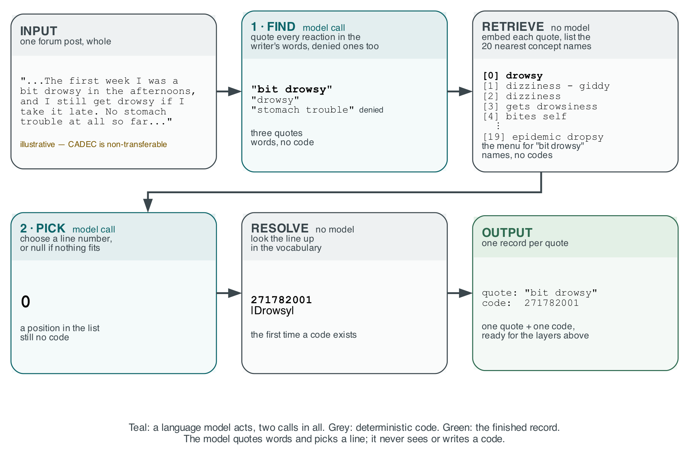
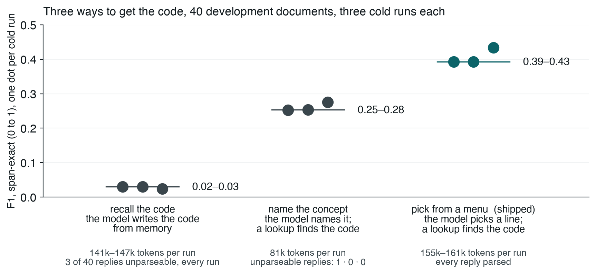
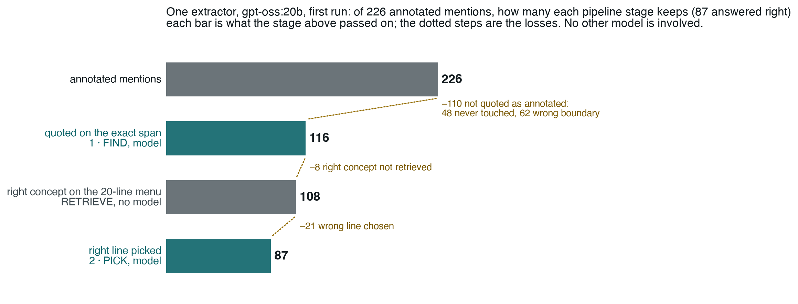

# Testing Six LLM Reliability Layers: What Each Bought and What It Cost

*Wejdan Bagais and Pushpdeep Mishra*

<!-- Submission rules for this file (word budget, takeaways, captions, Word export): docs/INFOQ-SUBMISSION.md. tests/test_infoq_article.py enforces the mechanical ones. -->

---

## Key takeaways

- Reliability layers do not make a model more accurate; they say which answers to trust, so judge them on correct answers over all inputs.
- Start with a free check: matching answers' words to the vocabulary's own names sorted them by trustworthiness; three paid layers changed one answer, each having little to act on or going unread.
- Ask the model to read, never to remember: it picked well from a menu but invented 13 to 18 percent of the codes it recalled.
- Make repeat runs a validation step: rerun the same inputs, measure how far answers move and set the difference you accept; ours agreed on 70 percent.
- Study the data before adding layers: our biggest gains came from annotation conventions, not medicine; no layer recovers what the model never read.

---

## The theory we set out to test

Clinical notes, incident reports, support tickets and forum posts are prose, and a language model can read them. What it produces is not dependable. Ours was right about one answer in three on the task below and reported full confidence on two thirds of its answers; wherever a wrong answer costs something, that is unusable.

We tested six layers that each evaluate the model's output and flag what is wrong so that it can be put right: check each answer against something deterministic, send provable failures back to the model [1], sample it several times and vote [2], have a second model judge it [3], withhold what cannot be corroborated, and send the rest to a person. The theory we set out to test is the one that justifies stacking them: each layer catches errors the layers below missed, so accuracy rises with every layer added. We ran all six on the same records, each priced, with the free check entered as a competitor. The theory did not hold. The layers sorted the answers by how far to trust them and corrected almost none.

Testing it needs a graded task, so we chose an annotated corpus: CADEC, the CSIRO Adverse Drug Event Corpus [4], 1,250 forum posts about two drugs, every adverse reaction marked as a span of the writer's own words and given a SNOMED CT code. A gold answer for every mention lets us score each layer's verdicts instead of trusting them. We did not build a CADEC system or tune for it: the aim was to evaluate open-weight models and measure how much each layer raises their accuracy, and CADEC is the instrument.

A supervised system does far better. CONORM [5], fine-tuned on 875 of CADEC's 1,250 files, reaches an end-to-end F1 of 0.72 under lenient span matching. Our zero-shot extractor, everything it returns, reaches 0.47 to 0.50 under the same matching on our development split, 0.39 to 0.43 span-exact. We are not competing with it: it needs those 875 annotated files, and still cannot say which of its answers to trust. Our held-out split was spent once, 60 documents, one run; every other number is development-side and says so. Two things would move the absolute numbers: the judge is small, and CADEC, public since 2015, is almost certainly in its training data. The comparisons between layers should hold.

## The system under test: the model reads, the vocabulary knows

**The model is never asked for a code, and everything above it depends on that choice.**

*Figure 1: The pipeline, left to right, on one illustrative post (CADEC is non-transferable). Teal: a model call; grey: deterministic code. Each card shows what that step produces for the example; a code appears for the first time in the last one. Image: the authors.*

Behind the menu, a retriever with no model searches 227,554 keyword-to-code rows. Codes are written as `271782001` |Drowsy|, SNOMED's bar notation, throughout.

We chose this shape by measuring the alternatives on 40 development documents, three cold runs each: recall the code from memory, name the concept and look it up, or pick from the menu.

*Figure 2: F1 of the extractor alone under three ways of getting the code, one dot per cold run, with tokens per run and unparseable replies beneath. Image: the authors.*

Recalling the code is not weak but broken: eight to twelve times worse than naming the concept. It answered `null` on up to 38 percent of records, and of the codes it committed to, 13 to 18 percent exist in no SNOMED release.

F1 is *span-exact* throughout: a wrong boundary is both a false positive and a false negative.

That is the extractor the six layers sit on. Before measuring what a layer adds, we had to know how much its output moves between runs of the same inputs.

## The noise floor: three runs of the same system

**Three identical runs of the unchanged extractor differed by four points of F1, at temperature zero.**

We ran the extraction step three times, cold, on the same 40 documents. Two runs were byte-identical. The third diverged and finished with 98 correct mentions against the pair's 87. Grouped by mention, the three runs give 233 mentions:

| across the three runs | mentions |
|---|---|
| all three agree on span and code | 164 (70%) |
| same span, different code | 22 |
| same code, different span | 1 |
| span and code both differ | 10 |
| found by only two runs | 15 |
| found by only one run | 21 |

Where all three found the same span, they agreed on the code 84 percent of the time, so what moves between runs is mostly the reading, not the coding. We did not ask why those 22 were coded differently, and should have.

The variation is a property of this model: four other families run three times each, llama3.1:8b, mistral:7b-instruct, qwen3:8b and granite4:micro-h, returned byte-identical output every time. Our extractor, gpt-oss:20b, is the only mixture-of-experts model of the five and the only one that varied. Why, we could not settle: the diverging request, sent alone eight times, returns one reply; it moves only inside a full run. We kept it for its 6.5 extra points of F1 over llama3.1:8b.

From then on every change was measured on three runs and reported as the range across them.

## What each layer bought, and what it charged

**The two free layers did their jobs: the vocabulary check sorted the answers and refusal withheld the doubtful ones, and neither changed an answer. Of the three paid layers, self-correction almost never fired, voting did not help, and the judge worked but nothing read its verdict.**

Development split, three runs of 40 documents; figures below are ranges across the runs:

- **Vocabulary check, 0 tokens. Did its job.** It sorts every answer into three lanes. REJECT: the code does not exist or the quote is not in the post. ACCEPT: the span's words match one of the concept's own names, `"chronic pain"` against |Chronic pain|. BAND: neither. ACCEPT was 76 to 82 percent correct and BAND 27 to 30 percent, a 2.7 to 2.8× separation. The check can prove an answer wrong, never right, and its ceiling is that only 32 percent of annotated mentions are worded so a perfect answer could land in ACCEPT.
- **Self-correction, about 1,500 tokens. Barely exercised.** It fires only on REJECT, restating the failure to the model as a fact ("code 999999 does not exist"). It fired two or three times per run and corrected nothing: unmeasured, not refuted.
- **Voting, 411,000–432,000 tokens. Did not help.** Three samples of the extractor, majority wins. It changed about 27 codes a run, as many right-to-wrong as wrong-to-right: net −1 to +1, destroying 2 to 5 right answers. The voter is the answerer, so a vote carries no information the answer lacked.
- **Second-model judge, 84,000–88,000 tokens. Worked once shown the menu; nothing read its verdict.** A second, smaller model, 3.2B parameters against the extractor's 20B, is asked whether each answer is right. Shown only the quote and a nine-digit code, it barely told right from wrong. Shown the menu the extractor chose from, it separates 3.4 to 4.2×, more sharply than the free check, and can say *the right answer is not on this list*. No later layer reads its verdict.
- **Refusal, 0 tokens. A guard, and it held.** It passes answers that meet a chosen verdict and holds the rest for a person. On ACCEPT, our measured setting, 21 to 23 percent of records pass at 0.74 to 0.82 accuracy. A confidence threshold was tried and retired: the extractor's confidence is 1.0 on two thirds of answers, right or wrong.
- **A person. Not measured.** What refusal holds back goes to a reviewer, whose decisions are corrections a later model can be trained on.

Then we removed the three paid layers and replayed refusal: **the set that passed the guard differed by one record on the first run and by none on the other two.**

Voting's and the judge's verdicts are good for diagnosis, not repair: a split vote marks an answer the model cannot reproduce, and a judge answering *not on this list* marks a failed menu, not a failed pick. We did not use them that way, and should have.

## One dial, not a staircase

**Every verdict carries information. None makes the system produce more right answers, and they do not stack.**

*Figure 3: The first run's 230 records under each shipping rule. Dark green: right code on the exact span; light green: exact span, wrong code; light teal: right code, boundary off; grey: neither; amber: to a person. Dotted lines: the most the extractor found. Image: the authors.*

Figure 3 reads each verdict as a shipping rule over the same 230 records. Three things hold.

First, any verdict raises the accuracy of what passes, because withholding is a layer's only lever. No rule ships more than the 88 right answers the extractor found, so every gain in accuracy is paid for in right answers held back. Accuracy alone flatters any guard. Yield, right answers over all records, cannot be flattered, so we report both.

Second, the price differs by verdict. ACCEPT is the most precise rule and the most expensive: moving to it removes 128 errors at the cost of 49 right answers and 177 records for a person, because the check can endorse only the 32 percent of mentions whose wording matches the vocabulary. The menu-shown judge's verdict is informed rather than lexical, and it is the one rule whose F1 beats shipping everything, 0.420 against 0.397.

Third, the verdicts nest rather than add. Nearly everything the free check endorses, the judge endorses too, so a second verdict mostly confirms the first and can only remove records, never recover one the first held back; that is why removing the paid layers changed one record. Where every verdict agrees the answers are almost all right; where only a vote does, almost all wrong. Each verdict is a different trade between errors, lost answers and reviews; we recommend none.

The held-out split, run once, tells the same story. Before any check, one answer in three was right. Of those the vocabulary check marked ACCEPT, five in six were right; of the rest, one in five. The check changed no answer; it only sorted them.

## Where the model loses

**The domain knowledge was never missing. The model loses at reading, and nothing above it can see what it did not read.**

*Figure 4: Where the development split's 226 annotated mentions go through the shipped extractor, gpt-oss:20b, first run. Each bar is what the stage above kept; the dotted steps are what each stage lost. Teal: a model call; grey: deterministic code. Image: the authors.*

Once a mention is found, the pipeline is reliable: the right concept reaches the menu for 93 percent of found spans and the model picks it 81 percent of the time. The loss is at finding. Nearly half the annotated mentions are never quoted as the annotators marked them, and none of the reasons are medical: single words like `"sore"` go untouched, boundaries stretch, `"extreme rectal bleed"` for `"rectal bleed"`, and figures of speech are read literally, `"at my wits end"` coded as |Wanders at night|. Two domain-adapted models did not help; a worked example and a denied-reactions rule did.

**No layer can add a mention.** Every layer above the extractor checks, re-asks, votes on, judges or withholds an answer the extractor already gave; none can find a mention it missed. So the most any stack can ever get right is what the extractor found in the first place: on the held-out split, just over half the annotated mentions, a detection F1 of 0.521. The one way past that ceiling is a second reader: a different model family shown the post and the first model's quotes, asked what was missed. We did not build it. Its additions would be proposals, needing the same measurement as the extractor's.

## Does it hold beyond CADEC?

**Four of the five lessons held on other data. What changed is where the model loses, and where the free check can be trusted.**

Seven further corpora, four model families; for each lesson, does the data agree?

- **Layers sort, they do not fix.** Agrees. On PsyTAR the paid layers changed nothing in any run.
- **Start with the free check.** Holds where the vocabulary's names are evidence and reverses where they are not. Clinical vocabularies behave as SNOMED did; gazetteers do not: a place name matches the vocabulary and is still the wrong place, and on one news corpus the check endorses the answers more likely to be wrong. On financial tag names it never fires.
- **Ask the model to read, never to remember.** Not re-tested; every corpus used the menu.
- **Make repeat runs a validation step.** Agrees. Every other family repeated itself exactly; our extractor's one instability elsewhere was refusing a document on one run of three.
- **Study the data before adding layers.** Agrees, with a change: where the model loses is not the same everywhere. On CADEC it loses at reading; on the financial corpus it read well and coded badly, and its worst error was a habit, picking the menu's first line, not a gap in domain knowledge.

Two more findings met the same test:

- **Self-correction barely fires.** Sharpened. On PsyTAR the check wrongly rejects some right codes in the answer key, so self-correction had work; it fired zero times, because the check never rejects what the model actually writes.
- **A fact recorded once will be wrong silently.** Repeated. Seventeen matrix cells ran with the wrong prompt or the wrong model, caught only because each run also saved the configuration it received.

The judge, the nesting of verdicts and the diagnostic use of split votes were measured on CADEC only.

## What the tests could not see

**Every layer passed its own tests. The two defects that mattered sat between the layers and inside the metric.**

The first was the unread verdicts. The second was the metric: voting overwrote codes without re-running the vocabulary check, so records shipped marked *verified* for a code they no longer held. Fixing that moved the held-out F1 from 0.204 to 0.204, because precision and recall cannot tell an unwarranted answer from a wrong one. **We built six layers to decide which answers to trust, then scored them with a metric that cannot see the difference.**

Both defects share a shape: a load-bearing fact recorded once, so nothing could disagree with it. Three checks built from that lesson, gatecheck, crosscheck and stagecheck, are reached from the repository below.

## What to do on Monday

**What transfers is not the ladder but six practices, each earned above.**

- **Read the data before you add a layer.** Our two largest gains were a worked example in the corpus's conventions and a rule for denied reactions; no layer and no domain model supplied either.
- **Never ask the model for an identifier.** Have it quote and pick; let a lookup produce the code. Asked to recall codes, it invented them 13 to 18 percent of the time and scored ten times worse.
- **Anchor confidence in something that does not resample**: a vocabulary, a schema, a compiler. Test it on the answer key, where every rejection is false by construction, and on your own vocabulary, where it may reverse.
- **Measure your floor before any improvement.** Three runs minimum, reported as a range, and decide in advance what difference you will accept.
- **Treat disagreement as a to-do list.** A split vote, a judge's *not on this list*, a mention coded differently on a repeat run: each marks where the task is underspecified. Read them offline; do not pay for them online.
- **Find the reader of every field a layer writes, and check your metric can see the defect you prevent.** A forty-line search found three verdicts nothing read; yield beside accuracy shows what a withholding layer hides.

We set out believing that stacking reliability layers buys reliability. Measured end to end, they sorted the answers by how far to trust them and fixed almost none: worth a great deal, and not what we bought them for. The model reads. Almost everything else belongs to code, and one choice to you.

---

Code, ledger, decision records and every figure's source: **github.com/wbagais/reliability-ladder**. CADEC is non-transferable; we ship document IDs, never text.

## References

1. Madaan et al., *Self-Refine: Iterative Refinement with Self-Feedback*, 2023. arxiv.org/abs/2303.17651
2. Wang et al., *Self-Consistency Improves Chain of Thought Reasoning in Language Models*, 2022. arxiv.org/abs/2203.11171
3. Zheng et al., *Judging LLM-as-a-Judge with MT-Bench and Chatbot Arena*, 2023. arxiv.org/abs/2306.05685
4. Karimi, Metke-Jimenez, Kemp and Wang, *Cadec: A corpus of adverse drug event annotations*, Journal of Biomedical Informatics 55, 2015. doi.org/10.1016/j.jbi.2015.03.010
5. Yazdani, Rouhizadeh, Bornet and Teodoro, *Context-Aware Entity Normalization for Adverse Drug Event Detection* (CONORM), medRxiv 2023. doi.org/10.1101/2023.09.26.23296150

## About the authors

**Wejdan Bagais** is Senior Manager, AI Engineering at US Pharmacopeia (USP), the standards body for medicine quality, where she leads the team building LLM pipelines that turn scientific documents into structured, auditable data. She specialises in reliability for AI in regulated settings: evaluation methodology, provenance, and the line between what a model decides and what deterministic code enforces. She has spent seven years shipping machine learning in healthcare and pharmaceutical quality, and holds an M.S. in Health Informatics from George Mason University.

**Pushpdeep Mishra** is a Senior Manager at IIT Bombay, where he leads national-level initiatives in EdTech, innovation, healthcare and governance with central ministries, multiple state governments and multilateral partners. He brings together leadership, technical expertise, managerial capability and community engagement, and specialises in reducing redundancy and toil to increase efficiency for a given task. He values strong work ethics, fosters a culture of continuous learning within his team, and is passionate about emerging technologies, leadership practices, software and hardware product development, and AI-led digital transformation.
