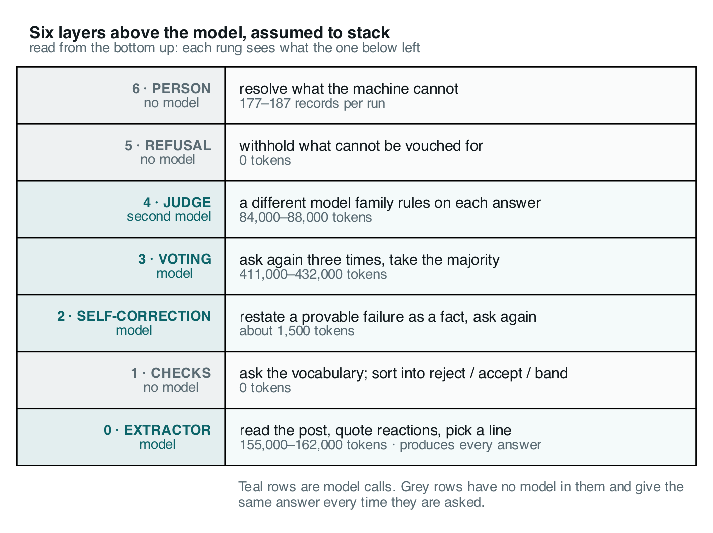
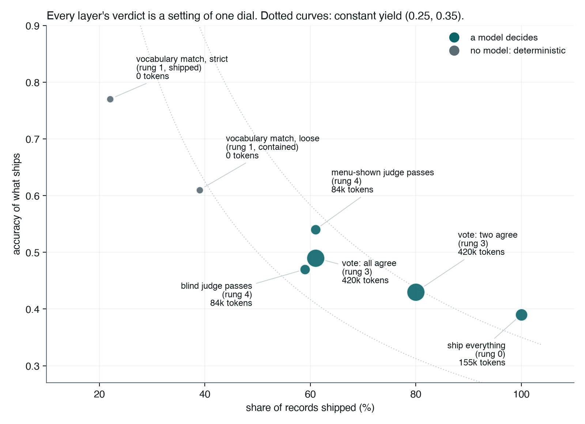
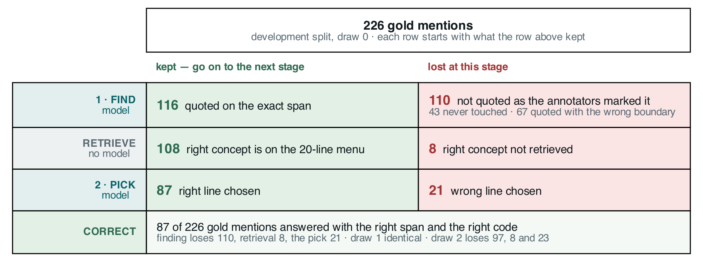

# Measuring the AI Reliability Ladder: What Six Layers Around a Language Model Bought, and What They Charged

*Checking, self-correction, voting, a second-model judge, refusal and a human desk, priced against each other on the same records, on a task with an answer key*

*[byline: author order to be agreed]*

> **Draft note for the owners.** InfoQ-shaped rewrite of `article-v3-CADEC.md`. Every number is from the base run `rerun-cadec-d0/d1/d2` (2026-09-03) or the single held-out run `phaseF-test-1`, and is labelled by split. Earlier experiments are named without figures, as in the source. Figures: `figures/infoq-fig1-ladder.png`, `infoq-fig2-dial.png`, `infoq-fig3-funnel.png` (sources beside them, rendered by `figures/make_infoq_figs.py`) and the existing `figures/fig7-pipeline-cadec.png`. Prose and lists run about 3,425 words excluding tables and captions; with two 75-word bios the piece is about 3,575 against a 3,500 budget.

---

## Key takeaways

- The model produced every answer. Of the six layers above it, the one that decided what shipped was a zero-token string comparison against the vocabulary; the three that cost tokens spent about half a million per run and changed one shipped answer in 53.
- Reliability layers of this kind select; they do not correct. Every one works by withholding, so precision rises as yield falls. Print yield beside precision, and treat how much to withhold as the deployer's dial.
- Measure the run-to-run floor before measuring an improvement. Three identical runs at temperature 0 differed by four F1 points, and a bootstrap blind to that variance confirmed a change whose sign reversed on the third run.
- Divide the labour. The model reads: it finds spans and picks from a menu. Deterministic code holds the knowledge: retrieve candidates, resolve codes, check existence. Asked to recall identifiers directly, the model fabricated 13 to 18 percent of them.
- Nothing above the extractor can see what it missed. Not voting, not a judge, not the human desk. Detection is the ceiling, and every layer above it is a precision instrument.

---

## The promise, and the catch

Most of what an organisation knows about its own work is written down as prose: clinical notes, incident reports, support tickets, forum posts. Language models can read that prose in a way nothing before them could. Give one a patient's post and it will find where a reaction is described and say what the reaction is. That promise is real: the model we used touched four of every five reactions the annotators had marked.

A language model is not a dependable component, though. It can be 80 percent right and unable to tell you which 80 percent, and wherever a wrong answer costs something that is unusable. The standard response is to wrap it in layers until the whole behaves as if it were dependable: check its output against something deterministic, send provable failures back, sample it and vote, have a second model judge it, withhold what cannot be corroborated, send the rest to a person. Each layer has published work behind it. We wanted them priced against each other on the same records, in the same run, with the free layer entered as a competitor rather than as preprocessing.

That needs a task where "right" can be graded, which is why we chose CADEC, the CSIRO Adverse Drug Event Corpus: 1,250 forum posts about two drugs, every adverse reaction marked as a span of the writer's own words and given a SNOMED CT code. Find every reaction, code each one, be able to defend it. It is the shape of a great deal of production work, structured records pulled out of prose and normalised against a controlled vocabulary, and unlike most production work it comes with an answer key.

Two caveats. A supervised system does this task far better: CONORM, fine-tuned on 875 of CADEC's 1,250 files, reaches about 0.70 end to end against our 0.20. We did not use one on purpose: most teams have no 875 annotated files, and a fine-tuned model still cannot tell you which of its answers to trust. And we spent our held-out split once, 60 documents, one run. Its numbers are the claim; everything else here is development-side and says so.

| held-out split, 60 documents, run once | bare model | with the ladder |
|---|---|---|
| answers shipped | all 314 | 72 (23%) |
| errors per 100 shipped answers | 59.6 | 3.8 |
| records sent to a person | 0 | 242 |

*End-to-end F1 of what ships is 0.204 span-exact.*

Not a good result. An honest one. The error rate fell fifteenfold because two of the six layers withheld what they could not vouch for, and neither costs a token. Most of this article is about the other four.

## The pipeline: the model reads, the vocabulary knows

**The model is never asked for a code, and everything above it depends on that choice.**


*Figure 1: The pipeline. Two model calls, and neither ever sees a SNOMED code. Everything between and after them is deterministic.*

The first call is given the whole post and asked to quote every reaction in the writer's exact words, including the ones the writer denies, and the same reaction twice if it is described twice. It is asked for no concept and no code. CADEC is non-transferable, so this post is ours:

```
Been on this for arthritis pain for about three months now. The first
week I was a bit drowsy in the afternoons, and I still get drowsy if I
take it late. No stomach trouble at all so far, which is more than I
can say for the last one. Some days I just feel awful and have no stamina.
```

The model returns six spans, including the condition the drug was taken for, the drowsiness twice, and the denied stomach trouble; each is a rule we wrote after measuring the corpus. Then a retriever with no model in it embeds each span, matches it against 227,554 keyword-to-code rows, and turns the twenty best-scoring concepts into a numbered menu. This is the real menu for `"bit drowsy"`:

```
     [0] drowsy
     [1] dizziness - giddy
     [2] dizziness
     [3] gets drowsiness
     [4] bites self
     ...
     [19] epidemic dropsy
```

Line 0 is right, and several lines under it are the embedder matching on the letters *b-i-t*. The second call is given that menu and asked for a line number, with `null` available when nothing fits. It answers `0`, and a lookup table turns line 0 into `271782001` |Drowsy|. The code the system ships was looked up, never generated, because a position cannot be misspelled and a name can.

We arrived at this shape by measuring the alternatives, on the same 40 development documents, three cold runs each:

| | **recall the code** | **name the concept** | **pick from a menu** *(shipped)* |
|---|---|---|---|
| the model returns | span, concept name and code | span and concept name | span, then a line number |
| where the code comes from | the model's memory | a lookup on the name | a lookup on the line |
| F1 span-exact, three runs | 0.030 · 0.030 · 0.024 | 0.252 · 0.253 · 0.276 | **0.393 · 0.393 · 0.434** |
| tokens per run | 141,000–147,000 | 82,000 | 155,000–162,000 |
| replies that would not parse | 3 of 40, every run | 1 · 0 · 0 | 0 |

The first column is not weak. It is broken: eight to ten times worse than the second, for 1.7 times the tokens. It was allowed to answer `null` for a code it did not know and did so on 16 to 38 percent of its records, and of the codes it committed to, 13 to 18 percent exist in no SNOMED release. **An abstention hatch reduces fabrication. It does not remove it.**

One scoring convention travels with every number below: the headline F1 is *span-exact*, so quoting `"extreme rectal bleed"` where the annotators wrote `"rectal bleed"` counts as a false positive and a false negative, for naming the same concept correctly.

## The ladder



*Figure 2: The six layers above the extractor. Teal rows are model calls; grey rows have no model in them. Costs are per run on the development split.*

One detail matters later: the judge must be a different model family from the extractor, enforced in code, because the same family would measure self-consistency rather than correctness.

All of it rests on one assumption: that they stack. Before we could test that, we had to know what noise looked like, and we got that wrong first.

## We nearly published a result that was not there

**Three identical runs of the unchanged system differed by four points of F1, at temperature zero. Every improvement measured without knowing that flattered us.**

We ran the extraction step three times, cold, on the same 40 documents, at temperature 0: greedy decoding, the knob everyone reaches for already turned all the way down. Two runs were identical to the byte. The third diverged at its fifth request and on every prompt downstream. The spread was 87, 87 and 98 correct answers out of 226: four points of F1.

The case that taught us was a reranker: reorder the menu so a good concept at line 14 moves up. A paired bootstrap over documents came back above zero with an interval that excluded zero. Significant. Most write-ups stop there. On the second run the gain was smaller; on the third the sign reversed. The test was not broken; it answers a narrower question than it appears to. A bootstrap over documents asks *would this hold on different documents?*, never *would this hold on a different run?*, and here the run-to-run term is the larger one. The reranker stays off.

Then, worse. The helper computing those intervals resampled with `set(random.choices(...))`, and the `set()` deleted the duplicates a bootstrap depends on. It ran that way for a month, because the intervals looked fine, and had already judged every change to the extractor we had accepted. Re-tested at three runs, the changes survived; one of their headline claims did not.

**A wrong number that looks wrong gets found. A wrong number that looks right becomes evidence.** From here on, every arm was measured on three runs, all three reported, against a four-point floor.

## What each layer bought, and what it charged

**The model produced every answer. Of the layers above it, the two that did their jobs cost nothing, and the three that cost tokens either could not be tested, could not be shown to help, or were not read.**

| layer | what it is for | did it do that? | cost per run |
|---|---|---|---|
| deterministic checks | sort into lanes, not raise accuracy | **yes**: the lanes separate 2.8× | 0 tokens |
| self-correction | restate a provable failure as a fact | barely exercised: fired 2, 2 and 3 times, corrected none | ~1,500 tokens |
| voting | catch answers the model cannot reproduce | **no**: net +1, −1, −1; destroyed 2, 3 and 5 right answers | 411,000–432,000 tokens |
| second-model judge | rule on whether an answer is right | **yes, once shown the menu**: 3.4–4.2× separation; read by nothing | 84,000–88,000 tokens |
| refusal | guard in front of a person | **yes**: ships at 0.74–0.82 accuracy on 21–23% of records | 0 tokens |
| person | resolve what the machine cannot | not measured | 177, 177 and 187 records |

*Development split, three runs, 230, 230 and 238 records over 40 documents. Where the runs differ, all three are printed.*

**The deterministic checks** sort every record into one of three lanes. REJECT means a check failed: the code does not exist, or the quote is not in the post. ACCEPT means the span's text matches one of the concept's own names in the vocabulary, `"chronic pain"` against |Chronic pain|. BAND means nothing fired and nothing matched. The lane is assigned by nine lines of string comparison, with no model and no answer key.

Scored afterwards, ACCEPT is 75.5, 75.5 and 82.4 percent correct across the three runs, and BAND is 26.9, 26.9 and 30.4 percent. A 2.8× separation, identical on every run, for zero tokens. It is not a correctness claim: where two concepts share a name, the check accepts whichever the model picked. REJECT holds two or three records per run, all of them quotes the model composed rather than read. Planted into the answer key, fabricated quotes, nonexistent codes and wrong-branch concepts are caught every time; a near miss, a real concept that is simply the wrong one, is caught 4 times in 6,492. **A free check can prove an answer cannot be right. It can never show that it is.**

The check has a precondition, and one query tests it. Run over the answer key itself, only 73 of the 226 development mentions can land in ACCEPT: 32 percent of even a perfect answer set, because the writer's words and the vocabulary's names coincide only that often. The other 68 percent is the bill the paid rungs exist to work through, and its size is knowable before a token is spent.

**Self-correction** fires only on REJECT, so it fired 2, 2 and 3 times per run, each time on a quote that was not in the post. Each time the model relocated one quote and corrected no answer. Unmeasured, not refuted.

**Voting** costs 411,000 to 432,000 tokens per run, 2.5 to 2.8 times the entire extraction step. It changed 25, 28 and 27 codes and moved net correct answers by +1, −1 and −1, turning right answers wrong 2, 3 and 5 times against 3, 2 and 4 the other way. Most of what it changed were spans that sit on no gold mention at all. The voter is the same model as the answerer, so a vote carries no information the original answer lacked; on the held-out split it re-found eight records, all wrong.

**The judge** is a 3.2B-parameter model grading a 20B one, and as first built it barely separated right from wrong: 1.7×. That was our fault: we had asked whether `1003722009` was correct and shown it neither the concept's name nor the menu. Shown what the extractor was shown, the same model separates 3.4 to 4.2×, above the free check, and gains a verdict it could not express blind, *the right answer is not on this list*, which mostly fires on invented spans, the one failure nothing else in the ladder can see. Then the sentence that stood for five phases of development: **nothing reads its verdict.** It is written to a field no downstream rung consults.

**Refusal** ships ACCEPT and withholds everything else, at zero model calls. It had a confidence threshold too, retired because the extractor reports confidence of 1.0 on 66 percent of its answers and never below 0.9, on a run that is right 38 percent of the time.

Then we deleted the three paid layers, replayed the refusal decision on the same records, and counted what changed. **One shipped answer of 53 on draw 0, none on draws 1 and 2.** The one was voting overwriting a correct, vocabulary-verified |Pain| with |Increased pain| on a two-to-nothing vote.

## It is a dial, not a staircase

**Every verdict carries information. None makes the system produce more right answers, and they do not stack.**



*Figure 3: Every layer's verdict read as a shipping rule, over the same records. Grey points are deterministic rules, teal points are model-driven, bubble size is tokens per run. Means over three runs.*

Each verdict can be read as a shipping rule. Run every rule over the same records and the rungs stop looking like a staircase and start looking like settings of one dial:

| ship only when… | ships | accuracy | **yield** | errors | tokens per run |
|---|---|---|---|---|---|
| the extractor says so: everything | 233 | 0.39 | **0.389** | 142 | 0 extra |
| the vocabulary check says ACCEPT *(shipped)* | 52 | **0.77** | 0.175 | **12** | 0 |
| the loose vocabulary check says ACCEPT | 91 | 0.61 | 0.236 | 36 | 0 |
| every voting sample chose the same code | 142 | 0.49 | 0.295 | 73 | ~420,000 |
| at least two samples agree | 186 | 0.43 | 0.341 | 107 | ~420,000 |
| the blind judge passes | 138 | 0.47 | 0.278 | 74 | ~84,000 |
| the menu-shown judge passes | 141 | 0.54 | **0.331** | 64 | ~84,000 |

*Means over the three development runs. Yield is correct answers over all records, shipped or not. The loose-check row is computed from the source article's policy table on the same basis as the others.*

Filter on any verdict and accuracy rises above the 0.39 of shipping everything, so the paid rungs were not noise. But every row ships fewer correct answers than shipping everything, because every one works by withholding, and the free check plus the menu-shown judge ships the same 52 records as the free check alone. What the judge earns is a setting the free check cannot give, three fifths of the batch at 0.54, for 84,000 tokens a run. Voting earns a worse one at five times the price.

**Abstaining always raises precision, whatever you abstain on and however badly.** Yield cannot be fooled that way, which is why we print it beside every accuracy figure. Moving from the top row to the shipped one on draw 0 means 128 fewer errors, 49 fewer correct answers, and 177 more records for a person. Three currencies moving in three directions, and no optimum: only a break-even set by what a wrong answer, a missing answer and a review each cost you, which a hospital and a research pipeline will price differently. Every setting we measured ships either everything or between 15 and 40 percent of the batch; the ceiling is the free check's ability to sort, not the policy on top of it.

## Where the system actually loses

**The domain knowledge was never missing. The model loses at reading, and nothing above it can see what it did not read.**

The obvious response to a general model failing on a specialist task is a specialist model. We tried two and rejected both: a domain-adapted encoder put more right concepts on the menu and the picks got worse; a domain-adapted generator failed to answer on most documents.



*Figure 4: Where the 226 development-split gold mentions go, draw 0. Each row is a stage; the green cell is what survives to the next row, the red cell is what that stage loses. Read down the green column: 226 → 116 → 108 → 87.*

Once the right concept is on the menu, the model picks it 81 percent of the time. That is the specialist half of the task, and it is fine; the retriever, with no model in it, puts the right concept on the menu for 93 percent of the spans the model finds. Where the system loses is finding: 110 of 226 mentions are not proposed as the annotators marked them, and 31 proposed spans sit on nothing they marked at all.

Neither failure is medical. The 43 mentions the model never touched are single words like `"sore"` and conditions mentioned in passing, `"gout"`, `"stroke"`, which the corpus convention counts and the model reads as background; the 67 with the wrong boundary are `"extreme rectal bleed"` for `"rectal bleed"`; the 31 inventions are figures of speech read literally, `"at my wits end"` coded as |Wanders at night|.

This is why the two largest gains we ever measured were a worked example in the prompt, in the corpus's own conventions, and a rule to extract denied reactions. What the general model lacked was not the vocabulary but the annotation convention, and no domain model supplied that either.

And it is why one limit is structural. **Every rung operates on records the extractor already proposed.** The checks reject, voting re-scores, the judge rules per record, refusal withholds. Not one can put a mention on the table, not even the human desk, which shows a reviewer a span the system found and offers codes for it. There is no control for *you missed one*. The ladder's ceiling is the extractor's detection, 0.521 exact on the held-out split. Reliability engineering of this kind makes a system's answers more trustworthy. It does not make the system see more.

## Why none of it showed up in a test

**Every layer passed its own tests. The failures were between the layers, and in a metric that could not see them.**

Only one verdict travels through the ladder, and it is the free one. Self-correction, voting and the judge each write a field, and nothing reads any of them. Voting reaches the refusal step only by re-running the free check over whatever code it left behind; the judge writes into a dead end. No test caught this, because every layer does exactly what it says it does.

Then the metric. Voting overwrote codes without re-validating, so records shipped marked *verified* against a code they no longer had. Fixing that moved exact F1 from 0.204 to 0.204, because precision and recall cannot tell an unwarranted answer from an incorrect one. **We built seven layers to decide which answers are trustworthy, then scored them with a metric that cannot see the difference.** All of it was found by re-measuring things that had already looked fine.

## What to do on Monday

**What transfers is not the ladder. It is five practices and a division of labour.**

Five practices, each learned by getting it wrong first:

- **Understand the data and what you actually need out of it before you add a layer.** The two largest gains we ever measured came from studying the corpus: a worked example in the annotators' own conventions, and a rule to keep denied reactions once we saw that the answer key counts them and the model was dropping them.
- **Condition your confidence on something that does not resample**, a vocabulary, a schema, a type check, a compiler, and test it before you build on it. One query against the answer key told us the free lane's ceiling; replaying the check over the answer key, where every rejection is false by construction, took its false-rejection rate from nearly one in ten to 0.1 percent.
- **Measure your floor before you measure an improvement.** Three runs minimum, all three reported, and any go/no-go probe run on the denominator the arm will be scored on: our encoder probe said go over the whole corpus, and on the forty documents the arm ran on the sign was negative.
- **Grep for the readers of every field you write**, and measure an orphan before adopting it. Forty lines of regex found the three verdicts nothing read; five phases of passing tests had not.
- **Judge each layer against its own purpose, and check that your metric can see the defect you are preventing.** Print yield beside every accuracy figure; any layer that withdraws answers looks good on the wrong column.

And the division of labour. The model is the only component that can read, so give it the reading and give everything else to code that does not resample, mixed freely inside one pipeline:

| job | whose | evidence |
|---|---|---|
| read the prose and propose candidates | **the model** | the one thing it does well, and nothing else in the pipeline can propose one |
| recall a fact from a closed set: an identifier, a code, a key | a lookup, not the model | F1 0.03 asked for the code against 0.39–0.43 looked up; 13–18% of recalled identifiers did not exist |
| narrow and rank the candidates the model chooses from | deterministic tooling: an index, a retriever | a retriever with no model in it put the answer on the menu 93% of the time; the model then picked it four times in five |
| verify what can be verified mechanically: existence, format, grounding, type | deterministic checks | exact on those classes, for free, identical on every run |
| judge whether an answer is right | **a second model, shown the evidence** | 1.7× separation blind, 3.4–4.2× with the menu, at 84,000 tokens a run |
| grade its own output: self-correct, vote, report confidence | not the model | self-correction corrected none; voting's sign changed with the run; confidence never below 0.9 while right 38% of the time |
| decide how much to withhold | **you** | three currencies moving in three directions, and a break-even only the deployer has |

## What we could not settle

- **Why a model at temperature 0 repeats itself on two runs and not the third.** The diverging prompt sent eight times in isolation returns one reply; it moves only inside a full run, so whatever the inference server carries between requests is the remaining suspect.
- **Whether the looser vocabulary match should ship.** It wins on yield three runs of three and roughly triples the errors per hundred records. That trade is the deployer's; we left the default where the held-out run was made.
- **We assume exactly one code is right.** Where two concepts share a name, a defensible synonym is scored wrong, and we have not measured how much of our miscoding is of that kind.
- **The judge is a 3.2B model grading a 20B one, the extractor was frozen early, and CADEC is from 2015 and almost certainly in pretraining data.** Every absolute number here would move with those; the comparisons between layers do not.

We set out believing that stacking reliability layers buys reliability. Measured end to end, they made errors visible rather than fewer: worth a great deal, and not what they were bought for. The model reads. Almost everything else belongs to something that does not resample, and one job belongs to you.

---

Code, ledger, decision records and the source for every figure: **github.com/wbagais/reliability-ladder**. CADEC is non-transferable; we ship document IDs, never text.

## About the authors

*[two bios to be supplied, about 75 words each, in the agreed author order]*
