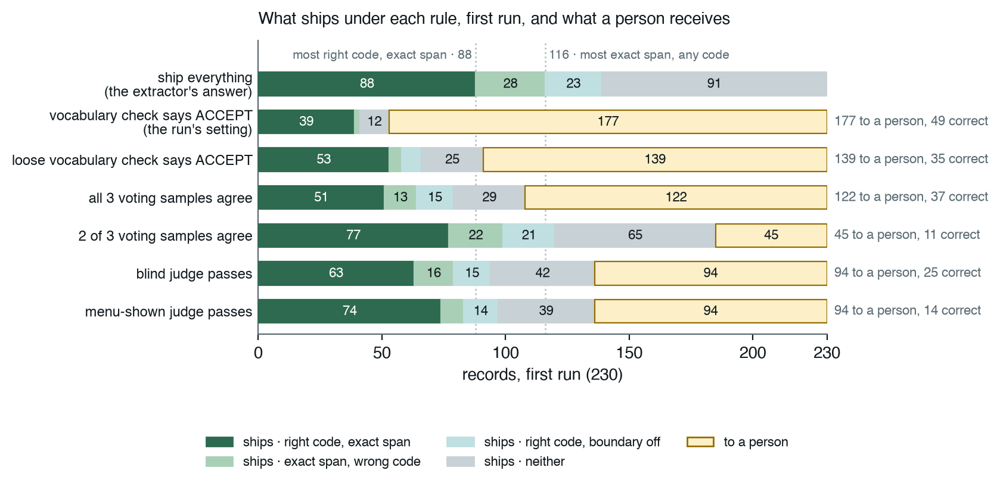

# Six Reliability Layers Around an LLM Sorted Its Answers and Fixed Almost None

*Wejdan Bagais and Pushpdeep Mishra*

---

## Key takeaways

- Reliability layers do not make a model more accurate; they tell you which answers to trust. Plan for whoever handles what they refuse to ship.
- Start with the check that costs nothing: a string comparison against our vocabulary sorted answers into tiers 83 and 28 percent correct; three paid layers changed one shipped answer.
- Ask the model to read, never to remember: it picked well from a retrieved menu but invented 13 to 18 percent of the codes asked of it.
- Never trust one run, even at temperature 0: two runs matched byte for byte, the third agreed on 70 percent of mentions, and that gap reversed an improvement's sign.
- Score what a layer withholds, not only what it ships: precision rises whenever answers are withdrawn; yield does not.

---

## The promise, and the catch

Most of what an organisation knows about its own work is prose: clinical notes, incident reports, support tickets, forum posts. Language models can read it as nothing before them could.

A language model is not a dependable component, though. It can be 80 percent right and unable to say which 80 percent, and wherever a wrong answer costs something, that is unusable. The standard response is layers: check its output against something deterministic, send provable failures back [1], sample it and vote [2], have a second model judge it [3], withhold what cannot be corroborated, send the rest to a person. We wanted them priced against each other on the same records, with the zero-token check entered as a competitor.

That needs a task where "right" can be graded, so we chose CADEC, the CSIRO Adverse Drug Event Corpus [4]: 1,250 forum posts about two drugs, every adverse reaction marked as a span of the writer's own words and given a SNOMED CT code. It is the shape of much production work: records pulled from prose and normalised against a vocabulary.

Two caveats. A supervised system does this far better: CONORM [5], fine-tuned on 875 of CADEC's 1,250 files, reaches about 0.70 end to end against our 0.20. We did not use one: most teams have no 875 annotated files, and a fine-tuned model still cannot say which answers to trust. And we spent our held-out split once, 60 documents, one run; every other number is development-side and says so.

| held-out split, 60 documents, run once | records | correct | accuracy |
|---|---|---|---|
| bare model, everything | 314 | 127 | 0.40 |
| ACCEPT tier, shipped | 72 | 60 | 0.83 |
| BAND and REJECT tiers, sent to a person | 242 | 67 | 0.28 |

*End-to-end F1 of what ships is 0.204 span-exact. Errors per 100 records: 59.6 bare, 3.8 shipped.*

As a product this is not shippable: three quarters of the batch went to a person, and that tier holds more correct answers than the shipped one. As a signal it is the result: a zero-token check split two-in-five odds into five in six and two in seven. It improved nothing; it sorted.

## The pipeline: the model reads, the vocabulary knows

**The model is never asked for a code, and everything above it depends on that choice.**


*Figure 1: The pipeline. Two model calls, and neither ever sees a SNOMED code. Everything between and after them is deterministic. Image: the authors.*

The first call is given the whole post and asked to quote every reaction in the writer's exact words, including denied ones, and twice if described twice. CADEC is non-transferable, so this post is ours:

```
Been on this for arthritis pain for about three months now. The first
week I was a bit drowsy in the afternoons, and I still get drowsy if I
take it late. No stomach trouble at all so far, which is more than I
can say for the last one. Some days I just feel awful and have no stamina.
```

The model returns six spans, including the condition the drug treats, the drowsiness twice and the denied stomach trouble. A retriever with no model in it then embeds each span against 227,554 keyword-to-code rows and lists the twenty best-scoring concepts as a numbered menu. The real menu for `"bit drowsy"`:

```
     [0] drowsy
     [1] dizziness - giddy
     [2] dizziness
     [3] gets drowsiness
     [4] bites self
     ...
     [19] epidemic dropsy
```

Line 0 is right; several below it match the letters *b-i-t*. The second call is given the menu and asked for a line number, or `null`. It answers `0`, and a lookup table turns line 0 into code `271782001`, named |Drowsy| in SNOMED's bar notation, used throughout. The code was looked up, never generated.

We arrived at this shape by measuring the alternatives, 40 development documents, three cold runs each:

| | **recall the code** | **name the concept** | **pick from a menu** *(shipped)* |
|---|---|---|---|
| the model returns | span, concept name and code | span and concept name | span, then a line number |
| where the code comes from | the model's memory | a lookup on the name | a lookup on the line |
| F1 span-exact, three runs | 0.030 · 0.030 · 0.024 | 0.252 · 0.253 · 0.276 | **0.393 · 0.393 · 0.434** |
| tokens per run | 141,000–147,000 | 82,000 | 155,000–162,000 |
| replies that would not parse | 3 of 40, every run | 1 · 0 · 0 | 0 |

The first column is not weak but broken: eight to twelve times worse than the second, for 1.7 times the tokens. It answered `null` on up to 38 percent of records, and of the codes it committed to, 13 to 18 percent exist in no SNOMED release. **An abstention hatch reduces fabrication; it does not remove it.**

One convention holds throughout: F1 is *span-exact*, so quoting `"extreme rectal bleed"` where the annotators wrote `"rectal bleed"` counts as a false positive and a false negative.

Above this sit the six layers; the judge is a different model family from the extractor, or it would measure self-consistency. Testing whether they stack meant first knowing what noise looked like, and we got that wrong.

## We nearly published a result that was not there

**Three identical runs of the unchanged system differed by four points of F1, at temperature zero.**

We ran the extraction step three times, cold, on the same 40 documents, at temperature 0. Two were byte-identical; the third diverged from its fifth request on: 87, 87 and 98 correct of 226, four points of F1. The third still agreed with the pair on 70 percent of mentions outright, and on 84 percent of codes where all three found the same span; the remainder was worth those four points.

The case that taught us was a menu reranker. A paired bootstrap over documents excluded zero; on the second run the gain was smaller, and on the third the sign reversed. The test answers *would this hold on different documents?*, never *on a different run?*, and here the run-to-run term is the larger one.

Worse: the helper computing those intervals wrapped `random.choices` in `set()`, deleting the duplicates a bootstrap depends on, and ran that way for a month because the intervals looked fine. Re-tested at three runs, one headline claim did not survive.

**A wrong number that looks wrong gets found. A wrong number that looks right becomes evidence.** From here on, every change was measured on three runs, all reported.

## What each layer bought, and what it charged

**The check sorted and refusal withheld; neither corrected anything. The three paid layers could not be tested, could not be shown to help, or were not read.**

| layer | what it is for | did it do that? | cost per run |
|---|---|---|---|
| vocabulary check | sort into lanes, not raise accuracy | **yes**: the lanes separate 2.7–2.8× | 0 tokens |
| self-correction | restate a provable failure as a fact | barely exercised: fired 2, 2 and 3 times, corrected none | ~1,500 tokens |
| voting | catch answers the model cannot reproduce | **no**: net +1, −1, −1; destroyed 2, 3 and 5 right answers | 411,000–432,000 tokens |
| second-model judge | rule on whether an answer is right | **yes, once shown the menu**: 3.4–4.2× separation; read by nothing | 84,000–88,000 tokens |
| refusal | guard in front of a person | **yes**: ships at 0.74–0.82 accuracy on 21–23% of records | 0 tokens |
| person | resolve what the machine cannot | not measured | 177, 177 and 187 records |

*Development split, three runs, 230, 230 and 238 records over 40 documents.*

**The vocabulary check** sorts every record into three lanes: REJECT, the code does not exist or the quote is not in the post; ACCEPT, the span's text matches one of the concept's own names, `"chronic pain"` against |Chronic pain|; BAND, neither.

Scored afterwards, ACCEPT is 75.5, 75.5 and 82.4 percent correct and BAND is 26.9, 26.9 and 30.4 percent: a 2.7 to 2.8× separation for zero tokens. **The check can prove an answer cannot be right. It can never show that it is.**

Its precondition, tested by one query over the answer key: only 73 of the 226 development mentions can land in ACCEPT, 32 percent of a perfect answer set, because the writer's words and the vocabulary's names coincide only that often. The other 68 percent is the paid layers' bill.

**Self-correction** fires only on REJECT, so it fired 2, 2 and 3 times per run and corrected nothing: unmeasured, not refuted.

**Voting** costs 2.5 to 2.8 times the extraction step and changed about 27 codes a run, as many right to wrong as wrong to right, mostly on spans that sit on no annotated mention. The voter is the answerer, so a vote carries no information the answer lacked.

**The judge** is a 3.2B-parameter model grading a 20B one, and as first built it barely separated right from wrong: we had shown it a nine-digit code and neither the concept's name nor the menu. Shown what the extractor was shown, it separates twice as well and gains a verdict it could not express blind, *the right answer is not on this list*. And then: **nothing reads its verdict.**

**Refusal** ships ACCEPT and withholds everything else. That is the setting we measured, not a recommendation. A confidence threshold was retired: the extractor reports 1.0 on 66 percent of answers and never below 0.9, while right 39 percent of the time.

Then we deleted the three paid layers, replayed refusal and counted the change. **One shipped answer of 53 on the first run, none on the other two**: voting overwriting a correct |Pain| with |Increased pain|.

## It is a dial, not a staircase

**Every verdict carries information. None makes the system produce more right answers, and they do not stack.**



*Figure 2: The first run's 230 records under each shipping rule. Dark green: right code on the exact span; light green: exact span, wrong code; light teal: right code, boundary off; grey: neither; amber: to a person. Image: the authors.*

Read each verdict as a shipping rule over the same records, and the layers become settings of one dial:

| ship only when… | ships | to a person | correct | accuracy | yield | **F1** | tokens per run |
|---|---|---|---|---|---|---|---|
| the extractor says so: everything, after voting | 233 | 0 | 90 | 0.39 | **0.388** | 0.405 | 0 extra |
| the vocabulary check says ACCEPT *(the run's setting)* | 52 | 180 | 40 | **0.77** | 0.173 | 0.292 | 0 |
| the loose vocabulary check says ACCEPT | 91 | 142 | 55 | 0.61 | 0.236 | 0.353 | 0 |
| all three voting samples agree | 116 | 117 | 57 | 0.50 | 0.246 | 0.345 | ~420,000 |
| at least two of three samples agree | 186 | 46 | 79 | 0.43 | 0.341 | 0.396 | ~420,000 |
| the blind judge passes | 138 | 94 | 65 | 0.47 | 0.278 | 0.363 | ~84,000 |
| the menu-shown judge passes | 141 | 91 | 77 | 0.54 | 0.331 | **0.430** | ~84,000 |

*Means over three development runs of 230, 230 and 238 records against 226 annotated mentions. Accuracy is correct over shipped; yield is correct over all records; F1 is span-exact on what ships, so a withheld answer is a miss. Voting rows send a split or a missing sample to a person; the loose check accepts a span contained in a concept name.*

Filter on any verdict and accuracy rises above the 0.39 of shipping everything, so the paid verdicts were not noise, and every row ships fewer correct answers because every one withholds. F1 sees both sides. ACCEPT and strict voting give up eleven and six points of it to send half or more of the batch to a person; the loose check, loose voting and the blind judge land within about five points of shipping everything; only the menu-shown judge clears it, by two to three points on every run, for 84,000 tokens.

The dotted lines in Figure 2 are the ceiling: no rule ships more than 88 right codes or 116 exact spans, because that is all the extractor found. Everything right of that line is the next section's loss.

**Abstaining always raises precision, whatever you abstain on and however badly.** Yield cannot be fooled that way, so we print it beside accuracy. Moving from the top row to the run's setting means 128 fewer errors, 49 fewer correct answers and 177 more records for a person; the correct answers given up outnumber those kept. Each row is what you get by shipping on that verdict; we choose none.

## Where the system actually loses

**The domain knowledge was never missing. The model loses at reading, and nothing above it can see what it did not read.**

We tried two specialist models and rejected both: a domain-adapted encoder put more right concepts on the menu and the picks got worse; a domain-adapted generator would not answer.


*Figure 3: Where the 226 development-split annotated mentions go, first run. Green is what survives to the next stage, amber is what that stage loses: 226 → 116 → 108 → 87. Image: the authors.*

Once the right concept is on the menu, the model picks it 81 percent of the time, and the retriever puts it there for 93 percent of the spans the model finds: the specialist half is fine. It loses at finding: 110 of 226 mentions are not proposed as the annotators marked them, and 31 proposed spans sit on nothing.

Neither failure is medical. The 43 mentions the model never touched are single words like `"sore"`; the 67 with the wrong boundary are `"extreme rectal bleed"` for `"rectal bleed"`; the 31 inventions are figures of speech read literally, `"at my wits end"` coded as |Wanders at night|. Our two largest gains were a worked example in the corpus's conventions and a rule to extract denied reactions; no domain model supplied either.

One limit is structural. **Every layer operates on records the extractor already proposed.** The ladder's ceiling is the extractor's detection, 0.521 exact on the held-out split.

## Why none of it showed up in a test

**Every layer passed its own tests. The failures were between them, and in a metric that could not see them.**

Only one verdict travels through the ladder, the vocabulary check's; self-correction, voting and the judge each write a field that nothing reads. No test caught this, because every layer does what it says.

Then the metric. Voting overwrote codes without re-validating, so records shipped marked *verified* for a code they no longer held. Fixing that moved exact F1 from 0.204 to 0.204: precision and recall cannot tell an unwarranted answer from a wrong one. **We built six layers to decide which answers to trust, then scored them with a metric that cannot see the difference.**

## What to do on Monday

**What transfers is not the ladder but five practices and a division of labour.**

- **Understand the data before you add a layer.** Our two largest gains came from studying the corpus.
- **Condition your confidence on something that does not resample**: a vocabulary, a schema, a compiler. Then test it against the answer key, where every rejection is false by construction.
- **Measure your floor before you measure an improvement.** Three runs minimum, all reported; run any go/no-go probe on the denominator the change will be scored on.
- **Grep for the readers of every field you write.** Forty lines of regex found three unread verdicts; months of green tests had not.
- **Check that your metric can see the defect you are preventing.** Print yield beside accuracy; a layer that withdraws answers looks good on the wrong column.

The division of labour follows. The model reads and proposes candidates, the one thing nothing else can do. Code holds the knowledge: a lookup recalls identifiers, an index narrows the candidates, deterministic checks verify existence, format, grounding and type. A second model, shown the evidence, may judge; the model should not grade itself. Which verdict to ship on is yours: three currencies moving in three directions, and a break-even only the deployer has.

## What we could not settle

- **Why a model at temperature 0 repeats itself on two runs and not the third.** Sent alone eight times, the diverging prompt returns one reply; it moves only inside a full run.
- **The looser vocabulary match.** It wins on yield in all three runs and roughly triples errors per hundred records; we show both and pick neither.
- **We assume exactly one code is right.** Where two concepts share a name, a defensible synonym scores wrong; how much miscoding is of that kind is unmeasured.
- **The judge is a 3.2B model grading a 20B one, and CADEC is from 2015 and almost certainly in pretraining data.** Absolute numbers would move with those; the comparisons would not.

We set out believing that stacking reliability layers buys reliability. Measured end to end, they sorted the answers by how far to trust them and fixed almost none: worth a great deal, and not what we bought them for. The model reads. Almost everything else belongs to code, and one choice to you.

---

Code, ledger, decision records and every figure's source: **github.com/wbagais/reliability-ladder**. CADEC is non-transferable; we ship document IDs, never text.

## References

1. Madaan et al., *Self-Refine: Iterative Refinement with Self-Feedback*, 2023. arxiv.org/abs/2303.17651
2. Wang et al., *Self-Consistency Improves Chain of Thought Reasoning in Language Models*, 2022. arxiv.org/abs/2203.11171
3. Zheng et al., *Judging LLM-as-a-Judge with MT-Bench and Chatbot Arena*, 2023. arxiv.org/abs/2306.05685
4. Karimi, Metke-Jimenez, Kemp and Wang, *Cadec: A corpus of adverse drug event annotations*, Journal of Biomedical Informatics 55, 2015. doi.org/10.1016/j.jbi.2015.03.010
5. Yazdani, Rouhizadeh, Bornet and Teodoro, *Context-Aware Entity Normalization for Adverse Drug Event Detection* (CONORM), medRxiv 2023. doi.org/10.1101/2023.09.26.23296150

## About the authors

**Wejdan Bagais** and **Pushpdeep Mishra**.

<!-- two bios to be supplied, about 75 words each -->
