# The AI Reliability Ladder, Measured Rung by Rung, on CADEC

> **This is the single-corpus version.** It reports the ladder on CADEC alone, and every development-side number in it comes from the base run `rerun-cadec-d0/d1/d2` of 2026-09-03. The two-corpus article, which adds FiNER-139 and the findings that only a second corpus could produce, is `article-v3.md`.

> **Where this stands.** Every number here is measured, labelled by split, and
> traceable to the run that produced it. Two claims that were at risk have been
> checked against their sources: the ~0.70 span-exact ceiling holds in the region
> we predicted, though the strongest supervised tagger on this corpus clears it by
> four points (section 8). Every development-side number comes from one base run
> of the full ladder — three cold draws, every arm replayed on the same cache,
> run ids `rerun-cadec-d{0,1,2}` — and
> nothing measured on an earlier run is quoted. Where an earlier experiment is
> mentioned it is named as such, without its figures; those live in the decisions
> log. What remains open is listed in section 10.

**Pushpdeep Mishra · Wejdan Bagais**

*Six reliability layers around a language model, measured one at a time on a
task with a real answer key — what each one bought, and what it charged.*

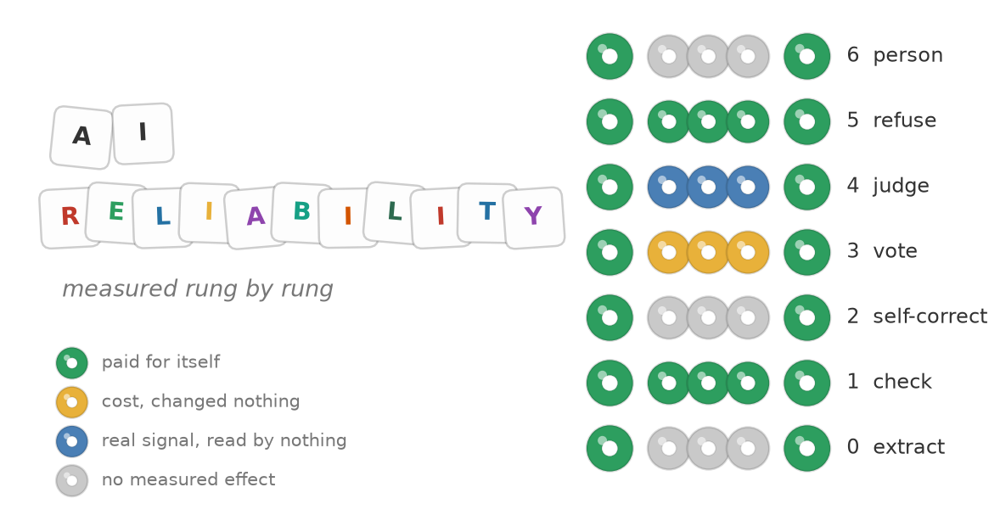

*Fig. 1: The seven rungs, coloured by what each one bought. The two that carry
the shipped result cost nothing; the judge carries a signal nothing reads.
Source: author-created with Matplotlib.*

---

## Five key takeaways

1. **The layer that did the shipped work was free.** A string comparison against the vocabulary — zero tokens, zero latency — sorts answers into a lane **75–82%** correct and one **27–30%** correct, and the refusal step ships only the first. The three paid layers — self-correction, sampled voting and a second-model judge — cost **496,000 to 521,000 tokens** per run between them and changed **one shipped answer out of 53 on one draw and none on the other two**. One of them earns something: shown the menu it is judging, the judge separates right from wrong 3.4–4.2×. But on the lane that ships it agrees with the free check on 52 records of 53, and nothing reads its verdict.
2. **That free check has a precondition, and one query tests it.** It works when the vocabulary's names and the writer's words come from the same language. On CADEC they do for less than half of even a perfect answer set — **43%** of gold mentions can land in the lane it vouches for, **57%** cannot, before any model runs — and that ceiling is knowable without spending a token. Test it before you build on it.
3. **The domain knowledge was never in the model, and we could not put it there.** Asked to recall a SNOMED identifier it fabricates one; two domain-adapted models made things worse, not better. What works is a division of labour: a retriever with no model in it puts the correct concept on a twenty-line menu for **93%** of the spans the model finds, and the model then picks it **four times in five**. Where the system loses is *finding* — 110 of 226 mentions not proposed as gold marks them, 31 spans invented outright. **The expertise lives in the vocabulary. The model's job is to read, and reading is where it fails.**
4. **Nothing above the extractor made the system better at the task**, and the number that improved was measuring something else. Refusal took answered accuracy from **0.38 to 0.74–0.82** and yield from **0.38 to 0.17** on the same records, three draws of three — abstaining always raises precision. The judge, once shown the menu it was judging, separates right from wrong **3.4–4.2×** where it had managed 1.7× blind; nothing reads its verdict. No layer we built can propose a mention the extractor missed; even a flawless reviewer left detection exactly where it started.
5. **Nondeterminism arrives in whole runs.** At temperature 0 the model we shipped repeated itself to the byte on **two draws of three** — 94 real calls each — and diverged on the third from the first find call onward, for a **4.1-point** spread in F1. Where all three runs found the same mention they chose the same code **84%** of the time; what varies is mostly the reading, not the labelling. Every measurement error we made inside that band flattered us.

---

## What an AI reliability ladder is for

A language model is not a dependable component. The standard response is to wrap
it in layers until the whole behaves as if it were: check the output against
something deterministic, ask the model to correct itself, sample it and take the
majority, have a second model judge it, withhold what cannot be corroborated,
send the rest to a person.

Six layers above the model. Each reasonable, each with published work behind it,
and all of them resting on one assumption — that they stack.

Each layer has its own literature and we lean on it below. What we could not find
published is the comparison *between* them: the layers priced against each other,
on the same records, in the same run, with the free one entered as a competitor
rather than as preprocessing. So we built all seven and measured each.

**On our task, the staircase is not there.** What follows is a reckoning with the
stack we built, not a proof about stacking — the next section says why the
distinction matters.

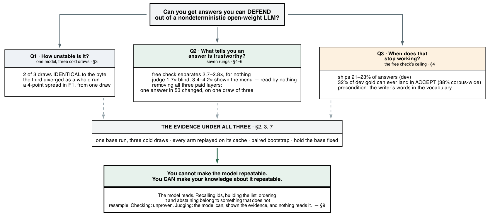

*Fig. 2: How to read this article. One question, three sub-questions, one body of
evidence under all three. Source: author-created with Graphviz.*

## The task, and the result

Read a patient's forum post about a drug. Find every adverse reaction. Assign each
a SNOMED CT code. There is a real answer key — CADEC, 1,250 posts, 9,111 annotated
mentions — and the task is the shape of many production pipelines: pull structured
records out of prose, normalise against a controlled vocabulary, be prepared to
defend each one.

That last part is the hard one. **A system that is 80% right and cannot tell you
*which* 80% is unusable wherever a wrong answer costs something.**

**A supervised model would do this task better, and we did not use one on
purpose.** Fine-tuned systems reach 0.72 end-to-end on CADEC against our 0.20,
and section 8 sets out that comparison with the caveats it needs. We are not
trying to win this benchmark. The question is whether the reliability scaffolding
people are already wrapping around general-purpose models — check it, correct it,
vote, judge, abstain, escalate — makes those models' answers defensible, and that
question needs a task where "defensible" can be graded. This one has an answer key
and a controlled vocabulary, which is exactly what it takes to grade it.

**The extractor could be made better, and we stopped improving it on purpose.**
This is a domain-specific task, and the largest gains we ever measured came from
understanding the data more closely — a worked example in the corpus's own
conventions, a rule about denied reactions — not from any layer above the
model. More of that work would raise every number in this article. We froze the
extractor once the ladder had a stable base, because the question here is what
the reliability layers buy on top of a given model, measured against each other
on the same records — not how good an agent for this one task can be made.

> **On the held-out split, run once and never re-run:** the system ships **23%**
> of its answers — 72 records of 314. On those it makes **3.8 errors per 100**,
> against **59.6** for the bare model. It sends the other **242** to a person.
> End-to-end F1 is **0.204 [0.150–0.260]** span-exact, **0.215** on overlap.

Not a good result. An honest one — and most of this article is about the things we
built that did not contribute to it. **The error rate fell by a factor of fifteen,
and two of the six layers above the model are why**: a free string comparison
against the vocabulary sorted the answers, and the refusal step declined to ship
the ones it could not vouch for. Of the three that cost tokens, one could not be
tested, one could not be shown to help, and one — the judge — turned out to carry
a real signal once we showed it what it was judging, which nothing in the shipped
configuration reads.

Three things to hold while reading. The held-out split was spent on that single
run, so **every other number here is development-side** and labelled as such; we
name the split every time, because the two do not agree and the difference is not
always in our favour. Every development-side figure comes from **one base run
of the full ladder — three cold draws, `rerun-cadec-d0/d1/d2`, 230/230/238
records** — with each arm replayed on the same draw, so adjacent numbers are
from the same records and we print all three draws where they differ. And the choice
of task bounds the conclusion: our strongest finding is that a free vocabulary
check beats every paid layer above it, and **on a task with no vocabulary to check
against, there is no free check to run.**

---

## 1. The dataset

An answer key is the whole experiment: a corpus where somebody has already written
down the right answer for every record, so that a score means something.

**CADEC v2** — the CSIRO Adverse Drug Event Corpus — is 1,250 posts from AskaPatient,
a consumer site where people write up their own experience of a medication. All
1,250 concern two drugs, diclofenac and atorvastatin. Annotation ran as two human
passes, mark the mentions and then attach the terminology, reviewed by a clinical
terminologist. Every adverse reaction the writer mentions is marked as a span of
their own words and given a SNOMED CT code. **One record is one span with one
code**, and our system has to produce both halves from the post alone.

### What the model is given, and what it gives back

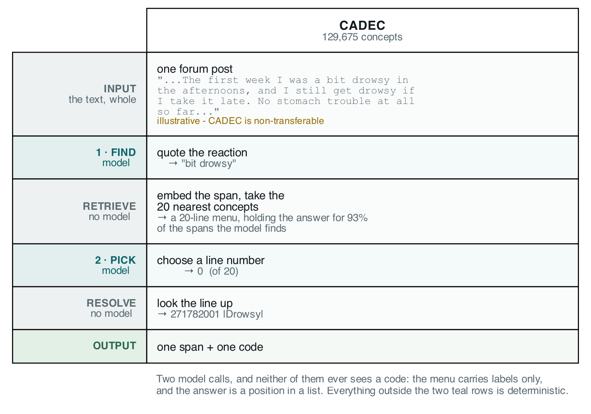

*Fig. 3: The pipeline. Two model calls; everything else is deterministic.
Source: author-created with Graphviz.*

**First call — find.** The model gets the whole post and an instruction asking
for every reaction, quoted as the writer's own exact words, character for
character — including reactions they say they did *not* have, and the same
reaction twice if it is described twice. It is asked for no concept and no code.

We cannot print a real post: CADEC is non-transferable, and annotated spans and
vocabulary labels are all this article can quote from it. This one is ours,
written to exercise those rules.

```
Been on this for arthritis pain for about three months now. The first
week I was a bit drowsy in the afternoons, and I still get drowsy if I
take it late. No stomach trouble at all so far, which is more than I
can say for the last one. Some days I just feel awful and have no stamina.
```

```json
{"mentions":[
  {"span_text":"arthritis pain",  "negated":false},
  {"span_text":"bit drowsy",      "negated":false},
  {"span_text":"drowsy",          "negated":false},
  {"span_text":"stomach trouble", "negated":true },
  {"span_text":"feel awful",      "negated":false},
  {"span_text":"no stamina",      "negated":false}]}
```

Six mentions: the condition the drug was taken for, a reaction described twice
and returned twice, a denied reaction kept rather than dropped, and a vague
state with no specific symptom in it. Every one of those is a rule we wrote
after measuring the corpus.

**Between the calls — retrieval, and there is no model in it.** Each span is
embedded by `granite-embedding:30m` and cosine-matched against 227,554
keyword-to-code rows covering SNOMED's findings and disorders. The twenty
best-scoring distinct concepts become a numbered menu. This is the real one:

```
reaction 1: "bit drowsy"
     [0] drowsy
     [1] dizziness - giddy
     [2] dizziness
     [3] gets drowsiness
     [4] bites self
     ...
     [19] epidemic dropsy
```

Line 0 is right, and several lines under it are the embedder matching on the
letters *b-i-t*. A retrieved menu is not a clean menu.

**Second call — pick.** The model gets that menu and an instruction to answer
with numbers only, never a concept name, with `null` and `no_concept` available
when nothing fits. It returns `{"picks":[{"reaction":1,"choice":0}]}`.

**The menu carries labels only. The model is never shown a SNOMED code, at any
point in the pipeline** — and that `0` is a position in a twenty-line list, not
an identifier. Numbers rather than names because a position cannot be
misspelled and a name can.

**After the calls — resolution, again with no model.** Line 0 is `271782001`,
the concept named |Drowsy|. The code the system ships was looked up from a table,
never generated.

**The system can fail at either half, so we score them separately.**
*Detection* is whether it found the right words; *coding* is whether it named the
right concept. They fail for different reasons and want different fixes, and one
combined number sends your effort to the wrong half.

**Scoring happens once, at the end.** It is not a step in the pipeline and the
model never sees it: we take the finished records, line them up against the
answer key by span, and count. A span counts as matched two ways and we print
both. *Exact* means the same characters; *overlap* means the two spans intersect.
Exact is the headline and it is harsh — quoting `"extreme rectal bleed"` where
gold says `"rectal bleed"` scores as a false positive *and* a false negative, for
naming the same concept correctly.

### What we removed from the answer key, and why

Before any of this runs, 414 of CADEC's gold mentions are dropped from the
denominator — 6% of the corpus. Three reasons, all recorded per record in
`data/exclusions.csv`:

| reason | mentions | what it is |
|---|---|---|
| **retired code** | 407 | the gold code was withdrawn from SNOMED after CADEC was annotated in 2015 |
| span/offset mismatch | 4 | the annotation's character offsets do not land on its own quoted text |
| invalid code | 3 | the number is not a SNOMED identifier at all |

The last row is the interesting one. Every SNOMED identifier ends in a check
digit, and these fail it — so they were never issued, which means they are typos
rather than retirements. `81680008` is plainly meant to be `81680005` |Neck pain|.
**We did not repair them.** Editing an answer key so the system under test scores
better is how a benchmark stops being evidence. They are dropped, counted, and
reported here.

The retired codes are the bulk, and dropping them matters more than the count
suggests. CADEC was coded against a 2015 release and we score against a current
one; **before this filter 6.3% of coded gold carries a withdrawn code, and after
it 0.5% does.** So the staleness that would otherwise sit inside every coding
number is removed from the denominator rather than absorbed into it — and where
a retired code survives *with* a recorded successor, the scorer names that
outcome separately rather than counting it right or wrong.

**The splits.** 40 documents, 226 mentions, for development — every arm, ablation
and comparison in this article. 60 documents, 290 mentions, held out, run once
and never re-run.

---

## 2. Rung 0: what it is, what we tried, what it achieves

**Sections 2 and 3 are the extraction step alone** — rung 0, over 40 development
documents, `gpt-oss:20b` unless another model is named. No checks,
no refusal: this is what the model proposes, not what the system ships. Section 1
showed the pipeline; this is what came out of building it. Section 4 is where the
ladder proper starts.

### First we tried three shapes for rung 0

Before any of that, a more basic question: how much of the job should the model
do? We built three versions and measured them on the same 40 documents.

| | what the model is asked for | F1 exact | F1 overlap | tokens | replies that would not parse |
|---|---|---|---|---|---|
| **S0** | the span, the concept name, **and the code** | **0.018** | 0.018 | 43,998 | **5 of 40** |
| **S1** | the span and the concept name; the code is looked up | 0.171 | 0.305 | 36,079 | 0 |
| **S2** | the span; then a line number from a retrieved menu | **0.209** | 0.310 | 68,906 | 0 |

**S0 is not weak, it is broken.** Ten times worse than S1, for *more* tokens, and
it is the only version that fails to produce readable output at all. Asking a
model to recall a nine-digit identifier from its weights is the single most
expensive thing in this table and the least successful.

It also fails in the way that matters most. S0 was given an explicit escape —
answer `null` if you do not know the code — and it used it 12.4% of the time. It
still emitted `2714004`, a code that exists in no SNOMED release, next to a
correct concept name. **An abstention hatch reduces fabrication and does not
remove it.**

S1 and S2 are close: half a point apart on overlap, 3.8 on exact, and S2 costs
1.9× the tokens. We froze S2 anyway, because rungs 1 to 6 all have to be measured
against one extraction step and the exact metric is the headline — but the cost
is a declared trade, not a free win.

A fourth design was dropped before it could be measured properly: show the model
one fixed printed list of codes and have it pick. No printable list survives
contact with this task. The obvious candidate is the answer key's own inventory,
which is circular; the best ontology-native alternative covers 48.7% of gold; and
the real keyword table is 227,554 rows. **A list retrieved per mention is S2.**

Everything section 3 measures is a change *within* S2.

### Sixteen changes to the one we picked

Every result below is judged against one number. **Three identical runs of this
system can differ by 4 points of F1** — the same 40 documents answered 87, 87 and
98 times correctly out of 226, with nothing changed between runs, and two of the
three runs identical to the byte. Section 3 is about where that number comes from
and how nearly it fooled us; here it is just the bar, and it works out to roughly
two to three correct answers per point. Here is everything we tried on the
extraction step — development split throughout:

| change to rung 0 | |
|---|---|
| a worked example in the prompt | shipped |
| negation: extract denied reactions, flagged | shipped |
| coordination splitter: one quote → several records | shipped |
| span trimmer: cut spans to gold's boundary convention | shipped |
| the trimmer's threshold, tuned | shipped |
| drop spans not found in the post | shipped — can only remove errors |
| drop spans with no content word | shipped |
| drop repeated spans | shipped |
| a frontier hosted model as the extractor | **rejected** — no gain, at a licence cost |
| a domain-adapted model as the extractor (BioMistral) | **rejected** — failed on most documents |
| retrieving 40 candidates instead of 20 | **rejected** — more gold on the menu, picked worse |
| **reranking the menu** | **rejected** — sign flips across draws |
| three prompt rewrites | **rejected** — traded exact for overlap |
| rewriting the query before retrieval | **rejected** |
| a domain-adapted encoder (SapBERT) | **rejected** — better menus, worse picks |
| alphabetising the menu | **rejected** |

*Each arm was measured on three draws of its own before the base run, against
the run-to-run floor of its day; effect sizes are in the decisions log and are
not reprinted here, because they belong to earlier draws of a configuration
this article otherwise reports from one run.*

Sixteen changes, eight shipped. **The pattern worth taking is which ones won.**
The two largest gains — a worked example, and telling the model to report
denied reactions — are both *the prompt describing the task more exactly*. The
next fixes a structural mismatch: gold marks each reaction separately, and our
extractor returned one quote covering several. Nothing that tried to help the
model *choose better from the menu* ever cleared the bar, and four of those made
it worse.

One qualification we owe that sentence. The most promising menu intervention we
built — a rerank pass driven by the model itself rather than by a free feature —
was measured on **one draw** and dropped on cost before it ever faced three. It
is untested, not rejected. Every other row here survived or failed the full
three-draw test; that one did not take it.

Most rejections are only interpretable because we measured the floor first.
**A gain of a point looks like a result until you know that three identical
runs of the unchanged system can differ by four.**

**And one caveat that cuts against us.** Two of those rejections say the model is
not the bottleneck — a frontier reader did no better on the same menu, and
neither a domain-adapted encoder nor a domain-adapted generator helped at all.
That is a claim about the *division of labour*, not about the height of the
ceiling, and the height is partly ours: the domain-adapted encoder puts gold on
the menu more often than the one we ship, and an oracle over the two would put
it there more often still. So the retriever's ceiling is this encoder's, not the
task's — and raising it did not raise the result. The SapBERT arm also caught a
flaw in our own method: **the probe that authorised it measured recall over the
whole corpus while the arm ran on the forty development documents**, and on
those forty the sign is negative. A go/no-go probe has to be run on the
denominator the arm will be scored on.

### What that leaves: where the answers go

S2 produces one number — F1 0.39 to 0.43 — and one number cannot tell you
which stage to work on. Following every gold mention and every proposed span
through the three stages can:

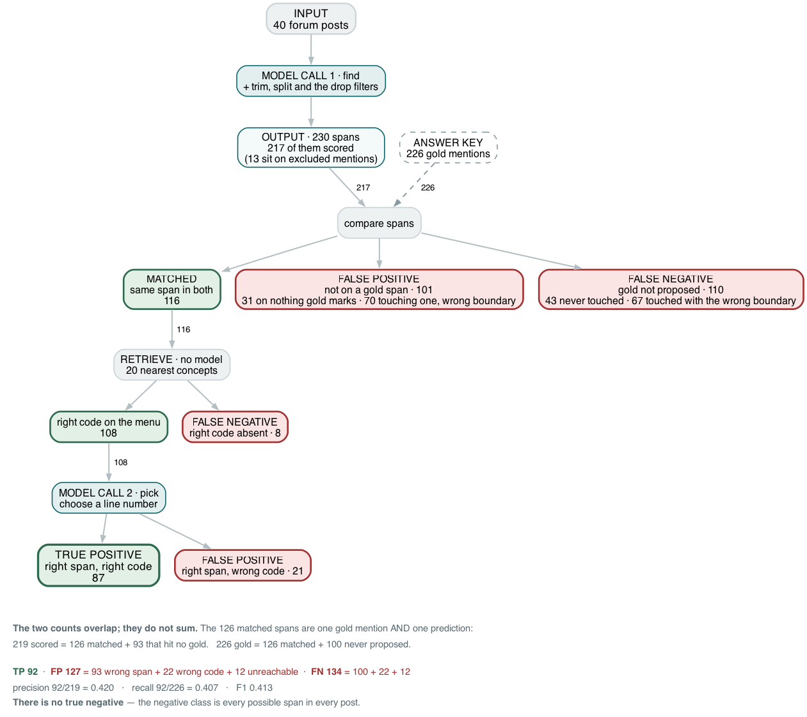

*Fig. 4: Rung 0 on the CADEC development split, `rerun-cadec-d0`. **The only
input is the 40 posts**; 230 spans come out, 217 of them scorable. The answer key
is dashed because it is not part of the pipeline — the system never sees it, and
it is applied only at the comparison. The 217 and the 226 overlap rather than
sum: the 116 matched spans are one prediction **and** one gold mention. Draw 1
is identical; draw 2 differs at each node — matched 116 / 116 / 129, code on the
menu 108 / 108 / 121, correct 87 / 87 / 98. Source: author-created with
Graphviz.*

**Three outcomes, not four.** There is no true negative on this task. A true
negative would be a span the system correctly declined to extract, and the
negative class is every possible span in every post — unbounded, so it cannot be
counted. That is why extraction is scored with precision, recall and F1, none of
which reference TN.

The three stages lose very different amounts, and the ranking is not the one the
project spent its effort on:

| stage | loses | of what reached it |
|---|---|---|
| **find** — quote the reaction | **110** missed, **101** invented | 49% of gold, 47% of predictions |
| **retrieve** — 20 nearest concepts | 8 | 7% of spans matched |
| **pick** — choose a line | 21 | 19% of menus holding the answer |

*Draw 0; draw 1 is identical, draw 2 loses 97 / 8 / 23. Every count is over the
same 226 scorable gold mentions, paired span-exact, so the three rows add up.
Of the 21 pick losses, 19 are the model's own choice and 2 are rung 0's
fallback rule filling an unanswered pick from line one.*

**Detection is where almost all of the loss is, on both sides.** It misses 110 of
226 gold mentions and proposes 101 spans that sit on no gold span. Retrieval
loses 8 on every draw; the pick 21 to 23.

The 110 are two failures, not one. **43 the model never touched**: single
words the instruction covers and the model skipped anyway (`"sore"`,
`"painful"`, `"tingly"`, `"pain"` four times in one post), and named
conditions the writer mentions in passing (`"gout"`, `"heart disease"`,
`"diabetic"`, `"MS"`, `"fibromyalgia"`, `"heart attack"`, `"stroke"`) — the
rule says the condition the drug was taken for and conditions compared to
count, and the model reads them as background. **67 it touched with the wrong
boundary**: `"extreme rectal bleed"` for gold's `"rectal bleed"`, `"Entire
body ached"` for `"body ached"`, `"problems"` for `"problems with memory"`,
and one quote — `"EXTREME AND EXCRUCIATING MUSCLE PAIN IN SHOULDERS"` —
covering two gold mentions, neck and hip. Twenty-two of the 67 carry the right
code under the wrong span; the exact metric counts them lost twice.

The 101 on the prediction side split the same way: **70 touch a gold mention
with the wrong boundary** — the other end of the 67 above — and **31 sit on
nothing the annotators marked**. Those 31 are the model's own inventions, and
they are not random: fragments of a real reaction (`"neck"`, `"severe
shoulder"`, `"pain"`) and figures of speech read literally (`"at my wits end"`
→ |Wanders at night|, `"truck hit"` → |Injury due to motor vehicle accident|,
`"worse than"` → |Melioidosis|, `"dying"` → |Thoughts about dying|). A further
13 predictions land on gold mentions the answer key excludes for carrying a
retired code — `"weight gain"`, `"tiredness"`, `"weak legs"` — and are
neither credited nor blamed.

Notice also that the two middle failures are counted twice. A right span with a
wrong code is a **false positive** — the system asserted something untrue — *and*
a **false negative**, because the gold mention still went unanswered. That is the
double penalty section 1 described, visible in the arithmetic: the 29 matched
spans with the wrong code count on both sides.

And the effort went to the wrong stage. Of eight shipped changes, the two largest
help the model *read* — a worked example and the negation rule — but most of the
rejected arms were attempts to improve the *choosing*, which loses 21 to 23
mentions out of 226.

That is the baseline: 87 to 98 of 226 gold mentions answered correctly, most of
the loss in detection, and a set of stages that each fail differently. The obvious next move
is to improve it. Section 3 is what happened when we tried.

---

### The same pipeline, other models

Everything above is one model. Four other open-weight families were run
through the identical frozen configuration on earlier draws — the finding
worth keeping is that a single F1 ranks them in an order the two halves do not
share: the model that codes second-best proposes so few spans that it ranks
last. Those runs predate the base run and their figures are in the decisions
log, not here; re-running the sweep on the base run's footing is registered.

---

## 3. How much of this is real?

Two of the numbers above nearly came out differently, for two different reasons.
The first is a mistake anyone can make with a standard tool. The second is why
the tool had nothing to work with.

### What a confidence interval actually prices

**One row of that table nearly went the other way**, and how it did is the
sharpest thing this project learned about measurement.

The reranking stage reorders the twenty-line menu before the model picks from it,
so a good concept sitting at line 14 moves up. It is the most obvious thing to
try once you know the menu usually holds the right answer, and we built it. Then
we asked whether it helped.

The standard way to ask is a **paired bootstrap**. Score every document twice,
with the stage on and off. Resample the documents at random a few thousand times,
and see how often the difference comes out positive. If nearly always, the
improvement is real.

On the first draw it came out **above zero, with an interval that excluded
zero**. Significant. Most write-ups stop here.

We ran the same comparison twice more. On the second draw the gain was smaller;
on the third **the sign reversed**, and the three averaged to a fraction of the
run-to-run floor section 2 measured. **So the reranker does not work, and we did
not turn it on.**
The code ships and the arm stays off: nothing here separates from zero across
draws, and a change that cannot be told from noise must not become the
configuration every rung above it is measured against.

The verdict is not the interesting part, though. The interesting part is that a
standard statistical test had already told us the opposite.

**The test was not broken. It answers a narrower question than it appears to.** A
bootstrap over documents asks *would this hold on different documents?* It never
asks *would this hold on a different run?* It resamples the documents of one run,
so run-to-run variance is invisible to it — and here that is the larger term.

> **Three draws minimum, and report all three.**

### And a wrong number that looked right

The helper computing those intervals resampled with `set(random.choices(...))`.
A bootstrap works by drawing duplicates; **the `set()` deleted them**, leaving a
subsample of about two thirds of the documents.

It ran that way for a month, because the intervals looked fine — right size,
sensible width, plausible bounds. Nothing errored, nothing looked odd, and no
number was implausible enough to make anyone re-derive it. **A wrong number that
looks wrong gets found. A wrong number that looks right becomes evidence.**

**And that helper had measured every rung 0 arm we accepted before we found it.**
Not the reranker alone — the reranker was caught before it shipped, which cost
nothing. The arms already *in* the shipped configuration had been judged the same
way, two of them on a single draw each.

So we re-tested those two with the fixed estimator, at three draws:

| shipped arm | one draw said | three draws said |
|---|---|---|
| coordination splitter | a gain on exact **and** overlap | **exact only** — the overlap effect reverses sign |
| the trimmer's threshold | a gain | consistent, small, inside the noise band on its own layer |

Both survived, and we kept them. But **the splitter's overlap claim did not** —
the single-draw headline had implied a gain there and never established one. That
is the honest shape of this: the method was wrong, the conclusions happened to
hold anyway, and we found out which was which only by redoing the work.

The reranker is the memorable story because it is the one that reversed. The
expensive one is the quieter fact that a shipped configuration had been accepted
on a number nobody had reproduced.

---

### Where the 4 points come from

One thing is still unexplained: why does an identical configuration move at
all? We ran at **temperature 0** — not low-temperature sampling but greedy
decoding, where the model takes its single highest-probability token every time.
The knob everyone reaches for was already turned all the way down.

So we ran the shipped configuration three times, cold, and counted how many of
the three files were different from each other: **two**. Draws 0 and 1 are the
same file — the same SHA-256, every span and every code identical — and draw 2
is not. (An earlier sweep of four other open-weight families found all four
bit-reproducible three times of three; it predates the base run and its
figures are in the decisions log.) So run-to-run variance is not a property of
language models, and not even a fixed property of this one: the same model,
the same temperature, the same two-call pipeline, and the ground holds still on
two draws of three.

Two things that does not say. **Repeatable is not the same as right**: a model
can return the same wrong answer twice, which is what this one does on draws 0
and 1 at F1 0.393. And nothing here establishes *why* the third draw moved;
section 10 keeps that open. This section asks only whether the ground
holds still. Section 4 onward asks whether what stands on it is correct.

### Where the model actually moves

It is not a temperature setting. We ran at **temperature 0** — not
low-temperature sampling but greedy decoding, where the model takes its single
highest-probability token every time — same documents, prompts, machine and hour.
The knob everyone reaches for was already turned all the way down.

Three cold draws of the shipped configuration, `rerun-cadec-d0/d1/d2`. (Every
F1 in this article is `ladder/score.py`'s span-exact figure with the declared
exclusions applied — worth saying once, because this repo carries three F1
variants that differ from each other by more than any improvement it ever
shipped.) The useful comparison is not how each one scored against gold — that
is section 4's question — but **where the three runs disagree with each other**,
which needs no answer key at all.

**Two of the three are the same file.** Draws 0 and 1 made 94 real model calls
each — none served from cache, which the call trace records per call — and every
reply is identical to the byte. Draw 2 diverged on 29 of the 69 prompts it
shares with them, from the first find call onward, and the whole 4-point spread
is that one draw. So the table below is a comparison between two runs wearing
three labels, and we say so rather than average it away.

Lining the runs up mention by mention, and grouping any spans that overlap into
one mention, gives 233 mentions across the three runs:

| CADEC — across three identical runs | mentions | |
|---|---|---|
| **all three agree — same span, same code** | **164** | **70.4%** |
| same span, different code | 22 | 9.4% |
| same code, different span | 1 | 0.4% |
| both differ | 10 | 4.3% |
| found by only two of the three runs | 15 | 6.4% |
| found by only one of the three runs | 21 | 9.0% |

Three summary numbers fall out, and they are not the same number:

| | |
|---|---|
| **consensus** — all three runs, same span *and* same code | **70.4%** |
| all three runs propose the same span | 79.8% |
| all three agree on the code, where all three found the mention | 83.8% |

**Two runs of one frozen configuration reach full consensus on seven mentions in
ten.** The rest splits between the two halves of the job: **15.4% of mentions
are not even found by both**, and **9.4% are found identically and then coded
differently.**

Both failures are worth seeing, because they look nothing alike. The coding one:

> span `"at my wits end"`, quoted identically by all three runs
> run 0 → **CONCEPT_LESS** — no concept fits
> runs 1, 2 → `225444004` |At risk for suicide|

One run declined to code it; two filed a suicide-risk concept. Same model, same
prompt, same menu, same hour. And the detection one, which is milder:

> run 0 → `"very very severe abdonimal pain"`
> runs 1, 2 → `"abdonimal pain"`
> all three → `21522001` |Abdominal pain|

Same concept, different boundary — the disagreement two human annotators also
have, and the one section 1 said exact matching punishes twice.

Note what did *not* prevent any of this: narrowing the question. The pick step
chooses a number from a twenty-line list, about as constrained as a request gets,
and it is where 9.4% of mentions diverge.

And note what the identical pair says about the mechanism. The same prompts,
answered two days earlier on the same machine, differ from these replies on
about half of them.
Whatever moves this model, it is not per-record sampling noise: it is a whole
run that either repeats or does not, and which one you get changed between
sessions and not between consecutive draws. We do not know why. The obvious
candidates are ruled out: the diverging document's find prompt, sent eight
times in isolation with the cache disabled — four back to back, four with
another model loaded and unloaded in between — returned one identical reply
eight times. The divergence happens only inside a full run, after fifty-odd
other requests to two models and an embedder, and what the inference server
carries between those requests is the remaining suspect.

**Which answers an objection that usually ends the conversation.** *You cannot
put a language model in a pipeline that has to be auditable, because it will not
give you the same answer twice.* On this evidence that is false as a general
claim: the model we shipped gave the same answer two times out of three, to the
byte, and agreed with itself on seven mentions in ten even where it did not.

> **Repeatability is available**, and where this model does not give it, other
> open-weight families we tried did. That is a purchase, and you can decline it.

Which reframes this whole section. Most of what we could not prove about our own
improvements, we could not prove because of a model we had chosen and never
compared against an alternative — for as long as we had run only one, which was
most of the project.

## 4. Rung 1 on CADEC: what a free deterministic check can and cannot see

**This is the first rung above the model, and the only free one.** If the output
will not hold still, attach something that will: SNOMED CT does not resample. Ask
the vocabulary whether a proposed code *can* be right — does it exist, is the
span really in the post, is the concept the right kind of thing — and the answer
is identical every time you ask, for zero tokens and no model call.

**Rung 1 judges; it does not route.** Its verdicts are recorded and counted, and
the record continues untouched, so every rung above sees the same unfiltered set
and each one's contribution stays attributable to it. Acting on a verdict is rung
5's job, five steps later. So nothing below is a decision about a record — it is
a label attached to one.

### The three lanes

Every record lands in exactly one, and none of the names means what it sounds
like:

| lane | what it claims | what it does **not** claim |
|---|---|---|
| **REJECT** | *provably wrong* — some check failed | — |
| **ACCEPT** | *the vocabulary uses these very words* | that the answer is right |
| **BAND** | *nothing fired* — no check objected, no words matched | that the answer is wrong |

The checks run as a chain and stop at the first failure. Fail any one → REJECT.
Survive all of them → a last string test decides between the other two.

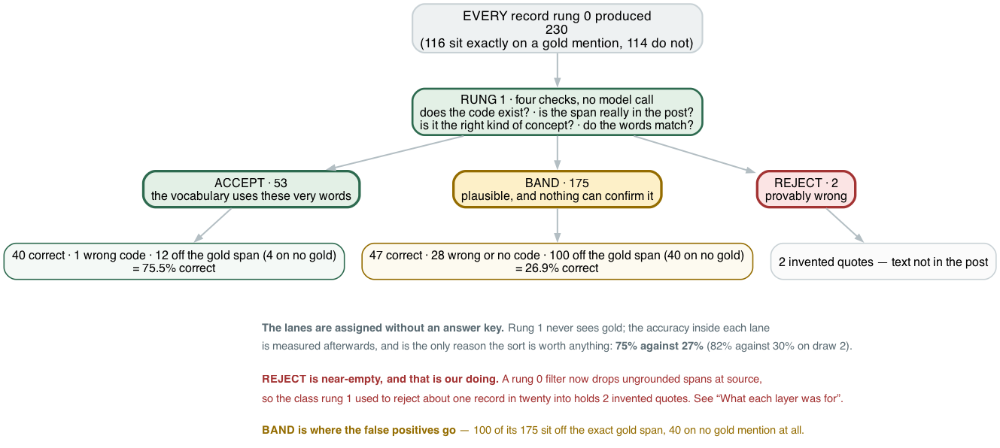

*Fig. 5: Rung 1 on the CADEC development split, `rerun-cadec-d0` (draw 1 is
identical; draw 2 reads ACCEPT 51 at 82.4%, BAND 184 at 30.4%, REJECT 3). Lanes
are assigned from the vocabulary alone — no model call, no answer key. The
correct / wrong split inside each lane is scored afterwards, span-exact, and
rung 1 never sees it. Source: author-created with Graphviz.*

Three lanes, and the same three questions of each: **what does it claim, how well
does it deliver, and how much of the batch lands there?**

### REJECT — exhaustively tested, provably exact, and empty

**What can it catch?** We took the answer key — every record correct by
construction — and broke it one way at a time, all 8,666 records per class. Each
class targets one of rung 1's three rejection paths:

| planted error | the check that fires | share caught |
|---|---|---|
| span shifted off its mention | span grounding | **1.000** |
| quote fabricated, not in the post | span grounding | **1.000** |
| code that exists in no release | `exists()` | **1.000** |
| wrong branch of the hierarchy | semantic type | **1.000** |

All of them, every time. That is less impressive than it looks — a lookup either
finds a code in the release or it does not, and each check is being tested on the
class it was built for. What it establishes is that the rejection machinery is
sound, before we ask what it is worth.

**What can it not catch?** One more corruption, and it is the one that matters: a
**near-miss** — a real, active, correctly-typed clinical finding that is simply
the wrong one, which is the mistake a coding model actually makes. Caught **9
times out of 8,666.**

The difference is not one of degree. The four it catches are answers that are
*impossible*, and a vocabulary can contradict those flatly. A near-miss is an
answer that is *possible and wrong*, and nothing mechanical separates the two.
**A free check can prove an answer cannot be right. It can never show that it is.**

**How much of the batch lands here?** **Almost none.** REJECT holds 2, 2 and 3
records across the three draws. Here is draw 2's third:

> span `"severe muscle pain in ankles"` — **that text is not in the post.**
> The model quoted something it had composed rather than read, and the check
> located the quote and found nothing there.

That is the entire rejection class in practice: not wrong codes, but invented
quotes. It used to hold one record in twenty — until a rung 0 filter began
dropping ungrounded spans at source and the class arrived nearly empty. The
checks still run, still pass their tests, and have nothing left to find. Section
6 is about what that did to the rung above.

So the lane we can test exhaustively is the lane that never fires. Everything
rung 1 is actually worth comes from the other two.

### ACCEPT — the one thing that worked

**What does it claim?** That the span's text matches one of the concept's own
names. Nine lines of string comparison: normalise the patient's words, fetch
every synonym the vocabulary holds for that code, look for an identical string.
`"chronic pain"` against |Chronic pain| matches. Nothing else is consulted — no
model, no embedding, no context.

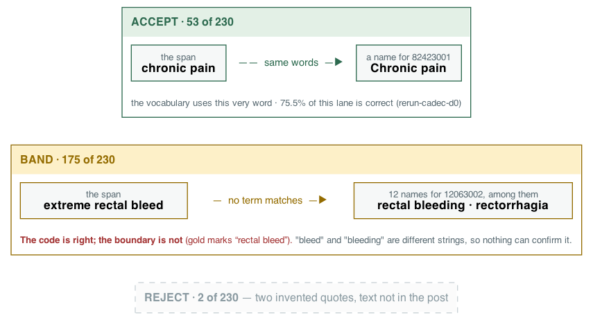

*Fig. 6: Rung 1's verdicts on CADEC, one real record each. REJECT is the empty
lane here. Development split. Source: author-created with Graphviz.*

**How well does it deliver?** **75.5%, 75.5% and 82.4% of what lands in ACCEPT
is correct** across the three draws, against 26.9%, 26.9% and 30.4% in BAND —
a 2.7× separation. (An earlier draw of the same configuration read 85.4%; two
of three of the base draws sit ten points under it, and we print the base
run.) Rung 1 reached that split with no model, no gold, and identically on
every run.

It is not a correctness claim, and it can be wrong. From the development split,
sitting in ACCEPT:

> span `"knee pain"` → `1003722009` |Pain of knee region|
> gold says `30989003` |Gonalgia|

Both concepts carry **"Knee pain"** among their names, so the span matches either
one exactly. The check accepts whichever the model picked and has no way to
prefer the other.

**Whether that is really an error is a fair question we cannot answer.** Gold's
code here is retired and SNOMED records no successor, so on the base run this
record sits on an excluded mention and is neither credited nor blamed; ours is
active and means the same thing to a clinician. Where the gold code is live the
scorer counts only the code in the answer key, so a defensible synonym is filed
as wrong. We have not measured how often that happens, and it would move the
coding numbers in our favour — which is a reason to be careful about it, not a
reason to skip it. It is on the list at the end.

**How much lands here?** 53, 53 and 51 of 230, 230 and 238 records, and **43.1%
of a perfect answer set.** That is the ceiling on how much of the batch this rung
can settle for free.

### BAND — the absence of a verdict

**What does it claim?** Nothing. No check objected and no words matched. BAND is
not a negative verdict; it is the lane for records the vocabulary had no opinion
about, and plenty of correct answers are in it:

> `"extreme rectal bleed"` → `12063002` |Rectorrhagia| — **the right code**, and
> BAND. The vocabulary holds twelve names for that code, among them "rectal
> bleeding" and "blood per rectum". None is the phrase the patient used. (It is
> also a wrong boundary — gold marks `"rectal bleed"` — so the exact metric
> counts it lost anyway; only the overlap metric credits it.)

Gold's own span for that mention is `"rectal bleed"`, and it lands in BAND too.
**Even quoting the answer key exactly is not enough**, because "bleed" and
"bleeding" are different strings and the test compares characters.

**How well does it deliver?** 27–30% correct — and that is the design working.
BAND is where uncertainty is supposed to accumulate.

**How much lands here?** 175, 175 and 184 of 230, 230 and 238 records, and **57%
of even a perfect answer set.** That is the bill the paid rungs exist to work
through, and you can know its size before spending a token.

One more thing the figure shows: **BAND is where the false positives go.** Of
the base run's 175 BAND records, 100 sit off the exact gold span — 40 on no gold
mention at all, 60 on the right mention with the wrong boundaries or the wrong
code. Not intelligence — an invented span has no vocabulary words to
match, so it fails the string test the same way a real-but-unmatched span does.

### The one decision this rung has

The ACCEPT/BAND divider is a string comparison, and it can be run two ways. You
pick one in the manifest and it applies to every record.

| setting | a match means | `"bit drowsy"` against the names of `271782001` |
|---|---|---|
| **`exact`** | the strings are identical, after lowercasing | none of the eight names *is* "bit drowsy" → **BAND** |
| **`contained`** | identical, **or** one's words are a subset of the other's | "drowsy" is a subset of "bit drowsy" → **ACCEPT** |

`contained` is the looser one. It accepts everything `exact` accepts and more, so
switching to it can only move records **from BAND into ACCEPT**, never back.

**It buys eleven points.** Free coverage goes from **43.1%** of gold to **54.5%**
— an eighth of the batch settled without spending a token, most of it records like
`"bit drowsy"`, where the patient's phrase wraps a word the vocabulary uses.

**We took the strict one anyway**, and here is the measurement that decided it.
We planted near-miss codes into the answer key — real, active, correctly-typed
findings sharing a head word with the right one, which is the mistake a coding
model actually makes — and ran both settings over them:

| setting | near-misses **caught** | near-misses put in **ACCEPT** |
|---|---|---|
| `contained` | 0.1% | **19.0%** |
| `exact` | 0.1% | **0.1%** |

Read the two columns separately, because they say different things.

**The first column is identical, and that is the point of section 4.** Neither
setting catches near-misses. No string comparison ever will — the right code is
not in the source text, so nothing mechanical can put it there.

**The second column is the decision.** It is not about catching them; it is about
what happens to the ones that get through. Under `exact` they sit in BAND, where
nothing is claimed about them. Under `contained`, **one in five is moved into
ACCEPT** — the lane that means *the vocabulary vouches for this*, and the lane
rung 5 will act on.

Eleven points of free coverage is not worth a check that endorses one near-miss
in five. The cost of refusing them is only that more records fall through to the
paid rungs, which is what the rest of the ladder is for.

**What that decision looks like on the records themselves.** The same three
draws, the whole ladder replayed under each setting on the same cache, so the
model calls are identical and only the line moves:

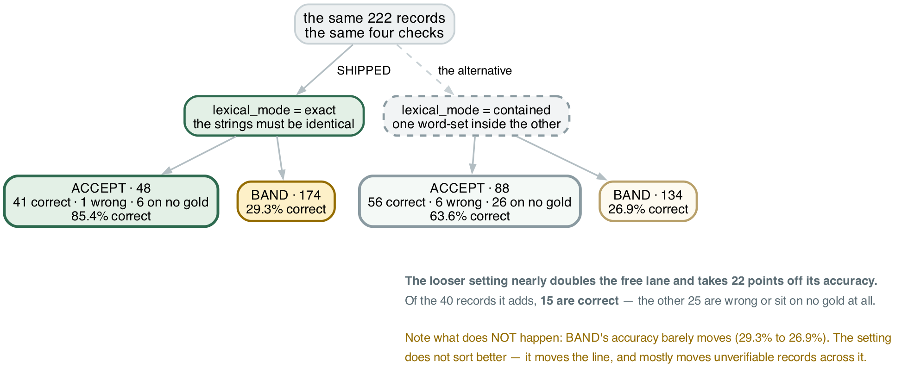

*Fig. 7: The same records, the same rung, the two settings, on `rerun-cadec-d0`
and its `contained` replay on the same cache. Correctness is scored afterwards
and rung 1 never sees it. Source: author-created with Graphviz.*

| setting | ACCEPT | of those, correct | admitted by the looser rule | of those, correct |
|---|---|---|---|---|
| **`exact`** *(shipped)* | 53 / 53 / 51 | **75.5% / 75.5% / 82.4%** | | |
| `contained` | 91 / 91 / 90 | 60.4% / 60.4% / 64.4% | +38 / +38 / +39 | 15 / 15 / 16 |

*Lane correctness at rung 1; the policy table in section 5 quotes the same
records after rung 3, where two more answers had been overwritten.* The looser
setting **nearly doubles the free lane and takes 15 to 18 points off its
accuracy**, three draws of three. Of the 38 to 39 records it adds, 15 or 16 are
correct; the rest are wrong or sit on no gold mention at all.

**And now we have looked at what separates them.** The rule can match in two
directions, and they are not alike. In 26 to 27 of the moves, *the vocabulary's
term sits inside the span* — `"severe fatigue"` for |Fatigue|, `"wild mood
swings"` for |Mood swings|, `"EXTREME AND EXCRUCIATING MUSCLE PAIN IN NECK"` for
|Neck pain| — and 11 to 13 of those are correct on exact spans, with most of the
rest correct on overlap: the model quoted a qualifier around the concept, which
is section 1's boundary problem, not a coding error. In the other 12, *the span
sits inside a term* — `"neck"` for |Neck pain|, `"dying"` for |Thoughts about
dying|, `"concerned"` for |Concerned about appearance| — and only 3 or 4 are
correct: a fragment, and a concept that happens to contain it. A rule that
admits "qualifier plus exact term" and refuses "fragment of a term" is the
candidate worth building; it is not built.

BAND's accuracy barely moves either way. **The setting does not sort better. It
moves the line**, and that is the difference between a check that discriminates
and a threshold that is simply lower.

It also decides the number the rest of the ladder is built on. **The ACCEPT lane is 75–82%
correct because of this setting** — under the alternative it is 60–64%, and the
claim that the free check identifies a reliably-correct subset weakens. What the
looser setting buys instead is yield, and section 5 puts the two on the same
table.

**The strict setting reduces that failure by a factor of 190. It does not remove
it** — the `"knee pain"` record above is one of the surviving 0.1%.

**A lexical match is evidence about the words, never about the claim.** Where two
concepts share a name — and SNOMED has many such pairs — it is not even evidence
about which of them you meant.

---

### And it should hold whichever model you use

The reason is structural, and it is the whole argument for putting a
deterministic layer under a stochastic one. **The lane is conditional on a
property of the record, not on the run** — whether the patient's words happen to
appear in the vocabulary is fixed before any model is chosen. Section 3 showed we
could not make this model repeat itself. This is the other half of that: **you
can still make your knowledge about its answers repeat itself.**

We have measured that on other models once, on an earlier sweep of four other
open-weight families through the same configuration: the ACCEPT lane sat in a
narrow band well above BAND for every one of them, with no ordering
relationship to model quality, and the worst model by F1 had the sharpest
separation. Those runs predate the base run; their figures are in the decisions
log, and re-running the sweep on the base run's footing is registered work.

## 5. The five resolvers, one at a time

We built five resolvers on the residue and expected a staircase. Three cost
tokens; two are free and spend something else.

**Everything in this section is the development split** — the base run,
`rerun-cadec-d0/d1/d2`, 230 / 230 / 238 records over 40 documents. The held-out
split was spent on one frozen run and cannot arbitrate an ablation, so the
ablation lives here and stays labelled.

Rung 1 is section 4's and is not repeated. What matters below is that its
verdicts are what every rung above either acts on or ignores.

**Rung 2, self-correction.** Sends the record back to the same model with the
check's finding stated as a fact — on the base run, *"the quoted text is not in
the post"* — never as a question. Not *are you sure*, which invites a flip whether or
not the answer was wrong. The post goes with it, and so does permission to
abstain.

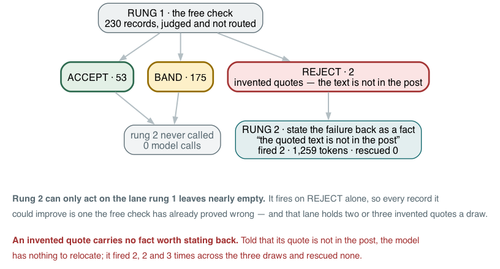

*Fig. 8: Rung 2 fires on REJECT alone, so ACCEPT and BAND are never touched.
`rerun-cadec-d0`; draws 1 and 2 fired 2 and 3 times and rescued none. Source:
author-created with Graphviz.*

**It can only act on the lane rung 1 leaves empty** — and section 4 showed that
lane holds almost nothing, because the classes a vocabulary can prove wrong are
the ones the model stopped producing. On the base run it fired 2, 2 and 3 times
in 230, 230 and 238 records, on invented quotes it could not relocate, and
rescued none.

**Rung 3, voting.** Asks again *k* times and takes the majority. It is the most
expensive thing in the ladder by a wide margin — **410,638 / 432,341 / 431,518
tokens, 2.5–2.8× the whole extraction step, and a 118–144-second p95** — and it
is the one rung whose numbers are a *sample* rather than a property of the
input, so each comes with its run id.

On the base run it changed **25, 28 and 27 codes** and moved net correct answers
by **+1, −1 and −1**. On the held-out split (`phaseF-test-1`) it re-found **8
previously unanswered records and every one of them was wrong**: coverage rose
0.904 → 0.930, correct answers stayed at 105, and accuracy fell **0.370 →
0.360.** **Its sign changes with the draw and its magnitude is one record either
way.**

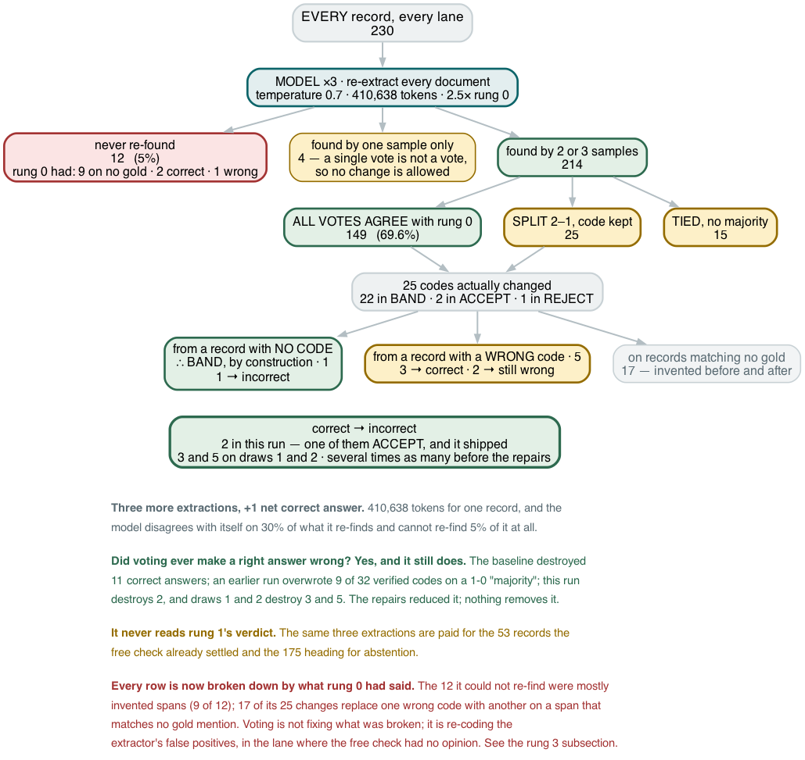

*Fig. 9: Rung 3 on the development split, `rerun-cadec-d0`, every node from the
per-record state table. Draws 1 and 2: 28 and 27 changes, net −1 and −1.
Source: author-created with Graphviz.*

**Did voting ever take a right answer and make it wrong?** Yes — **2, 3 and 5
times** across the three base draws, against 3, 2 and 4 wrong answers made
right. Before two repairs it destroyed several times as many — a vote counted
from a single sample, and samples drawn from a different prompt than the one
being verified — and one draw after the repairs read zero, which we had written
up as a property; it was a draw. **A resampling layer destroys right answers by
default, and stops only when you make it stop** — requiring two samples to agree
and drawing every sample through rung 0's own retrieval reduced it; nothing
removes it.

**Where the changes land, now that every record's state is recorded at every
rung.** Of the 25 / 28 / 27 changes, **22 / 27 / 26 are in BAND**, 2 / 1 / 0 in
ACCEPT and 1 / 0 / 1 in REJECT. So the vote does its work in the lane where the
free check had no opinion — which answers the question this section used to
leave open, and not in the rung's favour: **most of what it changes in BAND is a
span that sits on no gold mention at all**, 17 of draw 0's 25 transitions going
from unmatched to unmatched. The records it could not re-find, 11 to 12 per
draw, were mostly invented spans too. Rung 3 is under-targeted in the sense
that it could run on the BAND residue alone; it would still be re-coding the
extractor's false positives at 2.5× the extractor's price.

The case that matters is one it got wrong, on the base run:

> A record rung 1 had **ACCEPT**ed as |Pain| — the vocabulary uses the
> patient's own word — was overwritten by rung 3 to |Increased pain| on a **2–0
> vote**, and shipped as VERIFIED.

It shipped still carrying rung 1's verdict, which had been computed against the
code rung 3 replaced — so a check that had verified |Pain| travelled with
|Increased pain|. That is the one shipped answer of 53 that deleting the paid
layers changes, and it is the shape of the defect an earlier draw showed more
starkly, when a single re-finding counted as a majority.

The voter and the answerer are the same model, so a vote carries no information
the original answer lacked. It just occasionally lands somewhere else.

**Rung 4, the judge.** A second model reads each answer and rules on it. The
family is required to differ from the extractor's, enforced in code rather than
by convention — a model judging its own output measures self-consistency, not
correctness. It costs **84,000 to 88,000 tokens** per run.

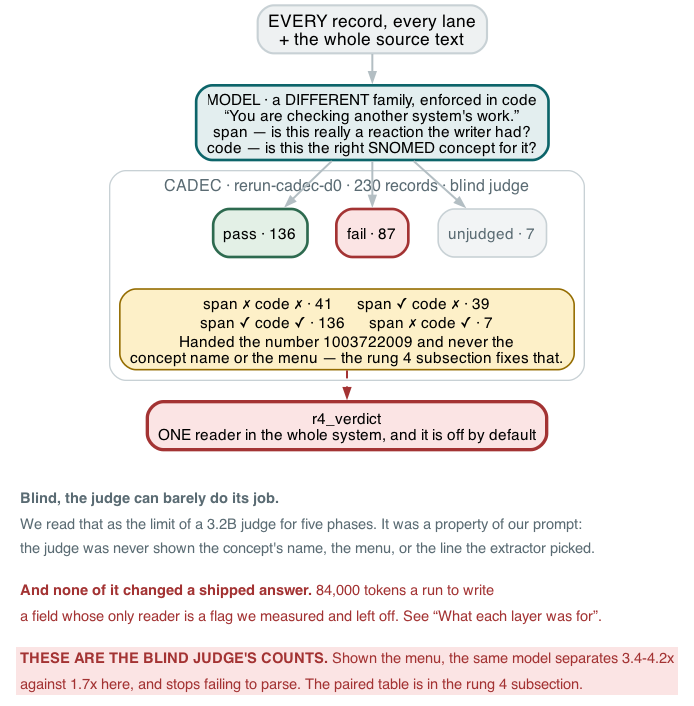

*Fig. 10: Rung 4, the blind judge as shipped, `rerun-cadec-d0`. The table below
adds the menu-shown judge. Source: author-created with Graphviz.*

The question a judge exists to answer is whether its verdict tells you anything
about correctness. **As shipped, ours barely did — and the reason was ours.**
Rung 4 formatted its prompt from the post, the span, the offsets and `sct`, and
nothing else. The concept's *name* is on the record, produced by rung 0 and
already checked by rung 1; the twenty-line menu the extractor chose from is on
the record too. Rung 4 read neither. We asked a 3.2B model whether `1003722009`
was correct and recorded its inability to answer as a finding about small
judges. It was a finding about our prompt, and it stood for five phases.

So we gave the judge what the extractor was given — the post, the span, the
menu as the extractor saw it, the line it chose, and the coding rule it was told
to follow — and asked one more question: *which line would you choose, or is
none of them right?* Same records, same 3.2B model, paired on each draw:

| judge | separation P(correct \| pass) / P(correct \| fail) | replies that would not parse | span failed | code failed | "not on this list" |
|---|---|---|---|---|---|
| **blind** — as shipped | **1.68× · 1.65× · 1.69×** | 7 · 4 · 7 | 48 · 48 · 48 | 80 · 81 · 80 | — |
| **shown the menu** | **3.65× · 4.23× · 3.44×** | 0 · 0 · 0 | 11 · 12 · 8 | 93 · 87 · 91 | 70 · 69 · 65 |
| shown the menu, **shuffled** | 3.51× · 4.07× · 3.61× | 0 · 0 · 0 | 14 · 14 · 10 | 85 · 84 · 89 | 66 · 66 · 65 |
| *the free check's ACCEPT/BAND, same draws* | *2.8× · 2.8× · 2.7×* | | | | |

Three things. The blind row reproduces the article's original 1.65× on every
draw — it was a real measurement of a question the judge could not answer. Shown
the menu, **the same model doubles its separation, stops failing to parse, and
now sits above the free check** on these draws rather than a third of the way to
it. And the verdict the blind judge could not express — *the right answer is not
on this list* — fires 65 to 70 times, and on draw 0 **54 of those 70 are spans
that sit on no gold mention**: the judge, given the menu, is mostly catching
invented spans, which is the detection failure nothing else in the ladder can
see. Shuffling the menu changes almost nothing, so there is no line-one
ratification to break. The judge's own choice of line is right 77 to 85 times
against the extractor's 87 to 98; it should not replace the pick, and it ratifies
the pick on about two records in three.

Two caveats travel with the table. It is still a 3.2B model grading a 20B one,
on the development split. And the separation is a *measurement*, not a shipped
number: **nothing reads the verdict**, so none of it changed an answer. Section
6 is about how that survived five phases of testing.

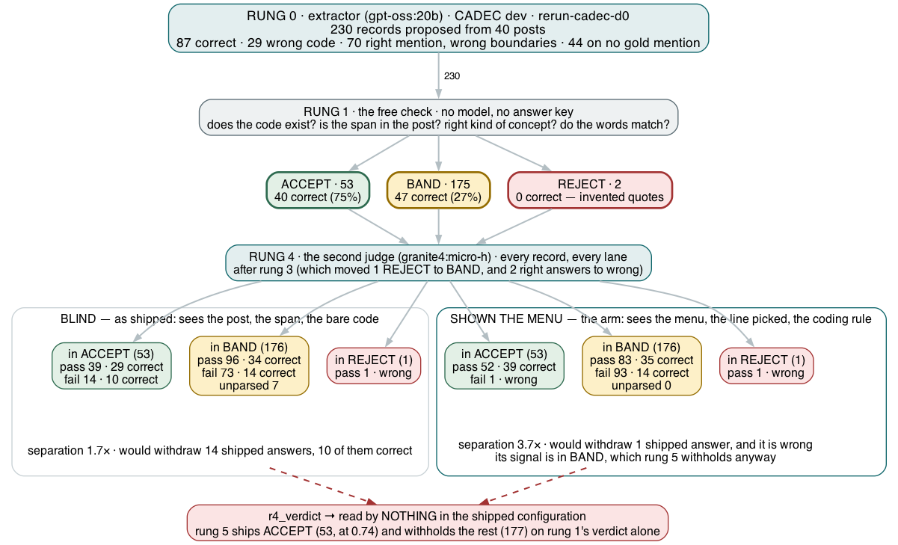

*Fig. 11: The same 230 records through rung 0, rung 1 and rung 4, `rerun-cadec-d0`.
The judge rules inside each of rung 1's lanes; had rung 5 acted on it, the blind
judge would have withdrawn 14 shipped answers, 10 of them correct, and the
menu-shown judge 1, wrong. Draw 1 is identical at rungs 0 and 1; draw 2 reads
51 / 184 / 3. Source: author-created with Graphviz.*

Which puts the judge in its place. On the lane that ships it agrees with the
free check on 52 of 53 records; its signal lives in BAND, where it mostly flags
invented spans, and BAND is withheld anyway.

**Rung 5, refusal.** Zero model calls, and no judgement of its own. It reads the
free check's verdict — recomputed, because rungs 2 and 3 re-run rung 1 after they
change a code — and disposes of the record:

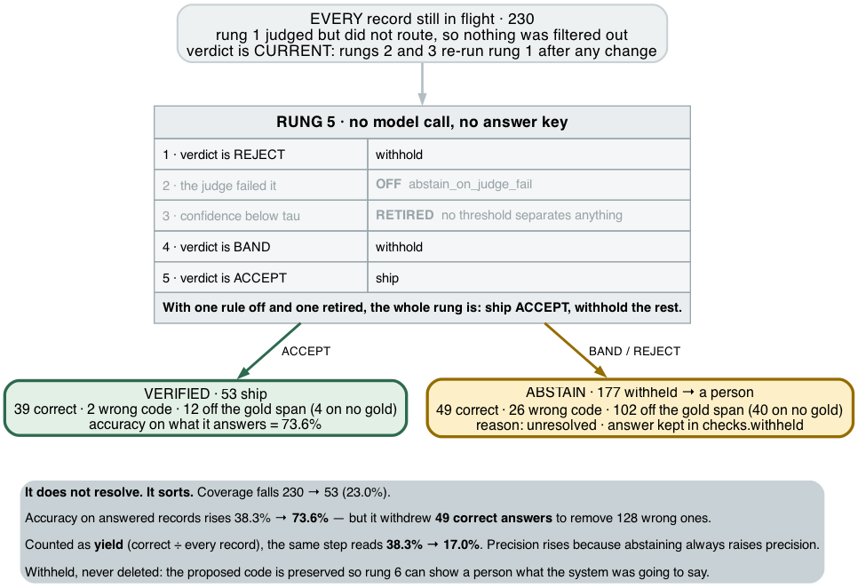

*Fig. 12: Rung 5 on the development split, `rerun-cadec-d0`, from the run's own
state rows. Source: author-created with Graphviz.*

Ship ACCEPT, withhold everything else. That is the whole rung as shipped. It
**withholds, it does not delete**: the proposed answer is kept so a reviewer can
see what the system was going to say.

Two of its rules never fired, and both silences are results. The judge rule
is off (above). The other is the one worth pausing on: rung 5 had a confidence
threshold, `tau`, and **the standard abstention technique is not merely untuned
here — it is unusable.** Rung 0 reports a confidence on every mention, and the
distribution is this:

| self-reported confidence | records (`rerun-cadec-d0`) |
|---|---|
| **1.0** | 151 (66%) |
| 0.99 | 59 |
| 0.95–0.98 | 13 |
| 0.90 | 7 |

Nothing below 0.9, on a run whose answers are right 38% of the time. **At
least six in ten of the answers this model calls near-certain are wrong.** There
is no threshold to place. You cannot ask this model how sure it is, which is a
one-line argument for the entire project. We retired the dial rather than leave
a knob that looks tunable and is not; a calibrated input for it is registered
future work.

### Refusal is not a technique. It is a dial, and you are the one who sets it

Rung 5 is where the system stops deciding and the deployer starts. It is a guard
in front of rung 6, and how aggressive it should be is not a property of the
task. Four settings, the first three from the same records:

| policy | ships | accuracy on what it answers | **yield** | to a person |
|---|---|---|---|---|
| ship everything — no rung 5 | 100% | 0.383 · 0.374 · 0.408 | **0.383 · 0.374 · 0.408** | 0 |
| looser lane (`contained`) | 40% · 40% · 38% | 0.582 · 0.582 · 0.656 | **0.230 · 0.230 · 0.248** | 139 · 139 · 148 |
| **ACCEPT only** — *shipped* | 23% · 23% · 21% | 0.736 · 0.755 · 0.824 | **0.170 · 0.174 · 0.176** | 177 · 177 · 187 |
| ACCEPT minus the blind judge's fails ⚠️ | 17% · 17% · 16% | 0.744 · 0.769 · 0.842 | **0.126 · 0.130 · 0.134** | 191 · 191 · 200 |

*All four rows are the base run's three draws, the same records under each
setting. The looser lane beats the shipped one on yield three draws of three,
by 0.056 to 0.072, and sends 38 or 39 fewer records to a person — at 2.7 to
3.4× the errors per hundred records. We report the measurement and left the
default where the held-out run was made.*

⚠️ *This row is the one setting that consults the second-model judge, replayed
from the base run's own verdicts — the blind judge's. Withdrawing what it
failed removes 14 shipped answers a draw, 10 of them correct. The menu-shown
judge would withdraw one, and it is wrong; the subsection below prices both.*

Read down the two accuracy columns. **They point in opposite directions, and
they are describing the same four systems.** Precision rises monotonically as the
policy tightens; yield falls monotonically. Neither column is wrong, and neither
one alone tells you which row to pick.

The asymmetry is not an accident, and it is the one thing to carry away from this
table: **abstaining always raises precision.** Any layer that withdraws answers
will look good on the first column, whatever it withdraws and however badly.
Yield cannot be fooled that way, which is why we quote it beside every coverage
figure in this article.

What the dial actually trades, moving from the top row to the shipped one:

> **Draw 0: 128 fewer errors. 49 fewer correct answers. 177 more records for a person.**

Three currencies moving in three directions at once. That is why we report them
separately and refuse to fuse them, and it is why this rung has no optimum — only
a break-even that depends on three numbers we do not have: what a wrong answer
costs you, what a missing one costs you, and what a review costs you. A hospital
coding department and a research aggregation pipeline will not put the dial in
the same place, and neither of them is misusing the system.

One honest limit on that freedom. Every setting we measured ships **either
everything, or between 15% and 40%.** There is no configuration in our evidence
that ships most of the batch at usable accuracy, and the dial cannot manufacture
one — the ceiling is the free check's ability to sort, not the policy on top of
it.

### Every rung's verdict is a setting of the same dial

The policy table above acts on rung 1. Every other rung writes a verdict too,
and each one can be read as a shipping rule: ship only what the votes agree on,
ship only what the judge passes. Run each rule over the same records and the
rungs stop looking like a staircase and start looking like settings, priced:

| ship only when… | ships | accuracy | **yield** | errors | tokens per run |
|---|---|---|---|---|---|
| rung 0 says so — everything | 233 | 0.39 | **0.389** | 142 | — |
| rung 1 says ACCEPT *(shipped)* | 52 | **0.77** | 0.175 | **12** | 0 |
| rung 3 — every sample voted the same code | 142 | 0.49 | 0.295 | 73 | ~420,000 |
| rung 3 — at least two samples agree | 186 | 0.43 | 0.341 | 107 | ~420,000 |
| rung 4 — the blind judge passes | 138 | 0.47 | 0.278 | 74 | ~84,000 |
| rung 4 — the menu-shown judge passes | 141 | 0.54 | **0.331** | 64 | ~84,000 |

*Means over the three base draws (230, 230 and 238 records); yield is correct
answers over all records.*

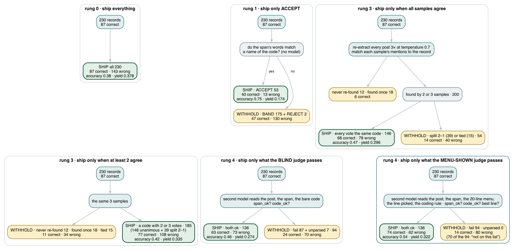

*Fig. 13: How each row is reached, on `rerun-cadec-d0`: the same 230 records,
six shipping rules, the split each one makes and the correct count on each
side. Source: author-created with Graphviz.*

Three things the table settles. **Every verdict carries information** — filter
on any of them and accuracy rises above the 0.39 of shipping everything — so the
paid rungs were not noise, once the judge could see what it was judging. **None
of them makes the system produce more right answers**; every row ships fewer
correct answers than rung 0, because every one works by withholding, and the
choice between rows is the deployer's trade of precision against yield. And
**they do not stack**: the free check plus the menu judge ships the same 52
records as the free check alone. What the judge earns is a setting the free
check cannot give — half the batch at 0.54, the best yield of any filter — at
84,000 tokens a run. Voting earns a worse setting than the judge at five times
the price.

---

## 6. What each layer was for, and whether it delivered

**Everything in this section is the development split** — the base run, 230 /
230 / 238 records over 40 documents — so its coverage figures are the 21–23% of
those runs, and the held-out box happens to read the same.

**Accuracy is the wrong test for four of these six layers.** The free check is
not trying to raise accuracy, it is trying to sort. Refusal makes no claim at
all, so it has none to report. Scored on one yardstick they mostly read as "did
nothing" — which is true, and useless. Each against its own purpose instead:

| layer | what it is **for** | did it do that? | cost |
|---|---|---|---|
| **deterministic checks** | sort into three lanes — *not* raise accuracy | **yes** — the lanes separate 2.7× (section 4) | **0 tokens, 0 s** |
| **self-correction** | restate a provable failure as a fact | **never viable here** — fired 2, 2 and 3 times, rescued none | 1,259–1,631 |
| **voting** | catch answers the model cannot reproduce | **no** — net +1, −1, −1; destroyed 2, 3, 5 | **411,000–432,000**, p95 **118–144 s** |
| **second-model judge** | rule on whether an answer is right | **yes, once shown the menu** — 3.4–4.2× separation; **read by nothing** | 84,000–88,000, p95 1.5 s |
| **refusal** | guard in front of a person | **yes** — ships at 0.74–0.82 on 21–23% of records | 0 |
| **person** | resolve what the machine cannot | not measured | **177 / 177 / 187 records** |

**The two layers that did their jobs cost nothing.** The three that cost 496,000
to 521,000 tokens between them per run either could not be tested, could not be
shown to help, or were not read — and when we deleted all three and replayed
the rung 5 decision on the same records, **one shipped answer out of 53 changed
on draw 0 and none on draws 1 and 2**. The one was voting overwriting a correct,
vocabulary-verified code on a 2–0 vote.

Two cells claim more than "did not fire", and both are load-bearing.
**Self-correction was never viable**, not merely idle: every rejection it could
have acted on, in every run, was a span the extractor could not locate, and an
unlocatable span carries no fact to state back to a model. **Voting had no
consistent effect**,
which is different from no effect — +1, −1 and −1 net correct across the base
draws, and on the held-out split it re-found 8 previously
unanswered records of which all 8 were wrong. A layer whose sign changes with the
draw is not one you can plan around, and it is the most expensive thing here.

### We computed a triage signal and then ignored it

The free check sorts every record into a lane, and the lanes have very different
accuracy — 75–82% in ACCEPT against 27–30% in BAND. That is a triage signal. Only
one layer uses it.

| lane | share | which layers act on it |
|---|---|---|
| REJECT | ~1% | **rung 2** — the one lane it fires on, and it holds two or three invented quotes |
| ACCEPT | 21–23% | rung 5 ships it |
| **BAND** | **76–77%** | rung 5 withholds it → a person |

**Rungs 3 and 4 do not read the lane** — both iterate over every record, so
voting and the judge ran across the whole batch, including the fifth of it the
free check had already vouched for. The two most expensive layers spent tokens on
the records least likely to need them.

Nothing is aimed at *improving* BAND either. Rung 5 withholds it rather than
resolving it, so the person at the end is a default destination rather than a
chosen one. **That is where the human cost comes from: three quarters of the
batch, routed by exhaustion.**

### None of them can find what rung 0 missed

**Every rung in this ladder operates on records rung 0 already proposed.** Rung 1
rejects, rung 2 rewrites a code, rung 3 re-scores existing spans, rung 4 issues a
per-record verdict, rung 5 withholds. Not one can put a mention on the table that
the extractor never proposed.

Rung 6 is the surprise. A person is the one layer you would expect to catch a
miss, and ours cannot — by construction, not by measurement. The desk shows a
reviewer a span the system already found and offers a choice of codes for it.
**There is no control for "you missed one," and none for "these boundaries are
wrong."** However good the reviewer, detection cannot move.

The two halves are also coupled, so a detection error does more than lose one
mention. Retrieval is deterministic: quote `"stamina"` where the writer described
the *lack* of it, and the menu comes back `[0] stamina` plus nineteen *stoma* and
*foramina* near-matches, with |Lack of stamina| absent at any depth we retrieve.
Quote `"no stamina"` and the same retriever puts it at line 0. **The span chooses
the menu, so a boundary error deletes the right answer before the model is asked
to pick.**

So the ladder's ceiling is rung 0's detection — 0.521 exact on the held-out
split — and everything above it is a precision instrument. **Reliability
engineering of this kind makes a system's answers more trustworthy. It does not
make the system see more.**

The obvious repair is to ask the judge what was missed, and we think that is the
wrong place: rung 4 is per-record where the question is per-document, and a judge
that names a mention nobody proposed is not judging but extracting, with a second
model — which collapses the measurement the ladder exists to take. So we state it
as a limitation rather than fix it: **no rung in this ladder can add a mention**,
and a rung that could is an open question, to be bounded with an oracle ceiling
before it is built — exactly as the human desk was bounded before we built it.

### Why none of it showed up in a test

Every layer passed its own tests, did what its documentation promised, and
returned. The failures were not in the layers but in what happens between them.

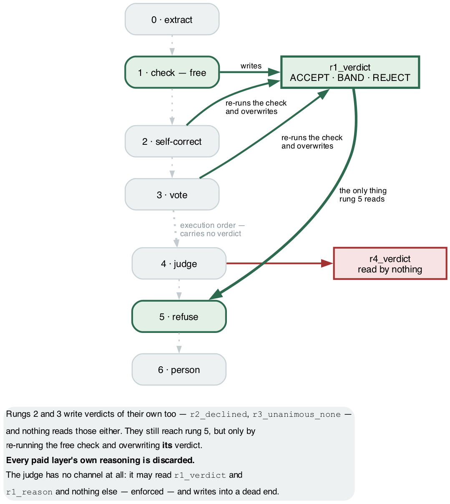

*Fig. 14: Verdict flow. An arrow exists only where a rung genuinely reads or
writes; execution order is not drawn, because it moves no verdict. Rung 0 is
absent — it writes no verdict, it produces the records. Source: author-created
with Graphviz.*

**Only one verdict travels, and it is the free one.** Self-correction writes
`r2_declined`, voting writes `r3_unanimous_none`, the judge writes `r4_verdict`,
and nothing reads any of them. Rungs 2 and 3 still reach the refusal step — but
only by re-running the free check and overwriting **its** verdict, so what arrives
is never their reasoning, only rung 1's opinion of whatever code they left behind.
Rung 2 depends on that verdict at both ends: it is also the only thing that can
trigger it. **The judge touches nothing** — it writes into a dead end, and its own
read of `r1_verdict` feeds a report rather than a decision. No test caught any of
this, because every layer does exactly what it says it does.

**Then the metric.** Voting overwrote codes without re-validating, so records
shipped marked *verified* against a code they no longer had — carrying a claim the
free check had made about something else. Fixing it moved exact F1 from **0.204 to
0.204**, because precision and recall cannot tell an *unwarranted* answer from an
*incorrect* one: a record with a wrong code scores the same whether it ships wrong
or is withdrawn. **We built seven layers to decide which answers are trustworthy,
then scored them with a metric that cannot see the difference.**

---

## 7. How we found these

None of it came from a failing test. It came from re-measuring things that had
already looked fine.

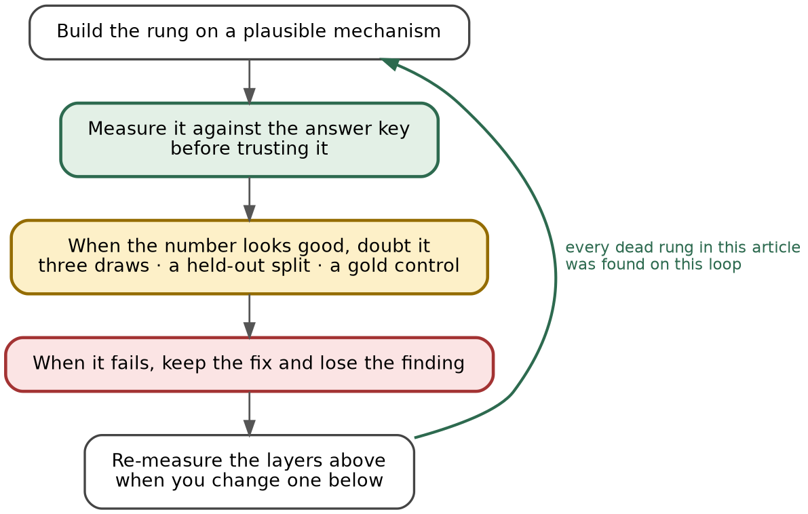

*Fig. 15: The measurement loop. Every dead layer here was found on it. Source:
author-created with Graphviz.*

The third step does the work. **A layer that has just produced a good number is
the least likely thing in a system to be re-examined**, and that is where all our
false results lived — a reranker with an interval excluding zero, a judge with
1.7× separation, a voting layer with a net gain on one draw. All three evaporated under a
second draw, a corrected prompt, or a held-out split.

---

## 8. Where this sits in the literature

**We mostly agree, and the agreements matter.** Our abstention layer is *selective
prediction*, a formalised field; we compute risk-coverage curves without having
used its vocabulary. Our weak judge is corroborated, not idiosyncratic — published
work documents self-inconsistency in LLM judges and an agreeableness bias with
true-positive rates above 96% against true-negative rates below 25%. Our voting
result is the same story from the other side. Position bias in option lists is
documented too, and *option-order randomisation* is the recommended mitigation
— we built it, and it showed our "attractor" was a default of our own, not the
model's (section 2).

**Where we differ is what we compared.** That literature treats the judge and
self-consistency voting as standard tooling. We priced both against a free string
comparison, on the same records, in the same run. Blind, the judge separated
1.7× against the string comparison's 2.7×; shown what it was judging, it
separates 3.4–4.2× — and still costs 84,000 tokens a run against zero, and still
nothing reads it. We have not found that comparison published. It is the narrow
claim this article defends.

**Where we are behind, stated in the right units.** The strongest published system
on this corpus is [CONORM](https://doi.org/10.1101/2023.09.26.23296150) — Yazdani,
Rouhizadeh, Bornet and Teodoro, *Context-Aware Entity Normalization for Adverse
Drug Event Detection*, medRxiv 2023 — which fine-tunes on 875 of CADEC's 1,250
files. Its
evaluation code scores a `(type, span, concept)` tuple under the same two
strategies we use — identical offsets, or overlapping ones — so the metrics line
up even though the vocabularies do not. Matched on both axes:

| | span-exact | overlap / lenient |
|---|---|---|
| CONORM, end-to-end, supervised | ≤ **0.704** | **0.7245** |
| CONORM, **detection only**, supervised | **0.704** | 0.891 |
| best supervised detection in their table (GLiNER-L, fine-tuned) | **0.744** | 0.851 |
| ours, end-to-end, zero-shot, held-out | **0.204** [0.150–0.260] | 0.215 |

We are a long way behind on both, and one number would have hidden by how much. The
`≤` is arithmetic, not modesty: end-to-end demands the span *and* the code, so it
cannot exceed detection alone under the same matching, and their published 0.7245
therefore has to be the lenient figure. Their paper reports one end-to-end number
per corpus without labelling its strategy.

**And the ceiling claim survives the check that was meant to break it — but only
in the weaker form.** We claimed CADEC's ~67% boundary determinism caps span-exact
scores near 0.70. Their table has three fine-tuned taggers on CADEC, scoring
**70.4, 71.7 and 74.4 span-exact on detection alone**, before any of them assigns
a code. That is the right region, reached by systems with every advantage doing
the easier half of the task — and the best of them clears 0.70 by four points, so
what we described as a cap is better described as where the boundary convention
puts you. Quoting only the 70.4 would have made our estimate look exact; it is
not.

Three things travel with the comparison. They normalise to **MedDRA preferred
terms**, not the 129,675-concept SNOMED graph we code against. They are supervised
— 875 of CADEC's 1,250 files for training, against our zero — and on the one
corpus where they report it, F1 falls from **50.2% to 39.4%** on concepts not seen
in training, with precision flat, so what supervision buys on unfamiliar concepts
is recall. A zero-shot system is in that condition on every record by
construction. And they state plainly that CONORM handles **only continuous ADE
mentions**, so the discontinuous spans our extractor cannot express are outside
theirs too.

---

## 9. What we would tell you

We set out believing that stacking reliability layers buys reliability. Measured
end to end, **the layers made errors visible rather than fewer** — worth a great
deal, and not what they were bought for.

One split runs under everything below, and it is worth naming before the table.
Our task has a general half and a domain half. Reading a patient's post and
finding where a reaction is described is ordinary English comprehension; deciding
that the reaction is |Gonalgia| and not |Pain of knee region| is specialist
knowledge. **The model is good at the general half and poor at the domain half** —
on the held-out split it finds four mentions in five and correctly codes about one
in three of them.

The obvious response is to reach for a domain model. We tried two, and both are
rows in section 2's table: SapBERT made the system worse, and BioMistral could
barely answer at all.

What actually explains the gap is stranger. **The domain knowledge was never
missing.** Our retriever puts the correct concept on the twenty-line menu for
**93%** of the spans the model finds, and the model, looking straight at it,
takes the right line **81%** of the time.
The expertise this task needs is not in the model and we could not put it
there; it is in the vocabulary, and the model reads it well enough. What it
does not do well enough is find the mention in the first place: half of gold
is not proposed as the annotators marked it, and nearly half of what is
proposed misses their span — a third of that on nothing they marked at all.
That is why the free check works, and why every job below except one comes off
the model's desk.

The part another team can use tomorrow is the assignment, not the ladder:

| job | whose | evidence |
|---|---|---|
| **Read the prose, propose candidate spans** | **the model** | the one thing it does well — it reaches 178 of 226 gold mentions on overlap, 116 exactly; nothing else in the ladder can propose one |
| Recall an identifier | **not the model** | F1 0.018 against 0.209 for retrieve-and-pick, at more tokens |
| Decide the candidate list | **not the model** | the retriever, with no model in it, puts the answer on the menu for 93% of the spans the model finds |
| Order the candidate list | **not the model** | line one is the retriever's best guess and the pick takes it four times in five when the answer is on the menu |
| Check its own output | **unproven** | self-correction fired 2–3 times a run on invented quotes and rescued none; voting's sign changed with the draw |
| Judge whether an answer is right | **the model can, shown the evidence** | blind, 1.7× against the string comparison's 2.7×; shown the menu, 3.4–4.2× (section 5) — at 84,000 tokens a run, and nothing reads it |
| Decide when to abstain | **not the model** | it never reported below 0.9 confidence while being right 38% of the time |
| Validate existence, format, grounding | **not the model** | deterministic checks are exact on those classes, at zero cost |
| Decide how much to withhold | **you** | three currencies moving in three directions, and a break-even only the deployer has |

> **The model reads. Almost everything else belongs to something that does not
> resample — and one job belongs to you.**

And six practices, each of which we learned by getting it wrong first:

- **Condition your confidence on something that does not resample** — a
  vocabulary, a schema, a type check, a compiler — and **establish its
  precondition before you build.** One query against the answer key tells you
  the ceiling of the free lane before a model runs.
- **Measure your floor before you measure an improvement.** Three identical runs
  of our unchanged system differ by up to 4 points of F1, which makes most of what we
  tried unreadable on its own. It is easier to state that rule than to obey it:
  two arms we shipped sit below that floor, and their rows say so. The same
  discipline applies to the probe that authorises an arm — run it on the
  denominator the arm will be scored on, not a larger one that happens to be
  available.
- **Test the free layer against your answer key.** Every rejection there is false
  by construction, so you get its false-positive rate for nothing. Ours went from
  9.3% to 0.13% without touching a model.
- **Grep for the readers of every field you write**, and when you find an orphan,
  measure it before you adopt it rather than assuming it would have paid. Forty
  lines of regex over our own source named all three orphaned fields we had found
  by hand, and left the 55 live ones alone.
- **Judge each layer against its own purpose, not against accuracy** — and print
  coverage and yield beside every accuracy figure. Abstaining always raises
  precision, so any layer that withdraws answers will look good on the wrong
  column.
- **Check that your metric can see the defect you are preventing.** Ours could
  not: fixing a layer that shipped answers under a warrant that no longer applied
  moved F1 by nothing, because precision and recall cannot tell an unwarranted
  answer from an incorrect one.

The system ships about a quarter of its answers, at four to six errors per
hundred instead of thirty-eight to forty-one on development (3.8 against 59.6
held out), and hands the rest to a person. Not what we set out to build.
And one limit is worth being plain about, because it is structural rather than a
shortfall we could engineer away: **nothing above the extractor made the system
better at the task.** Improving the extractor did — a worked example and a
negation instruction were the two largest gains we ever measured — but that is prompt
engineering, not reliability engineering, and it is the part everyone already
does. No layer we built can propose a mention the extractor missed — not even
the human desk, which can only choose codes for spans it was handed. Reliability
engineering of this kind makes a system's answers more trustworthy. It does not
make the system see more. That was still worth having, and it is not what we
thought we were buying.

---

## 10. What we could not settle

- **Why this model repeats itself on some runs and not others.** Two of three
  cold draws were identical to the byte and the third was not; the same prompts
  answered two days apart disagree on half. It is not sampling noise and it is
  not a model property alone. A probe of the inference server's state between
  requests is registered; nothing here explains it.

- **Whether the looser lexical setting should ship.** It wins on yield three
  draws of three and triples the errors per hundred records; the article says
  that trade is the deployer's, and we left the default where the held-out run
  was made.

- **We assume exactly one code is right.** `"knee pain"` coded |Pain of knee
  region| is scored wrong against a gold |Gonalgia| that is retired and carries
  "Knee pain" as one of its own names. Some share of our mis-coding is defensible
  synonymy; we have not measured which share, and the answer moves our numbers
  upward.

- **We never ran a supervised baseline.** Our distance from a trained system is
  read off someone else's paper, on a different vocabulary and a different test
  set — not measured on our own splits.

- **We never tested how much a dictionary could do.** A one-draw probe on an
  earlier run, below our own bar, suggested detection cannot be replaced but
  **the pick can be for about a quarter of records** — where a span resolves to
  one concept in our keyword table, taking it without asking the model was at
  least as accurate as the model's pick. A short-circuit we did not build, on
  the rung we spent the most effort on, and not re-measured on the base run.

- **The precondition tool has only ever been run backwards**, against wreckage
  whose answers we already knew. **A tool validated that way is a hypothesis
  about the next project, not a result from this one.**

- **The reproducibility mechanism rests on one sparse model against four dense
  ones.** It should fail on a dense model of similar size. Nobody has tried.

---

## 11. Limitations

- **The held-out split was spent once.** Its intervals are the claim; everything
  else here is development-side and labelled.
- **The extractor is not the best one buildable for this task.** Its prompt was
  tuned over a handful of arms and then frozen so the rungs could be compared
  against one base; a team building for this domain alone would keep going, and
  the base numbers would rise. The comparisons between rungs do not depend on
  that.
- **The development-side figures are one base run, three draws.** The twenty
  rung 0 arms, the reranker, the other-model sweeps and the dictionary probe
  were measured on earlier draws; they are named here without their figures,
  which are in the decisions log.
- **The judge is a 3.2B model grading a 20B one.** Shown the menu it separates
  3.4–4.2×; that is a measurement on the development split, and nothing in the
  shipped configuration reads it.
- **Self-correction was never exercised.** It fired 2, 2 and 3 times across three
  runs on invented quotes and rescued none, so one rung of seven is unmeasured
  rather than measured and found wanting.
- **Human cost is a count of records routed, never minutes.** No reviewer has sat
  at the desk: every figure for it is a declared rate or a ceiling derived from
  gold.
- **17.3% of the development split's gold mentions are discontinuous** and our
  extractor emits one segment, so every recall number carries a cap we built
  rather than one the task imposes. The near-miss corruption is synthetic.
- **CADEC is from 2015 and almost certainly in pretraining**, which inflates our
  absolute numbers and, if anything, understates what a reliability layer might do
  on text a model has not seen.
- **CADEC is non-transferable**, so a reader must accept CSIRO's licence and
  fetch it. We ship document IDs, never text.

Code, ledger, decision records, and the source for every figure:
**https://github.com/wbagais/reliability-ladder**
