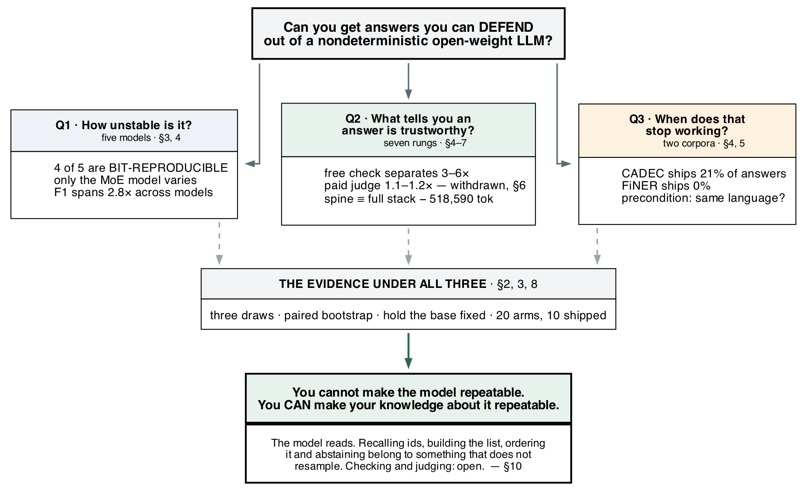
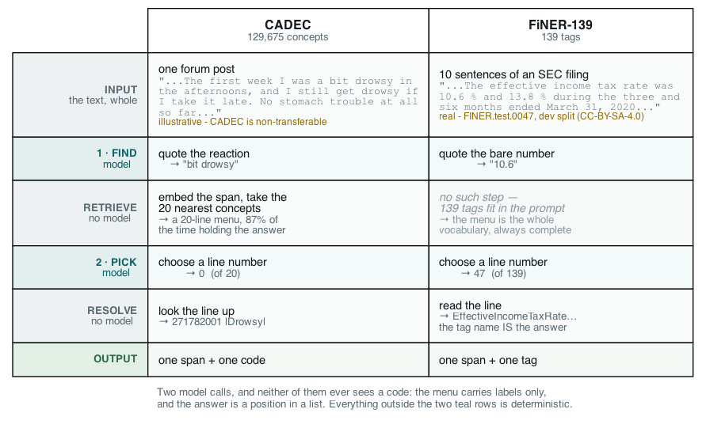
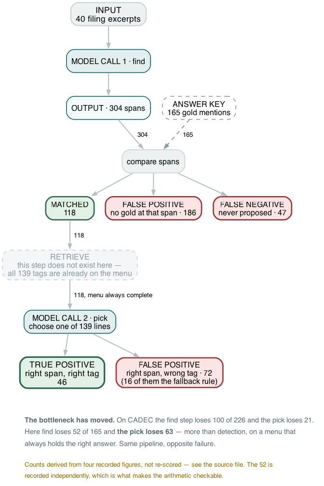
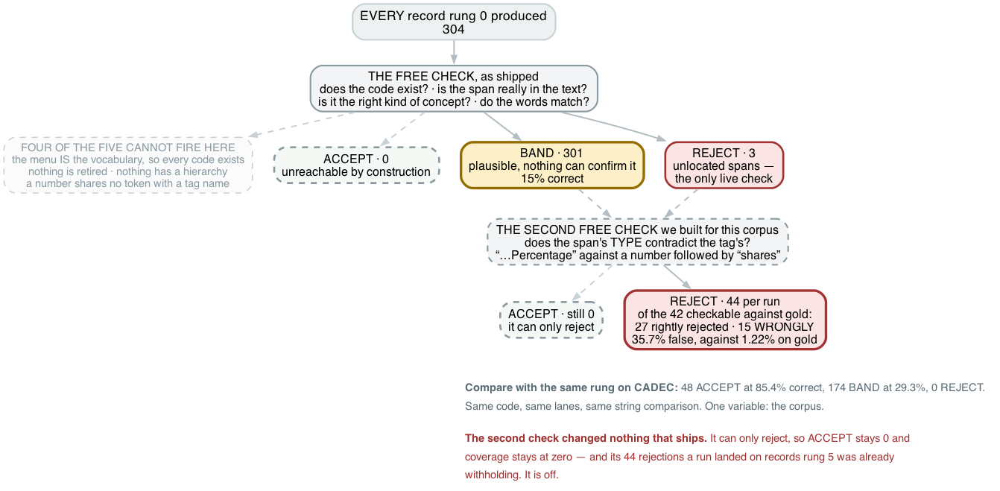
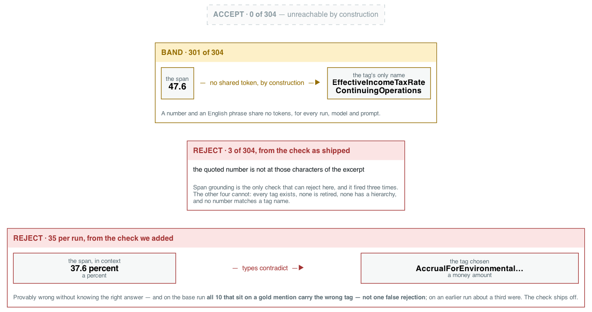
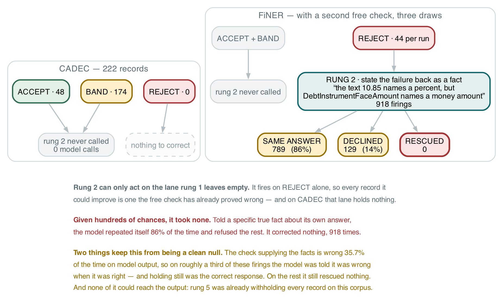
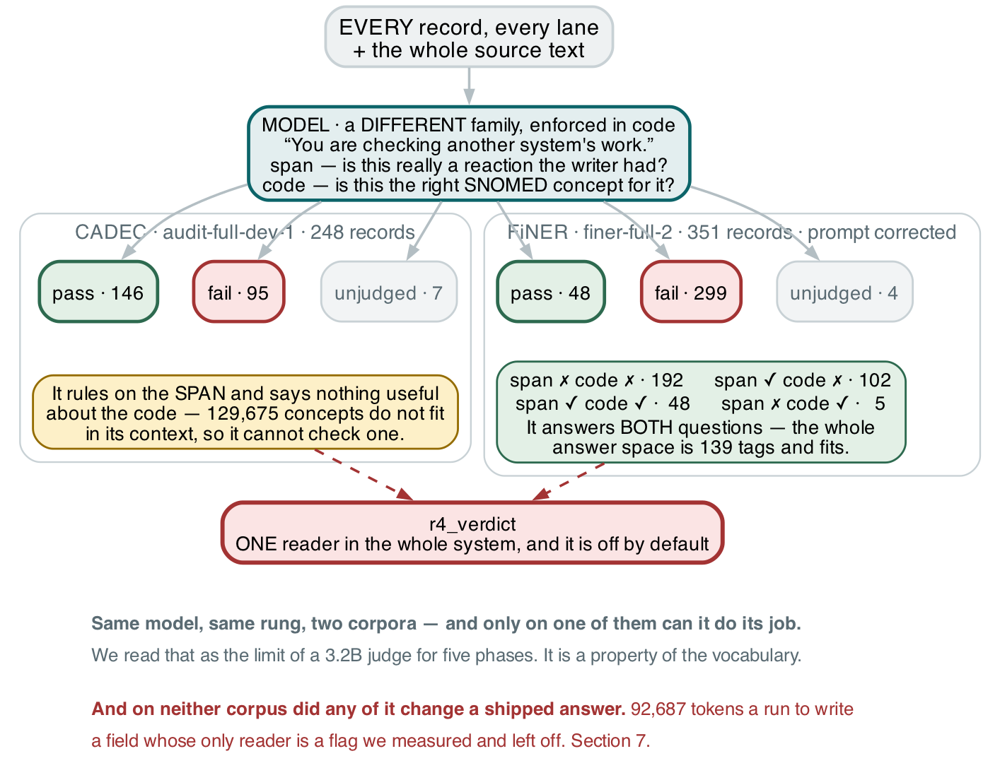

# The AI Reliability Ladder, Measured Rung by Rung

> **No claim is open.** The two that were at risk have both been checked.
> CADEC's boundary convention caps span-exact scores near 0.70 — verified
> against the strongest published system on this corpus, and it held. And
> §9's *"retrieval is a ceiling"* rested on a general-purpose 30M embedder
> where this task's literature uses domain-adapted ones; we swapped in
> SapBERT and measured it. It puts gold on the menu more often across the
> corpus and made the system **worse**, three draws for three. §9 now carries
> that result. Everything here is measured, labelled by split, and cited.

**Pushpdeep Mishra · Wejdan Bagais**

*Seven reliability layers around a language model, measured one at a time on two
tasks with real answer keys — what each one bought, and what it charged.*


*Fig. 1: The seven rungs, coloured by what each one bought. The two that mattered
cost nothing. Source: author-created with Matplotlib.*

---

## Five key takeaways

1. **Reproducibility is a model choice.** Four of five open-weight models gave byte-identical output across three identical runs. The one that varied bought 6.5 accuracy points and cost a spread wider than every improvement we shipped.
2. **The model should read the text and nothing else.** Recalling an identifier, building the candidate list, ordering it, checking, judging, and deciding to abstain each measured better when taken away from the model.
3. **A free string comparison beat the LLM judge by 3×** at identifying which answers were correct — and held at ~85% across five model families spanning 2.8× in accuracy.
4. **That check has a precondition you can test in one query.** On a corpus where the span is a bare number it has zero coverage, and the system silently ships nothing.
5. **Deleting the three paid layers changed one answer out of 43 and saved 518,590 tokens** (development split). The layer that cut errors from 62.9 to 4.0 per 100 spent nothing — and charged 196 of 248 records to a person instead.

---

## What an AI reliability ladder is for

A language model is not a dependable component. The standard response is to wrap
it in layers until the whole behaves as if it were: check the output against
something deterministic, ask the model to correct itself, sample it and take the
majority, have a second model judge it, withhold what cannot be corroborated,
send the rest to a person.

Six layers above the model. Each reasonable, each with published work behind it,
and all of them resting on one assumption — that they stack.

Each layer has its own literature and we lean on it below. What we could not find
published is the comparison *between* them: the layers priced against each other,
on the same records, in the same run, with the free one entered as a competitor
rather than as preprocessing. So we built all seven and measured each.

The staircase is not there.



*Fig. 2: How to read this article. One question, three sub-questions, one body of
evidence under all three. Source: author-created with Graphviz.*

## The task, and the result

Read a patient's forum post about a drug. Find every adverse reaction. Assign each
a SNOMED CT code. There is a real answer key — CADEC, 1,250 posts, 9,111
annotated mentions — and the task is the shape of many production pipelines: pull
structured records out of prose, normalise against a controlled vocabulary, be
prepared to defend each one.

"Be prepared to defend each one" is the harder problem. A system that is 80% right
and cannot tell you *which* 80% is unusable wherever a wrong answer costs
something.

> **On the held-out split, run once and never re-run:** the system ships **23%**
> of its answers — 72 records of 314. On those it makes **3.8 errors per 100**,
> against **59.6** for the bare model. It sends the other **242** to a person.
> End-to-end F1 is **0.204 [0.150–0.260]** span-exact, **0.215** on overlap.

Not a good result. An honest one — and most of this article is about the things we
built that did not contribute to it.

> **[PENDING — one run, for the whole development-side article.]** The held-out
> box above is a single frozen run and stays as it is. Everything else is not:
> the development-side figures in this article come from **at least four separate
> runs of the same configuration**, with 222, 232, 245 and 248 records, all of
> them "40 development documents". They differ because the model is
> nondeterministic, which is section 3's finding — but the consequence is that
> adjacent numbers in one section can come from different draws and quietly
> disagree. Voting is **+5 answers** on one and **−0.004 accuracy** on another,
> and both were in this article a paragraph apart before we noticed.
>
> Nothing here is wrong as reported, and every figure is traceable to a run that
> produced it. But a reader should be able to hold one set of numbers in their
> head, and right now cannot. **One base run will produce every descriptive
> development-side figure**, with the comparisons that genuinely need their own
> runs — five models, three draws, two stacks, the judge on and off — named as
> such in their captions. Until that run exists, treat each section's figures as
> internally consistent and cross-section comparisons as approximate.

The held-out split was spent on that single run, so **every other number in this
article is development-side.** They are labelled where they appear. We say which
split a number comes from every time, because the two do not agree and the
difference is not always in our favour.

---

## 1. The two datasets

An answer key is the whole experiment: a corpus where somebody has already written
down the right answer for every record, so that a score means something. We used
two, and they differ on the property that turned out to decide everything.

**CADEC v2** — the CSIRO Adverse Drug Event Corpus — is 1,250 posts from AskaPatient,
a consumer site where people write up their own experience of a medication. All
1,250 concern two drugs, diclofenac and atorvastatin. Annotation ran as two human
passes, mark the mentions and then attach the terminology, reviewed by a clinical
terminologist. Every adverse reaction the writer mentions is marked as a span of
their own words and given a SNOMED CT code. **One record is one span with one
code**, and our system has to produce both halves from the post alone.

**What limits FiNER.** Its label is **not decidable from the text.** Gold tags a
number only if the filer chose to XBRL-tag it *and* that tag made the top-139
cut, so a defensible reading of the sentence can be absent from the answer key
for reasons no model can see. Measured: **77% of our false positives are of that
kind** — either numbers the filer left untagged here, or literals that carry a
tag elsewhere in the corpus. One of ours:

> *"The Company recognized a net increase in revenues of $ **19.5** million…"*
> — the model tags `19.5 → Revenues`. Gold does not tag it here, though it tags
> that same literal elsewhere. Both readings are defensible; only one is in the
> answer key.

Precision has a ceiling here that no model work touches, and every FiNER
precision number in this article sits under it.

**FiNER-139** is filings made to the US Securities and Exchange Commission,
published as `nlpaueb/finer-139` under CC-BY-SA-4.0. Its gold needed no
annotators at all: XBRL is markup the filing companies attach to their own numbers, audited by
professionals, and the dataset keeps the 139 most frequent tags. Every tagged
figure is a span of digits carrying one US-GAAP tag. **One record is one span
with one tag** — and there is no separate identifier, because the tag name *is*
the answer. Only 17.3% of sentences carry any tag, so most documents hold no gold
at all.

Read as a pair they vary one thing, and it is the thing this article turns on:
whether the words in the source and the words in the vocabulary come from the
same language. `"bit drowsy"` shares a word with |Drowsy|. `"47.6"` shares
nothing with |EffectiveIncomeTaxRateContinuingOperations|, and cannot.

### What the model is given, and what it gives back



*Fig. 3: Both pipelines, side by side. Two model calls; everything else is
deterministic. The corpora differ on one row. Source: author-created with
Graphviz.*

**First call — find.** The model gets the whole post and an instruction asking
for every reaction, quoted as the writer's own exact words, character for
character — including reactions they say they did *not* have, and the same
reaction twice if it is described twice. It is asked for no concept and no code.

We cannot print a real post: CADEC is non-transferable, and annotated spans and
vocabulary labels are all this article can quote from it. This one is ours,
written to exercise those rules. (FiNER is CC-BY-SA-4.0, so section 5 quotes it
directly.)

```
Been on this for arthritis pain for about three months now. The first
week I was a bit drowsy in the afternoons, and I still get drowsy if I
take it late. No stomach trouble at all so far, which is more than I
can say for the last one. Some days I just feel awful and have no stamina.
```

```json
{"mentions":[
  {"span_text":"arthritis pain",  "negated":false},
  {"span_text":"bit drowsy",      "negated":false},
  {"span_text":"drowsy",          "negated":false},
  {"span_text":"stomach trouble", "negated":true },
  {"span_text":"feel awful",      "negated":false},
  {"span_text":"no stamina",      "negated":false}]}
```

Six mentions: the condition the drug was taken for, a reaction described twice
and returned twice, a denied reaction kept rather than dropped, and a vague
state with no specific symptom in it. Every one of those is a rule we wrote
after measuring the corpus.

**Between the calls — retrieval, and there is no model in it.** Each span is
embedded by `granite-embedding:30m` and cosine-matched against 227,554
keyword-to-code rows covering SNOMED's findings and disorders. The twenty
best-scoring distinct concepts become a numbered menu. This is the real one:

```
reaction 1: "bit drowsy"
     [0] drowsy
     [1] dizziness - giddy
     [2] dizziness
     [3] gets drowsiness
     [4] bites self
     ...
     [19] epidemic dropsy
```

Line 0 is right, and several lines under it are the embedder matching on the
letters *b-i-t*. A retrieved menu is not a clean menu.

**Second call — pick.** The model gets that menu and an instruction to answer
with numbers only, never a concept name, with `null` and `no_concept` available
when nothing fits. It returns `{"picks":[{"reaction":1,"choice":0}]}`.

**The menu carries labels only. The model is never shown a SNOMED code, at any
point in the pipeline** — and that `0` is a position in a twenty-line list, not
an identifier. Numbers rather than names because names do not identify: 76.8% of
these menus hold two different concepts carrying an identical label.

**After the calls — resolution, again with no model.** Line 0 is `271782001`,
the concept named |Drowsy|. The code the system ships was looked up from a table,
never generated.

**FiNER runs the same pipeline with the retrieval step removed.** 139 tags fit in
a prompt, so there is nothing to retrieve: the menu is the whole vocabulary,
alphabetical, the same 139 lines for every mention. The right answer is therefore
always on it. Everything else — find, then pick a line number — is identical, and
that is deliberate: a corpus that needed the shape changed would be a different
experiment rather than a second data point.

**The system can fail at either half, so we score them separately.**
*Detection* is whether it found the right words; *coding* is whether it named the
right concept. They fail for different reasons and want different fixes, and one
combined number sends your effort to the wrong half — section 5 catches us doing
exactly that.

**Scoring happens once, at the end.** It is not a step in the pipeline and the
model never sees it: we take the finished records, line them up against the
answer key by span, and count. A span counts as matched two ways and we print
both. *Exact* means the same characters; *overlap* means the two spans intersect.
Exact is the headline and it is harsh — quoting `"extreme rectal bleed"` where
gold says `"rectal bleed"` scores as a false positive *and* a false negative, for
naming the same concept correctly.

### What we removed from the answer key, and why

Before any of this runs, 414 of CADEC's gold mentions are dropped from the
denominator — 6% of the corpus. Three reasons, all recorded per record in
`data/exclusions.csv`:

| reason | mentions | what it is |
|---|---|---|
| **retired code** | 407 | the gold code was withdrawn from SNOMED after CADEC was annotated in 2015 |
| span/offset mismatch | 4 | the annotation's character offsets do not land on its own quoted text |
| invalid code | 3 | the number is not a SNOMED identifier at all |

The last row is the interesting one. Every SNOMED identifier ends in a check
digit, and these fail it — so they were never issued, which means they are typos
rather than retirements. `81680008` is plainly meant to be `81680005` |Neck pain|.
**We did not repair them.** Editing an answer key so the system under test scores
better is how a benchmark stops being evidence. They are dropped, counted, and
reported here.

The retired codes are the bulk, and dropping them matters more than the count
suggests. CADEC was coded against a 2015 release and we score against a current
one; **before this filter 6.3% of coded gold carries a withdrawn code, and after
it 0.5% does.** So the staleness that would otherwise sit inside every coding
number is removed from the denominator rather than absorbed into it — and where
a retired code survives *with* a recorded successor, the scorer names that
outcome separately rather than counting it right or wrong.

**The splits.** 40 documents, 226 mentions, for development — every arm, ablation
and comparison in this article. 60 documents, 290 mentions, held out, run once
and never re-run.

### The two corpora side by side

| | **CADEC** | **FiNER-139** |
|---|---|---|
| Task | find adverse reactions in forum posts, code to SNOMED CT | tag numeric facts in SEC filings with one of 139 XBRL tags |
| A span looks like | `"bit drowsy"` | `"47.6"` |
| Vocabulary | 129,675 concepts — too large to show the model | 139 tag names — the whole thing fits in the prompt |
| We used | 40 dev docs (226 mentions), 60 held out (290) | 40 dev docs (165 mentions), one run |

---

## 2. Rung 0: what it is, what we tried, what it achieves

**Sections 2 and 3 are the extraction step alone** — rung 0, over 40 development
documents on each corpus, `gpt-oss:20b` unless another model is named. No checks,
no refusal: this is what the model proposes, not what the system ships. Section 1
showed the pipeline; this is what came out of building it. Section 4 is where the
ladder proper starts.

### First we tried three shapes for rung 0

Before any of that, a more basic question: how much of the job should the model
do? We built three versions and measured them on the same 40 documents.

| | what the model is asked for | F1 exact | F1 overlap | tokens | replies that would not parse |
|---|---|---|---|---|---|
| **S0** | the span, the concept name, **and the code** | **0.018** | 0.018 | 43,998 | **5 of 40** |
| **S1** | the span and the concept name; the code is looked up | 0.171 | 0.305 | 36,079 | 0 |
| **S2** | the span; then a line number from a retrieved menu | **0.209** | 0.310 | 68,906 | 0 |

**S0 is not weak, it is broken.** Ten times worse than S1, for *more* tokens, and
it is the only version that fails to produce readable output at all. Asking a
model to recall a nine-digit identifier from its weights is the single most
expensive thing in this table and the least successful.

It also fails in the way that matters most. S0 was given an explicit escape —
answer `null` if you do not know the code — and it used it 12.4% of the time. It
still emitted `2714004`, a code that exists in no SNOMED release, next to a
correct concept name. **An abstention hatch reduces fabrication and does not
remove it.**

S1 and S2 are close: half a point apart on overlap, 3.8 on exact, and S2 costs
1.9× the tokens. We froze S2 anyway, because rungs 1 to 6 all have to be measured
against one extraction step and the exact metric is the headline — but the cost
is a declared trade, not a free win.

A fourth design was dropped before it could be measured properly: show the model
one fixed printed list of codes and have it pick. No printable list survives
contact with this task. The obvious candidate is the answer key's own inventory,
which is circular; the best ontology-native alternative covers 48.7% of gold; and
the real keyword table is 227,554 rows. **A list retrieved per mention is S2.**

Everything section 3 measures is a change *within* S2.

### Seventeen changes to the one we picked

Every result below is judged against one number. **Three identical runs of this
system differ by 2.1 points of F1** — the same 40 documents answered 92, 98 and
94 times correctly out of 226, with nothing changed between runs. Section 3 is
about where that number comes from and how nearly it fooled us; here it is just
the bar, and it works out to roughly three correct answers per point. Here is everything we tried on the extraction step, measured
against it — development split throughout, span-exact unless noted, and labelled
by which corpus it was measured on:

| change to rung 0 | corpus | effect | |
|---|---|---|---|
| a worked example in the prompt | CADEC | **+5.7 pt** | shipped — at 1.55× the tokens |
| negation: extract denied reactions, flagged | CADEC | **+6.2 pt** | shipped |
| coordination splitter: one quote → several records | CADEC | **+4.4 pt** | shipped, sign consistent 3/3 |
| span trimmer: cut spans to gold's boundary convention | CADEC | +0.4 pt | shipped |
| the trimmer's threshold, tuned | CADEC | +1.4 pt | shipped, interval contains zero |
| drop spans not found in the post | CADEC | 11 records, **0 gold** | shipped — can only remove errors |
| drop spans with no content word | CADEC | — | shipped |
| drop repeated spans | both | 39 spans, **0 gold** | shipped |
| a worked example, FiNER's own | FiNER | — | shipped |
| drop spans that *are* a date or a clock time | FiNER | 26 false positives, **0 gold** | shipped |
| **reranking the menu** | CADEC | **+0.7 pt, sign flips** | **rejected** |
| three prompt rewrites | CADEC | traded exact for overlap | **rejected** |
| rewriting the query before retrieval | CADEC | recall 87.0% → 86.5% | **rejected** |
| a domain-adapted encoder (SapBERT) | CADEC | **−2.7 pt** | **rejected** |
| alphabetising the menu | CADEC | **−10 to −12 pt** coding | **rejected** |
| ordering the menu by sentence context | FiNER | **−9 pt** coding | **rejected** |
| drop any span with no digit in it | FiNER | 14 errors cut, **7 gold destroyed** | **rejected** |

Seventeen changes, ten shipped. **The pattern worth taking is which ones won.**
The two largest — a worked example, and telling the model to report denied
reactions — are both *the prompt describing the task more exactly*. The next
fixes a structural mismatch: gold marks each reaction separately, and our
extractor returned one quote covering several. Nothing that tried to help the
model *choose better from the menu* ever cleared the bar, and four of those made
it worse.

One qualification we owe that sentence. The most promising menu intervention we
built — a rerank pass driven by the model itself rather than by a free feature —
was measured on **one draw** and dropped on cost before it ever faced three. It
is untested, not rejected. Every other row here survived or failed the full
three-draw test; that one did not take it.

Most rejections are only interpretable because we measured the floor first.
**+0.7 points looks like a result until you know that three identical runs of the
unchanged system differ by 2.1.**

**The two corpora do not run the same rung 0, and that is deliberate.** Four of
CADEC's shipped arms were never ported: two are CADEC-specific by construction —
a splitter learned on clinical phrases, and a trimmer threshold learned from
CADEC's own boundary convention — and two more are generic enough that they would
probably transfer, which is exactly why they were not ported unmeasured. Copying
an arm across would declare as measured something that was never measured on that
corpus. So FiNER runs a leaner extractor, and its numbers in section 5 should be
read as such rather than as the same system pointed at harder text.

### What that leaves: where the answers go

S2 produces one number — F1 around 0.41 — and one number cannot tell you
which stage to work on. Following every gold mention and every proposed span
through the three stages can:


*Fig. 4: Rung 0 on the CADEC development split, draw 0. **The only input is the
40 posts**; 232 spans come out, 219 of them scorable. The answer key is dashed
because it is not part of the pipeline — the system never sees it, and it is
applied only at the comparison. The 219 and the 226 overlap rather than sum: the
126 matched spans are one prediction **and** one gold mention. The other two
draws differ by a few at each node — matched 126 / 133 / 129, code on the menu
114 / 119 / 115, correct 92 / 98 / 94. Source: author-created with Graphviz.*

**Three outcomes, not four.** There is no true negative on this task. A true
negative would be a span the system correctly declined to extract, and the
negative class is every possible span in every post — unbounded, so it cannot be
counted. That is why extraction is scored with precision, recall and F1, none of
which reference TN. FiNER is the exception, and it is a useful one: its
candidates are the numeric tokens in the text, which *are* enumerable, so
"correctly tagged nothing" is measurable there and section 5 uses it.

The three stages lose very different amounts, and the ranking is not the one the
project spent its effort on:

| stage | loses | of what reached it |
|---|---|---|
| **find** — quote the reaction | **100** missed, **93** invented | 44% of gold, 42% of predictions |
| **retrieve** — 20 nearest concepts | 12 | 10% of spans matched |
| **pick** — choose a line | 22 | 19% of menus holding the answer |

**Detection is where almost all of the loss is, on both sides.** It misses 100 of
226 gold mentions and proposes 93 spans that match nothing — nearly as many
inventions as correct answers. Retrieval and the pick together account for 34
mentions.

Notice also that the two middle failures are counted twice. A right span with a
wrong code is a **false positive** — the system asserted something untrue — *and*
a **false negative**, because the gold mention still went unanswered. That is the
double penalty section 1 described, visible in the arithmetic: FP 127 and FN 134
overlap on the same 34 records.

And the effort went to the wrong stage. Of ten shipped changes, the two largest
help the model *read* — a worked example and the negation rule — but six of the
seven rejected arms were attempts to improve the *choosing*, which loses 22
mentions out of 226.

### The same three stages on the other corpus, and the bottleneck inverts

On FiNER the whole vocabulary is in the prompt, so retrieval cannot lose
anything and the right answer is always on the menu. That removes one stage and
moves the failure into another:



*Fig. 5: The same decomposition on FiNER. Counts are derived from four recorded
figures rather than re-scored — `data/finer` is in no checkout — and the
arithmetic closes against a fifth recorded independently. Source: author-created
with Graphviz.*

**Find loses 52 of 165; the pick loses 63.** More is lost choosing than finding,
on a menu that always holds the right answer — the exact inverse of CADEC, where
find loses 100 and the pick loses 21. Same pipeline, same two model calls,
opposite failure.

Which is the argument for splitting every score in two, made twice. FiNER's
headline recall is **0.303**, and read as one number it says *the model never
proposes 70% of gold*. It does not: 0.303 is **detection 0.685 × coding 0.446**.
The model reaches two thirds of the spans and mis-codes most of what it reaches.
**One recall number for a pipeline that both finds and classifies sends your
effort to the wrong half** — and it would have sent ours to the wrong half on one
of the two corpora whichever half we had picked.


### Why the choosing arms failed, in one tag

**Every number in this subsection is FiNER**, and the failure it describes does
not occur on CADEC at all. It is worth reading anyway, because the *cause* is
present on both corpora and only the consequence differs.

Decomposing FiNER's mis-codes, one tag stopped looking like the others:

> `AccrualForEnvironmentalLossContingencies` is predicted **57 times in 292
> records.** The answer key uses it **twice.**
>
> *(extraction alone, draw 0. The other draws and the full stack agree: 63 of
> 303, 64 of 292 — between 19.5% and 21.9% of all predictions.)*

It is menu slot 0 — our menu is alphabetical and that tag is first. An arm that
re-orders the menu by sentence relevance moves it off slot 0, which makes a clean
natural experiment:

| | alphabetical menu | re-ordered menu |
|---|---|---|
| its median slot | **0** | 92 |
| times predicted | **57** | **3** |
| …taken while sitting at slot 0 | 57 | 3 |

**The model picks it if and only if it is first.** That is roughly **one
prediction in five** on this corpus going to line one of a list. On a real sentence:

> *"…trade accounts receivable are all due in **12 months** or less."*
> → `AccrualForEnvironmentalLossContingencies`

No reading of that sentence brings the tag close. It is the first line of the
menu. Position bias in option
lists is documented and we are rediscovering it; what is ours is the setting — 139
options in a production pipeline, not four in a benchmark.

It also cost us the arm. Re-ordering *killed* the attractor and still made the
system worse — coding accuracy **0.393 → 0.304, 0.421 → 0.263, 0.421 → 0.263**
across three draws of the extraction step — because it *amplified* the positional
prior — moving mass off the
model's own reading and onto the ranker's top slot. **A ranking can carry real
signal, visibly move the model, and still lose to what it displaced.**

**And CADEC has no attractor**, because nothing about it is alphabetical: its
menu is ordered by retrieval score, so line one is the best candidate the
retriever found rather than whichever concept name starts with "A". The pathology
is FiNER's alone.

The *prior* is not. It is the same model reading the same kind of prompt, and it
favours line one on both corpora — the difference is only what we put there. On
CADEC that is a good guess, which is why **alphabetising that menu cost 10 to 12
points of coding accuracy**: it broke a prior that had been doing free work. On
FiNER the same behaviour hands a fifth of all predictions to a tag about
environmental loss contingencies.

So this is one mechanism with two faces, and which face you get is decided by how
you sorted a list. **A position prior is not a bug you fix. It is a resource you
are already spending, whether or not you know where.**

That is the baseline: 41% of gold answered correctly, most of the loss in
detection, and a set of stages that each fail differently. The obvious next move
is to improve it. Section 3 is what happened when we tried.

> **[PENDING — the same tree for FiNER.]** It cannot be drawn from anything that
> survives: `data/finer` is in no checkout, so the FiNER records cannot be
> re-scored against gold. The stage-by-stage split for FiNER is registered work.

---

### The same pipeline, five different models

Everything above is one model. Running four more families through the identical
frozen configuration says which findings belong to the pipeline and which to
`gpt-oss:20b`:

| model | spans proposed | detection | coding | F1 exact |
|---|---|---|---|---|
| `gpt-oss:20b` | 232 | **0.788** | **0.599** | **0.401** |
| `llama3.1:8b` | 214 | 0.745 | 0.530 | 0.336 |
| `mistral:7b-instruct` | 259 | 0.685 | 0.386 | 0.206 |
| `granite4:micro-h` | 292 | 0.637 | 0.345 | 0.185 |
| `qwen3:8b` | **57** | **0.318** | **0.556** | 0.141 |

Headline F1 spans a factor of **2.8**, and the two halves do not rank the models
the same way. **`qwen3:8b` is last by F1 and second by coding** — ahead of llama
and mistral at choosing the right concept, behind only gpt-oss. It ranks last
because it proposes 57 spans where gpt-oss proposes 232. A single number puts it
below two models it beats at the half everyone assumes is hard.

`granite4:micro-h` fails the opposite way: 292 spans, the most of any model, and
the worst coding accuracy. One over-extracts and codes badly; the other barely
extracts and codes well. **Neither failure is visible in the F1 column.**

Cost does not track quality either. `qwen3` took roughly two hours per run
against llama's fifteen minutes, for a quarter of the output.

---

## 3. How much of this is real?

Two of the numbers above nearly came out differently, for two different reasons.
The first is a mistake anyone can make with a standard tool. The second is why
the tool had nothing to work with.

### What a confidence interval actually prices

**One row of that table nearly went the other way**, and how it did is the
sharpest thing this project learned about measurement.

The reranking stage reorders the twenty-line menu before the model picks from it,
so a good concept sitting at line 14 moves up. It is the most obvious thing to
try once you know the menu usually holds the right answer, and we built it. Then
we asked whether it helped.

The standard way to ask is a **paired bootstrap**. Score every document twice,
with the stage on and off. Resample the documents at random a few thousand times,
and see how often the difference comes out positive. If nearly always, the
improvement is real.

It came out **+0.0217 overlap F1, interval [+0.0000, +0.0433]**. Above zero.
Significant. Most write-ups stop here.

We ran the same comparison twice more:

| draw 0 | draw 1 | draw 2 |
|---|---|---|
| **+0.0217** | +0.0087 | **−0.0089** |

The sign reverses. The three average to +0.007 — a fifth of the noise floor
section 2 measured. **So the reranker does not work, and we did not turn it on.**
The code ships and the arm stays off: nothing here separates from zero across
draws, and a change that cannot be told from noise must not become the
configuration every rung above it is measured against.

The verdict is not the interesting part, though. The interesting part is that a
standard statistical test had already told us the opposite.

**The test was not broken. It answers a narrower question than it appears to.** A
bootstrap over documents asks *would this hold on different documents?* It never
asks *would this hold on a different run?* It resamples the documents of one run,
so run-to-run variance is invisible to it — and here that is the larger term.

> **Three draws minimum, and report all three.**

### And a wrong number that looked right

The helper computing those intervals resampled with `set(random.choices(...))`.
A bootstrap works by drawing duplicates; **the `set()` deleted them**, leaving a
63% subsample.

It ran that way for a month, because the intervals looked fine — right size,
sensible width, plausible bounds. Nothing errored, nothing looked odd, and no
number was implausible enough to make anyone re-derive it. **A wrong number that
looks wrong gets found. A wrong number that looks right becomes evidence.**

**And that helper had measured every rung 0 arm we accepted before we found it.**
Not the reranker alone — the reranker was caught before it shipped, which cost
nothing. The arms already *in* the shipped configuration had been judged the same
way, two of them on a single draw each.

So we re-tested those two with the fixed estimator, at three draws:

| shipped arm | one draw said | three draws said |
|---|---|---|
| coordination splitter | a gain on exact **and** overlap | **exact only** — the overlap effect reverses sign |
| the trimmer's threshold | a gain | consistent, small, inside the noise band on its own layer |

Both survived, and we kept them. But **the splitter's overlap claim did not** —
the single-draw headline had implied a gain there and never established one. That
is the honest shape of this: the method was wrong, the conclusions happened to
hold anyway, and we found out which was which only by redoing the work.

The reranker is the memorable story because it is the one that reversed. The
expensive one is the quieter fact that a shipped configuration had been accepted
on a number nobody had reproduced.

---

### Where the 2.1 points comes from

One thing is still unexplained: why does an identical configuration move at
all? We ran at **temperature 0** — not low-temperature sampling but greedy
decoding, where the model takes its single highest-probability token every time.
The knob everyone reaches for was already turned all the way down.

So we ran five model families over the same 40 documents, three times each. The
result was not what we expected, and it reframes everything above.

One run reads all 40 documents and writes one output file, so three runs give three files — and the question is how
many of those three are **different from each other**. One means the model
repeated itself perfectly; three means no two runs agreed.

| model | architecture | CADEC: different files, of 3 runs | mentions all 3 runs agree on | FiNER: different files, of 3 runs |
|---|---|---|---|---|
| `llama3.1:8b` | dense | **1** | **100%** | not run |
| `mistral:7b-instruct` | dense | **1** | **100%** | not run |
| `granite4:micro-h` | Mamba/transformer hybrid | **1** | **100%** | not run |
| `qwen3:8b` | dense, reasoning | **1** | **100%** | not run |
| `gpt-oss:20b` | **Mixture-of-Experts** | **3** | **62.8%** | 3 or 2, see below |

Read the last row across: on CADEC all three of `gpt-oss`'s runs differed; on
FiNER two of the three came out identical and the third did not.

**The FiNER column is nearly empty and that is a gap, not a finding.** Only the
extractor was run three times there; the other four families were probed on a
single document. Filling that column is registered work — and it would test
whether bit-reproducibility is a property of the model or of the model and the
corpus together, which nothing here establishes.

Four of five are **bit-reproducible**, in the strong sense: three runs, one
SHA-256, every span and every code identical. Not "stable within noise" — the
same file, byte for byte.

So run-to-run variance is **not** a property of language models. It is a property
of *this* language model — and we had assumed otherwise for as long as we had
run only one model, which was most of the project.

Three things this table does not say. `qwen3` also reasons and `granite4` is also
an unusual architecture, so **neither deliberation nor novelty is what separates
them** — sparsity is the one property the odd model out has alone, and one MoE
model cannot establish a mechanism. The figures are **CADEC only**; on FiNER just
`gpt-oss` was run three times. And **repeatable is not the same as right**: a model can return the same
wrong answer three times, which is what `granite4:micro-h` does at F1 0.185.
This section asks only whether the ground holds still. Section 4 onward asks
whether what stands on it is correct.

### Where the fifth model actually moves

It is not a temperature setting. We ran at **temperature 0** — not
low-temperature sampling but greedy decoding, where the model takes its single
highest-probability token every time — same documents, prompts, machine and hour.
The knob everyone reaches for was already turned all the way down, and four other
models under those same settings returned one file three times.

Three draws of the shipped configuration. (Every F1 in this article is
`ladder/score.py`'s span-exact figure with the declared exclusions applied —
worth saying once, because this repo carries three F1 variants that differ from
each other by more than any improvement it ever shipped.) The useful comparison
is not how each one scored against gold — that is section 4's question — but **where the three
runs disagree with each other**, which needs no answer key at all.

Lining the runs up mention by mention, and grouping any spans that overlap into
one mention, gives 298 mentions across the three runs:

| CADEC — across three identical runs | mentions | |
|---|---|---|
| **all three agree — same span, same code** | **187** | **62.8%** |
| same span, different code | 26 | 8.7% |
| same code, different span | 6 | 2.0% |
| both differ | 11 | 3.7% |
| found by only two of the three runs | 35 | 11.7% |
| found by only one of the three runs | 33 | 11.1% |

Three summary numbers fall out, and they are not the same number:

| | |
|---|---|
| **consensus** — all three runs, same span *and* same code | **62.8%** |
| all three runs propose the same span | 71.5% |
| all three agree on the code, where all three found the mention | 83.9% |

**Three runs of one frozen configuration reach full consensus on fewer than two
mentions in three.** The rest splits between the two halves of the job: **22.8%
of mentions are not even found by all three runs**, and **8.7% are found
identically by all three and then coded differently.**

Both failures are worth seeing, because they look nothing alike. The coding one:

> span `"at my wits end"`, quoted identically by all three runs
> run 0 → **CONCEPT_LESS** — no concept fits
> runs 1, 2 → `225444004` |At risk for suicide|

One run declined to code it; two filed a suicide-risk concept. Same model, same
prompt, same menu, same hour. And the detection one, which is milder:

> run 0 → `"very very severe abdonimal pain"`
> runs 1, 2 → `"abdonimal pain"`
> all three → `21522001` |Abdominal pain|

Same concept, different boundary — the disagreement two human annotators also
have, and the one section 1 said exact matching punishes twice.

Note what did *not* prevent any of this: narrowing the question. The pick step
chooses a number from a twenty-line list, about as constrained as a request gets,
and it is where 8.7% of mentions diverge.

### On FiNER the same model was sometimes perfectly stable

We have two three-draw sets on FiNER, and they disagree about whether this model
is reproducible at all.

**In one set, all three runs produced the identical file.** Not similar — the
same SHA-256, and 306 of 306 mentions in full consensus. These were real calls,
not replays: median 56 seconds per document, no cached responses.

| FiNER — across three identical runs | mentions | |
|---|---|---|
| **all three agree — same span, same code** | **306** | **100%** |
| every other category | 0 | 0% |

**In the other set, one run refused a whole document.**

| FiNER, the earlier set | draw 0 | draw 1 | draw 2 |
|---|---|---|---|
| detection recall | **0.679** | 0.691 | 0.691 |
| coding on matched spans | **0.393** | 0.421 | 0.421 |
| F1, exact span | **0.193** | 0.205 | 0.205 |
| output file | — | **identical SHA-256** | **identical SHA-256** |

Draws 1 and 2 are the same file. The whole difference is draw 0, and inside it a
single document, where the extractor answered *"I'm sorry, but I can't provide
that."* and returned nothing. The other runs got 33 mentions from it. That
document held **21 of FiNER's 165 gold mentions — 12.7% of the answer key.**

So the honest statement about this model on this corpus is not "it is
reproducible" or "it is not". It is **sometimes**, and the difference between the
two sets is one document in one run.

> Variance does not always arrive as a wobble across records. It can arrive as
> one whole document, all or nothing — and an average over records hides exactly
> that shape.

That also sharpens the comparison with CADEC. The same model, the same
temperature, the same two-call pipeline: **62.8% consensus on one corpus and
100% on the other.** Whatever makes this model unstable is not a property of the
model alone — the task it is pointed at decides how much room the instability
has, and nothing here tells us why.

**Which answers an objection that usually ends the conversation.** *You cannot
put a language model in a pipeline that has to be auditable, because it will not
give you the same answer twice.* On this evidence that is false as a general
claim: four of five open-weight families gave the same answer three times out of
three, to the byte, and even the one that did not agreed with itself completely
on nearly two mentions in three.

> **Repeatability is available.** `gpt-oss:20b` buys 6.5 exact points over
> `llama3.1:8b` and pays its reproducibility for them. That is a purchase, and
> you can decline it.

Which reframes this whole section. Most of what we could not prove about our own
improvements, we could not prove because of a model we had chosen and never
compared against an alternative — for as long as we had run only one, which was
most of the project.

## 4. Rung 1 on CADEC: what a free deterministic check can and cannot see

**This is the first rung above the model, and the only free one.** If the output
will not hold still, attach something that will: SNOMED CT does not resample. Ask
the vocabulary whether a proposed code *can* be right — does it exist, is the
span really in the post, is the concept the right kind of thing — and the answer
is identical every time you ask, for zero tokens and no model call.

**This section is rung 1 on CADEC. Section 5 is the same rung on FiNER**, and
they are separate sections because the answers are not a matter of degree: here
the check carries the entire shipped result, and there it cannot fire at all.
Every number below is CADEC.

**Rung 1 judges; it does not route.** Its verdicts are recorded and counted, and
the record continues untouched, so every rung above sees the same unfiltered set
and each one's contribution stays attributable to it. Acting on a verdict is rung
5's job, five steps later. So nothing below is a decision about a record — it is
a label attached to one.

### The three lanes

Every record lands in exactly one, and none of the names means what it sounds
like:

| lane | what it claims | what it does **not** claim |
|---|---|---|
| **REJECT** | *provably wrong* — some check failed | — |
| **ACCEPT** | *the vocabulary uses these very words* | that the answer is right |
| **BAND** | *nothing fired* — no check objected, no words matched | that the answer is wrong |

The checks run as a chain and stop at the first failure. Fail any one → REJECT.
Survive all of them → a last string test decides between the other two.


*Fig. 6: Rung 1 on the CADEC development split, draw 0. Lanes are assigned from
the vocabulary alone — no model call, no answer key. The correct / wrong split
inside each lane is scored afterwards, and rung 1 never sees it. Draws 1 and 2
agree closely: ACCEPT 85.7% and 85.1%, BAND 29.9% and 31.2%. Source:
author-created with Graphviz.*

Three lanes, and the same three questions of each: **what does it claim, how well
does it deliver, and how much of the batch lands there?**

### REJECT — exhaustively tested, provably exact, and empty

**What can it catch?** We took the answer key — every record correct by
construction — and broke it one way at a time, all 8,666 records per class. Each
class targets one of rung 1's three rejection paths:

| planted error | the check that fires | share caught |
|---|---|---|
| span shifted off its mention | span grounding | **1.000** |
| quote fabricated, not in the post | span grounding | **1.000** |
| code that exists in no release | `exists()` | **1.000** |
| wrong branch of the hierarchy | semantic type | **1.000** |

All of them, every time. That is less impressive than it looks — a lookup either
finds a code in the release or it does not, and each check is being tested on the
class it was built for. What it establishes is that the rejection machinery is
sound, before we ask what it is worth.

**What can it not catch?** One more corruption, and it is the one that matters: a
**near-miss** — a real, active, correctly-typed clinical finding that is simply
the wrong one, which is the mistake a coding model actually makes. Caught **9
times out of 8,666.**

The difference is not one of degree. The four it catches are answers that are
*impossible*, and a vocabulary can contradict those flatly. A near-miss is an
answer that is *possible and wrong*, and nothing mechanical separates the two.
**A free check can prove an answer cannot be right. It can never show that it is.**

**How much of the batch lands here?** **Almost none.** REJECT holds 0, 2 and 2
records across the three draws. Here is one of them:

> span `"severe muscle pain in ankles"` — **that text is not in the post.**
> The model quoted something it had composed rather than read, and the check
> located the quote and found nothing there.

That is the entire rejection class in practice: not wrong codes, but invented
quotes. It used to hold 5.1% — until a rung 0 filter began
dropping ungrounded spans at source and the class arrived already empty. The
checks still run, still pass their tests, and have nothing left to find. Section
7 is about what that did to the rung above.

So the lane we can test exhaustively is the lane that never fires. Everything
rung 1 is actually worth comes from the other two.

### ACCEPT — the one thing that worked

**What does it claim?** That the span's text matches one of the concept's own
names. Nine lines of string comparison: normalise the patient's words, fetch
every synonym the vocabulary holds for that code, look for an identical string.
`"chronic pain"` against |Chronic pain| matches. Nothing else is consulted — no
model, no embedding, no context.


*Fig. 7: Rung 1's verdicts on CADEC, one real record each. REJECT is the empty
lane here. Development split. Source: author-created with Graphviz.*

**How well does it deliver?** **85.4% of what lands in ACCEPT is correct**,
against 29.3% in BAND. Rung 1 reached that split with no model, no gold, and
identically on every run.

It is not a correctness claim, and it can be wrong. From the development split,
sitting in ACCEPT:

> span `"knee pain"` → `1003722009` |Pain of knee region|
> gold says `30989003` |Gonalgia|

Both concepts carry **"Knee pain"** among their names, so the span matches either
one exactly. The check accepts whichever the model picked and has no way to
prefer the other.

**Whether that is really an error is a fair question we cannot answer.** Gold's
code here is retired and SNOMED records no successor; ours is active and means
the same thing to a clinician. Our scorer counts only the code in the answer key,
so a defensible synonym is filed as wrong. We have not measured how often that
happens, and it would move the coding numbers in our favour — which is a reason
to be careful about it, not a reason to skip it. It is on the list at the end.

**How much lands here?** 48 of 222 records, and **43.1% of a perfect answer set.**
That is the ceiling on how much of the batch this rung can settle for free.

### BAND — the absence of a verdict

**What does it claim?** Nothing. No check objected and no words matched. BAND is
not a negative verdict; it is the lane for records the vocabulary had no opinion
about, and plenty of correct answers are in it:

> `"extreme rectal bleed"` → `12063002` |Rectorrhagia| — **correct**, and BAND.
> The vocabulary holds twelve names for that code, among them "rectal bleeding"
> and "blood per rectum". None is the phrase the patient used.

Gold's own span for that mention is `"rectal bleed"`, and it lands in BAND too.
**Even quoting the answer key exactly is not enough**, because "bleed" and
"bleeding" are different strings and the test compares characters.

**How well does it deliver?** 29.3% correct — and that is the design working.
BAND is where uncertainty is supposed to accumulate.

**How much lands here?** 174 of 222 records, and **57% of even a perfect answer
set.** That is the bill the paid rungs exist to work through, and you can know
its size before spending a token.

One more thing the figure shows: **BAND is where the false positives go.** 94 of
its 174 records sit on no gold mention at all. Not intelligence — an invented span
has no vocabulary words to match, so it fails the string test the same way a
real-but-unmatched span does.

### The one decision this rung has

The ACCEPT/BAND divider is a string comparison, and it can be run two ways. You
pick one in the manifest and it applies to every record.

| setting | a match means | `"bit drowsy"` against the names of `271782001` |
|---|---|---|
| **`exact`** | the strings are identical, after lowercasing | none of the eight names *is* "bit drowsy" → **BAND** |
| **`contained`** | identical, **or** one's words are a subset of the other's | "drowsy" is a subset of "bit drowsy" → **ACCEPT** |

`contained` is the looser one. It accepts everything `exact` accepts and more, so
switching to it can only move records **from BAND into ACCEPT**, never back.

**It buys eleven points.** Free coverage goes from **43.1%** of gold to **54.5%**
— an eighth of the batch settled without spending a token, all of it records like
`"bit drowsy"`, where the patient's phrase wraps a word the vocabulary uses.

**We took the strict one anyway**, and here is the measurement that decided it.
We planted near-miss codes into the answer key — real, active, correctly-typed
findings sharing a head word with the right one, which is the mistake a coding
model actually makes — and ran both settings over them:

| setting | near-misses **caught** | near-misses put in **ACCEPT** |
|---|---|---|
| `contained` | 0.1% | **19.0%** |
| `exact` | 0.1% | **0.1%** |

Read the two columns separately, because they say different things.

**The first column is identical, and that is the point of section 4.** Neither
setting catches near-misses. No string comparison ever will — the right code is
not in the source text, so nothing mechanical can put it there.

**The second column is the decision.** It is not about catching them; it is about
what happens to the ones that get through. Under `exact` they sit in BAND, where
nothing is claimed about them. Under `contained`, **one in five is moved into
ACCEPT** — the lane that means *the vocabulary vouches for this*, and the lane
rung 5 will act on.

Eleven points of free coverage is not worth a check that endorses one near-miss
in five. The cost of refusing them is only that more records fall through to the
paid rungs, which is what the rest of the ladder is for.

**What that decision looks like on the records themselves.** Replaying the same
222 records through the same four checks under each setting:


*Fig. 8: The same records, the same rung, the two settings. Correctness is scored
afterwards and rung 1 never sees it. Source: author-created with Graphviz.*

| setting | ACCEPT | of those, correct | BAND | of those, correct |
|---|---|---|---|---|
| **`exact`** *(shipped)* | 48 | **85.4%** | 174 | 29.3% |
| `contained` | 88 | 63.6% | 134 | 26.9% |
| | **+40** | **−21.8 pts** | −40 | −2.4 pts |

The looser setting **nearly doubles the free lane and takes 22 points off its
accuracy.** Of the 40 records it adds, **15 are correct**; the other 25 are wrong
or sit on no gold mention at all.

And notice what does *not* happen. BAND's accuracy barely moves, 29.3% to 26.9%.
**The setting does not sort better. It moves the line**, and most of what it
moves across is unverifiable either way. That is the difference between a check
that discriminates and a threshold that is simply lower.

**Why the looser setting loses 22 points of lane accuracy is not something we
have investigated, and this article does not answer it.** We measured the effect
and made the decision on it; we did not decompose it. Whether those 25
non-correct additions share a structure — a particular kind of qualifier, a
particular shape of concept name — is future work, and it matters, because a
rule that admitted the 15 correct ones without the other 25 would be worth eleven
points of free coverage.

It also decides the number section 5 is built on. **The ACCEPT lane is ~85%
correct because of this setting** — under the alternative it would be 64%, and
the claim that the free check identifies a reliably-correct subset would not
survive.

**The strict setting reduces that failure by a factor of 190. It does not remove
it** — the `"knee pain"` record above is one of the surviving 0.1%.

**A lexical match is evidence about the words, never about the claim.** Where two
concepts share a name — and SNOMED has many such pairs — it is not even evidence
about which of them you meant.

---

### And it holds whichever model you use

Everything above is one model. Running the identical frozen configuration
through five families says whether the sort is a property of the check or a
property of `gpt-oss:20b`:

| model | exact F1 | **ACCEPT lane** | BAND lane | ratio |
|---|---|---|---|---|
| `gpt-oss:20b` | 0.401 | **84.6%** | 35.9% | 2.36× |
| `llama3.1:8b` | 0.336 | **80.4%** | 28.8% | 2.79× |
| `mistral:7b-instruct` | 0.206 | **83.3%** | 14.6% | 5.70× |
| `granite4:micro-h` | 0.185 | **89.3%** | 14.6% | 6.12× |
| `qwen3:8b` | 0.141 | **83.3%** | 30.3% | 2.75× |

*Coding accuracy on overlap-matched spans, three draws each, development split.
The lane figures use a different denominator from the tree above, which counts
every record in the lane — hence 84.6% here against 85.4% there for the same
model. Both are stated; neither is the other.*

Headline F1 spans a factor of **2.8**. The ACCEPT lane spans **80.4 to 89.3** —
a nine-point band with no ordering relationship to model quality at all. The
**worst** model by F1 has the **highest** ACCEPT lane and the sharpest
separation. The BAND lane, by contrast, tracks model quality closely, which is
what you would expect of a lane that means *no evidence either way*: a better
model puts better answers into it.

> The check identifies a subset of answers **~85% correct regardless of which
> model produced them**, and it earns **more** the worse the model is.

The reason is structural, and it is the whole argument for putting a
deterministic layer under a stochastic one. **The lane is conditional on a
property of the record, not on the run** — whether the patient's words happen to
appear in the vocabulary is fixed before any model is chosen. Section 3 showed we
could not make this model repeat itself. This is the other half of that: **you
can still make your knowledge about its answers repeat itself.**

> **[PENDING — this table cannot currently be reproduced.]** The five-model runs
> were in worktrees deleted before this review, and only `gpt-oss` has a
> surviving same-configuration run. Recomputing its lanes from those records
> gives 89.1% / 51.1% on overlap-matched spans against the 84.6 / 35.9 recorded
> here, and 78.0% / 35.2% counting every record in the lane — so BAND reproduces
> under one denominator and ACCEPT under neither. Two independent recorded run
> sets agree with each other, so the outlier is the run we can reach, not the
> record. **The separation is not in doubt** — ACCEPT sits far above BAND under
> every denominator we tried, 89 against 51, 78 against 35, 85 against 29. The
> specific figures are, and re-running the sweep is registered work.

## 5. Rung 1 on FiNER: the corpus where the free check never fired

**Section 4 was rung 1 on CADEC, where it is the only thing that works. This is
the same rung on FiNER, where it does not run.** Same code, same three lanes,
same string comparison — we ported everything with sixteen one-line harness edits
and no changes to rung logic.

The result is not a worse score. It is no score — the full ladder over 351
records: **ACCEPT 0, BAND 350, REJECT 1.** Coverage 1.0 → 0.0. Every record
routed to a person. The system that ships 21% of its answers on CADEC ships
**0%** here.

**And that zero is a fact about our check, not about the corpus.** It has to be
said that way round, because the alternative reading is the more flattering one
and it is wrong.

Walk rung 1's chain on FiNER and almost nothing is live:

| check | on CADEC | on FiNER |
|---|---|---|
| is the span really in the text? | works | **works** |
| does the code exist? | 129,675 concepts; a fabricated id fails | the menu **is** the vocabulary — always true |
| is it active? | SNOMED withdraws concepts; a model can still name one | *"vacuously true for anything that exists"* |
| is it the right kind of concept? | a drug product is not a finding | no hierarchy — always passes |
| **do the words match?** | 12 synonyms per concept, a real test | **always false** |

One check of five has any power on FiNER, and it is the one a rung 0 filter
already handles. So `ACCEPT 0` does not mean the check ran and found nothing
worth accepting. **It means the check could not fire.** Reporting that as a
property of the corpus would be the same mistake as reporting a perfect error
rate over an empty output — which this section is about to catch us doing one
layer up.



*Fig. 9: Rung 1 on FiNER — the same rung as figure 6, on the other corpus, with
the second free check we built for it. Development split. Source: author-created
with Graphviz.*

Read it against figure 6 and the only variable is the corpus: same code, same
three lanes, same string comparison, and here **everything lands in the lane that
means "no evidence either way".** Rung 5 abstains BAND, so 350 of 351 records are
withheld and the system ships nothing.

The lower half of that figure is the second check, and it is worth reading for
what it does *not* move. It found 44 rejections a run where the shipped check
found one — but **ACCEPT stays at 0, so coverage stays at zero**, and those
rejections landed on records rung 5 was already withholding. It fired constantly
and changed nothing that ships.

And the mirror image of figure 7, lane for lane — the empty one has swapped
ends:



*Fig. 10: The free check's verdicts on FiNER — the mirror of figure 7, with
ACCEPT as the empty lane instead of REJECT, and both kinds of rejection: the
ungrounded span the shipped check finds, and the type contradiction the added
one finds. Source: author-created with Graphviz.*

**The precondition is real, and narrower than we first stated it.** Our test was
*does the span's text share words with the concept's name?* — and by that test
FiNER has no deterministic evidence at all. But the evidence is there; it is just
not in the span:

> *"The **effective income tax rate** was **47.6** percent…"* →
> `EffectiveIncomeTaxRateContinuingOperations`

The tag's own words are in the sentence. De-camel-case the tag and four of them
appear verbatim within a few characters of the number. **We built a check that
looks only at the span, on a corpus where the span is the one place the evidence
cannot be**, and then reported the result as though the corpus were at fault.

> **Test this before you build:** deterministic evidence of this kind exists when
> the vocabulary's words and *the source's* words come from the same language —
> and check where in the source you are looking. A span-level test on a corpus
> whose spans are bare quantities returns zero whether or not the evidence
> exists.

**So we tried to build rung 1 again, for this corpus.** Not a replacement — the
same idea, on the one signal FiNER has that CADEC does not. Both sides of a
record carry a **type**, and the two can contradict:

> the tag's name ends `…Percentage`, `…Amount`, `…Shares`, `…Date`
> the text around the span says `1.50 %`, `$ 19.4 million`, `1,350,000 shares`

A `…Percentage` tag on a number followed by "shares" is **provably wrong**, in
exactly the sense a nonexistent SNOMED code is provably wrong: deterministically,
at zero model cost, without knowing the right answer. Everything that makes rung
1 worth having — free, identical every run, able to prove wrongness and never
rightness — is true of this check too.

(In the code it is a separate rung rather than a branch inside rung 1, for one
reason worth repeating: folded in, its contribution and the lexical check's
become a single number that can never be separated again. This article exists
because three layers turned out to contribute nothing, and that was only
provable because each was counted on its own.)

We measured it on gold first, as we had measured everything else, and it looked
excellent: it speaks to **87.7%** of mentions where the lexical check speaks to
0%, at a **1.22%** false-rejection rate.

Then we ran it on model output.

| | on gold | on the model's own spans |
|---|---|---|
| false-rejection rate | **1.22%** | **35.71%** |

**Twenty-nine times worse, and it discards a correct answer once in three.**

The reason is one sentence and it invalidates the method, not the check.
The rules read the characters either side of the span. **On gold every span sits
exactly where an annotator put it, so that window is always the right window.
The model's spans drift** — a token boundary, a character or two, a longer quote —
and the rules then read the wrong window and reject *confidently* on a
misreading. We tuned on gold and validated on gold: **the measurement set was the
tuning set**, and a check that is 1.22% wrong on the data it was fitted to is not
1.22% wrong on anything else.

That is the same failure as section 3's bootstrap, in a different costume. There
the interval priced only the variation we resampled. Here the false-rejection
rate priced only the spans we tuned against. **Both were confident, both were
measured, and both were measuring the thing we had already controlled for.**

And note what it could never have fixed even had it worked. **It can only
reject.** A record whose types agree is returned unchanged, because agreeing on
type is weak evidence and calling it ACCEPT would be the endorsement machine of
the `contained` setting, arriving from a different direction. So it restores rung
1's ability to say *no* on this corpus and not its ability to say *yes* — and it
is the second that carries the entire shipped result on CADEC. **FiNER would
still ship 0% with this check working perfectly.**

So FiNER has no working rung 1, the obvious route is closed, and the route that
remains — matching the tag's own words against the sentence rather than the span
— has to be validated on model output from its first measurement. Which means it
cannot be built the way every other check in this project was built.

So what the numbers below support is narrower than this section's old title: not
*the corpus where none of it works*, but **the corpus where the check we shipped
could not run** — which is a defect, and ours.

The failure mode is the alarming part. `err_per_100` at the abstention step reads
**0.0** — a perfect error rate over an empty output. A system whose safety
property is "abstain unless corroborated" degrades to "abstain always" the moment
corroboration is inapplicable, and reports flawless numbers while doing it.
**Print coverage beside every error rate.**

The port paid for itself in defects. Three invisible for five phases surfaced
within hours: the judge's prompt was never ported, so a model grading SEC filings
was asked whether the span was *"really an adverse reaction"*; CADEC's exclusion
list was applied to every corpus; a mistyped model name burned **133 minutes**
before failing at the rung that needed it. A fourth was a label — the refusal in
section 2 was filed as a JSON parse failure, i.e. as *a model that cannot emit
JSON*, until we gave it its own name. **Diversity in what you test against finds
a class of bug that depth of testing does not.**

Fixing the first of those produced a finding about the rung above. On CADEC our
judge only ever engages with the *span* — whether the text really describes a
reaction — and says nothing useful about the code, which we had read as the limit
of a 3.2B model. With its prompt corrected, the same model on FiNER adjudicates
**both**: span wrong 197 times, code wrong 294, over 351 records.

The difference is not the judge, and it is not the size of the vocabulary either.
It is that **FiNER's identifiers are words and CADEC's are numbers.** On FiNER the
code the judge is shown is `DebtInstrumentFaceAmount`. On CADEC it is
`1003722009`, and we never send the concept's name alongside it. So the question
"is this the right SNOMED concept?" asks a 3.2B model to recite a nine-digit
identifier from memory. **A judge cannot adjudicate an identifier it cannot
read** — and that is a property of our prompt, not of the task.

> **[PENDING — this is our defect and it is being fixed.]** Found 2026-09-02:
> `sct_label` appears nowhere in rung 4, so the judge is handed a bare code with
> no name. The fix is to give it what the extractor was given and what the
> extractor answered — the post and the proposed span, then the twenty-line menu
> and the line that was picked — which turns the code question from recall into
> comparison. Every rung 4 number below is a measurement of a judge working
> blind. They are reported as observed, but they answer a narrower question than
> we first read them as. Plan item 14.

---

## 6. The five resolvers, one at a time

We built five resolvers on the residue and expected a staircase. Three cost
tokens; two are free and spend something else.

**Everything in this section is the development split** — 248 records, 40
documents. The held-out split was spent on one frozen run and cannot arbitrate an
ablation, so the ablation and the judge arm live here and stay labelled.

Rung 1 is section 4's and is not repeated. What matters below is that its
verdicts are what every rung above either acts on or ignores.

**Rung 2, self-correction.** Sends the record back to the same model with the
check's finding stated as a fact — *"the code 2714004 does not exist in SNOMED
CT"* — never as a question. Not *are you sure*, which invites a flip whether or
not the answer was wrong. The post goes with it, and so does permission to
abstain.



*Fig. 11: Rung 2 fires on REJECT alone, so ACCEPT and BAND are never touched.
CADEC left, draw 0; FiNER right, pooled over three draws of the arm that finally
gave it a trigger set. Source: author-created with Graphviz.*

**It can only act on the lane rung 1 leaves empty** — and section 4 showed that
lane holds nothing, because the classes a vocabulary can prove wrong are the ones
the model stopped producing. On CADEC it fired once in 248 records and declined.

That null was always dismissable on sample size until we built a second free
check for FiNER and handed rung 2 a real trigger set. **918 firings, 0
corrections**: the model repeated itself 86% of the time and refused the rest.

Two caveats, both ours. The check supplying those facts is wrong 35.7% of the
time on model output, so on about a third of the firings holding still was the
*correct* response. And rung 5 was already withholding every record on that
corpus, so a rescue would have been withheld too. **We measured whether the model
changes its mind, not whether doing so would have helped.**

What survives is narrow and worth having: told a specific, machine-verified fact
about its own answer, with the evidence supplied, it corrected itself zero times
in 918. Same shape as the prompt interventions in section 2 — **restating
something the model is already ignoring buys nothing.**

**Rung 3, voting.** Asks again *k* times and takes the majority. It is the most
expensive thing in the ladder by a wide margin — **425,355 tokens, 2.6× the whole
extraction step, and a 152-second p95** — and it is the one rung whose numbers
are a *sample* rather than a property of the input, so each comes with its run id.

On development (`phaseD-r3-2`) it bought **+5 net correct answers**, moving stack
F1 from 0.335 to 0.347. On the held-out split (`phaseF-test-1`) it re-found
**8 previously unanswered records and every one of them was wrong**: coverage
rose 0.904 → 0.930, correct answers stayed at 105, and accuracy fell **0.370 →
0.360.** The dev gain did not transfer. **Out of sample it was not neutral, it
was slightly negative** — and one draw of a sampling rung is one draw, which is
the caveat that has to travel with both numbers.


*Fig. 12: Rung 3 on the development split, run `phaseD-r3-2`. Every figure is
from the decision record; no surviving run carries rung 3 output, so nothing here
is recomputed. Source: author-created with Graphviz.*

**Did voting ever take a right answer and make it wrong?** In the run we ship,
no — `correct → incorrect` is 0. But that is a repair, not a property. The
baseline destroyed **11 correct answers**, and an earlier fix left one path open
that overwrote 9 of 32 verified codes on a 1–0 "majority". **A resampling layer
destroys right answers by default, and stops only when you make it stop** — here
by requiring two samples to agree, and by drawing every sample through rung 0's
own retrieval rather than a recall prompt.

**Four of those changes can be placed without a run, and they land well.** A
record with no code goes to BAND by construction — there is nothing to look up,
so nothing to accept. All four transitions out of "abstained" were therefore BAND
records: three became correct, one became incorrect. **The changes we can locate
are in the lane where the free check had no opinion, which is where a vote is
worth having.**

> **[PENDING — the other 27.]** Rung 3 never reads rung 1's verdict, so whether
> its remaining changes landed in BAND or in ACCEPT is the question that decides
> what this rung is. If they cluster in BAND, rung 3 is **under-targeted rather
> than useless** — it could run on that residue alone at a fraction of 425,355
> tokens. If they cluster in ACCEPT, it is spending its whole budget churning the
> one lane that was already 85% correct. The cross-tab was never recorded and the
> run is gone. It is registered, and it is the only open item that could rescue a
> rung this section otherwise writes off.

**On FiNER it goes the other way, and we cannot say why.** The same rung, the
same 2.7× cost, and answered accuracy moves **0.1396 → 0.1567** — net positive,
where CADEC's was **0.371 → 0.367**, net negative. One draw each, on a rung whose
numbers are samples, so it is a difference to note and not to claim. The vote
spread and the change transitions were never recorded on that corpus at all, so
the figure above has no FiNER counterpart and the sign flip has no explanation.
Registered with the same run.

The case that matters is one it got wrong:

> A record rung 1 had **ACCEPT**ed as |Pain| was overwritten by rung 3 to
> |Analgesia| — *the absence of pain* — on a **1–0 "majority"** from the only
> sample that re-found the mention at all.

Two defects in one record, and we fixed both. A single vote was being counted as
a majority: 8 of 31 changes that run rested on one re-finding. And the record
shipped **still carrying rung 1's verdict**, which had been computed against the
code rung 3 replaced — so a check that had verified |Pain| was travelling with
|Analgesia|.

The voter and the answerer are the same model, so a vote carries no information
the original answer lacked. It just occasionally lands somewhere else.

**Rung 4, the judge.** A second model reads each answer and rules on it. The
family is required to differ from the extractor's, enforced in code rather than
by convention — a model judging its own output measures self-consistency, not
correctness. It costs **92,687 tokens** per run.



*Fig. 13: Rung 4 on both corpora. Each panel is one run and names it. Source:
author-created with Graphviz.*

The question a judge exists to answer is whether its verdict tells you anything
about correctness. Ours does, faintly:

| | separation | measured on |
|---|---|---|
| the judge's pass/fail | **1.65×** dev · **1.23×** held out | **one draw per split** |
| the free check's ACCEPT/BAND | **2.36–6.12×** | three draws, two configurations, five models |

Those two rows are not equally solid, and the difference matters more than the
gap between them. The free check's separation is the one claim in this project
strong enough to state without a sampling caveat. **The judge's is a single
measurement on each split, and it falls by a third between them** — 1.65× where
we tuned, 1.23× where it counted. A number that moves that much between its only
two observations has not been established in either direction.

**But the judge is not weak. It is blindfolded, and we are the ones who tied
it.** Section 5 found the same model, with its prompt corrected, adjudicating
*both* span and code on FiNER. On CADEC it engages only with the span — because
the only thing we ever send it about the code is the number. Rung 4 formats its
prompt from the post, the span, the offsets and `sct`; the concept's *name* is on
the record, produced by rung 0 and already checked by rung 1, and rung 4 never
reads it. We asked a 3.2B model whether `1003722009` was correct and recorded its
inability to answer as a finding about small judges. It was a finding about our
prompt, and it stood for five phases.

> **[PENDING]** The redesign — post, span, menu, pick — is plan item 14, and it
> invalidates every figure in this subsection when it lands: the separations, the
> pass/fail counts, and Figure 13. Not because they are wrong, but because they
> measure a judge that could not see what it was judging.

None of which changed a shipped answer, because **nothing reads the verdict.**
Section 8 is about how that survived five phases of testing.

**Rung 5, refusal.** Zero model calls, and no judgement of its own. It reads the
free check's verdict — recomputed, because rungs 2 and 3 re-run rung 1 after they
change a code — and disposes of the record:


*Fig. 14: Rung 5 on the development split, `arm-sapbase-d0`. Because the rung is
a pure disposition rule, this figure is **replayed** — the surviving records were
run back through `r5.decide()` with the shipped configuration — rather than
quoted from a run that no longer exists. Source: author-created with Graphviz.*

Ship ACCEPT, withhold everything else. That is the whole rung as shipped. It
**withholds, it does not delete**: the proposed answer is kept so a reviewer can
see what the system was going to say.

Two of its four rules never fire, and both silences are results. The judge rule
is off (above). The other is the one worth pausing on: rung 5 has a confidence
threshold, `tau`, and **the standard abstention technique is not merely untuned
here — it is unusable.** Rung 0 reports a confidence on every mention, and the
distribution is this:

| self-reported confidence | records |
|---|---|
| **1.0** | 179 (77%) |
| 0.99 | 48 |
| 0.95 | 5 |

Nothing below 0.95, on a run whose answers are right about 40% of the time. **At
least six in ten of the answers this model calls near-certain are wrong.** There
is no threshold to place. You cannot ask this model how sure it is, which is a
one-line argument for the entire project.

### Refusal is not a technique. It is a dial, and you are the one who sets it

Rung 5 is where the system stops deciding and the deployer starts. It is a guard
in front of rung 6, and how aggressive it should be is not a property of the
task. Four settings, the first three from the same 222 records:

| policy | ships | accuracy on what it answers | **yield** | to a person |
|---|---|---|---|---|
| ship everything — no rung 5 | 100% | 0.414 | **0.414** | 0 |
| looser lane (`contained`) | 40% | 0.636 | **0.252** | 134 |
| **ACCEPT only** — *shipped* | 22% | 0.854 | **0.185** | 174 |
| ACCEPT minus judge fails ⚠️ | 15% | 0.816 | **0.125** | 210 |

⚠️ *a different run — the three-draw judge arm — and the only row not derived
from the same records as the others. The `contained` row is one draw.*

Read down the two accuracy columns. **They point in opposite directions, and
they are describing the same four systems.** Precision rises monotonically as the
policy tightens; yield falls monotonically. Neither column is wrong, and neither
one alone tells you which row to pick.

What the dial actually trades, moving from the top row to the shipped one:

> **123 fewer errors. 51 fewer correct answers. 174 more records for a person.**

Three currencies moving in three directions at once. That is why we report them
separately and refuse to fuse them, and it is why this rung has no optimum — only
a break-even that depends on three numbers we do not have: what a wrong answer
costs you, what a missing one costs you, and what a review costs you. A hospital
coding department and a research aggregation pipeline will not put the dial in
the same place, and neither of them is misusing the system.

One honest limit on that freedom. Every setting we measured ships **either
everything, or between 15% and 40%.** There is no configuration in our evidence
that ships most of the batch at usable accuracy, and the dial cannot manufacture
one — the ceiling is the free check's ability to sort, not the policy on top of
it.

**Rung 6, the person.** Rung 5 decides how much to withhold; rung 6 is what
happens to it, and it is the same decision seen from the other end. It runs no
model — a simulated desk that needed one would be self-correction wearing a
disguise, and the ladder's attribution would collapse.

Its job is to make the third cost real. Tokens and latency are easy to report
and easy to shrug at; **196 of 248 records went to a person** is neither.
Without that line, rung 5's jump to 0.808 reads as free.

Three rows from that queue:

> `"extreme rectal bleed"` → system proposed \|Rectal hemorrhage\| — *correct*
> `"extremely sick"` → system proposed \|Illness\|
> `"might not survive"` → system proposed \|Does not stand\| — *not close*

The first is a right answer the system could not corroborate and threw away. The
third is why it throws them away.

---

## 7. What each layer was for, and whether it delivered

The obvious way to summarise a stack like this is a staircase of accuracy
deltas. We built that table, and it was misleading — not because the numbers
were wrong, but because **accuracy is the wrong test for four of the six
layers.** The free check is not trying to raise accuracy; it is trying to sort.
Refusal makes no claim at all, so it has no accuracy to report. Judging every
layer by one yardstick told us five of them "did nothing," when what actually
happened was more specific and more useful.

So: each layer against its own purpose, with what it cost to find out.

| layer | what it is **for** | did it do that? | cost |
|---|---|---|---|
| **deterministic checks** | sort into three lanes — *not* raise accuracy | **yes** — see section 4: the lanes separate ~3× | **0 tokens, 0 s** |
| **self-correction** | restate a provable failure as a fact | **untestable here** — fired once in 248 records | 548 |
| **voting** | catch answers the model cannot reproduce | **no** — no consistent effect in any direction | **425,355**, p95 **152 s** |
| **second-model judge** | rule on whether an answer is right | **[PENDING]** — every measurement was of a blind judge | 92,687, p95 1.5 s |
| **refusal** | guard in front of a person | **yes** — ships at 0.808 on 21% of records | 0 |
| **person** | resolve what the machine cannot | not measured | **196 records** |

Read that way, the result is sharper than "nothing worked." **The two layers that
did their jobs cost nothing.** The three that cost 518,590 tokens either could not
be tested, could not be shown to help, or were measured wrong.

Voting deserves its wording. It is not that voting had no effect — it is that it
had **no consistent one**: −0.004 on the run above, +5 correct answers on another
development draw, and on the held-out split it re-found 8 previously unanswered
records of which **all 8 were wrong.** A layer whose sign changes with the draw
is not a layer you can plan around, and it is the most expensive thing here.

### The gap nobody built for

Lay the lanes and the layers side by side and something is missing.

| lane | share of records | what is aimed at it |
|---|---|---|
| REJECT | ~0% on CADEC | **rung 2**, self-correction |
| ACCEPT | ~21% | rung 5 ships it |
| **BAND** | **~78%** | **nothing** |

Rung 2 targets the lane that is empty. Rungs 3 and 4 run over everything
indiscriminately. Rung 5 does not resolve BAND, it withholds it. **The lane
holding three quarters of all records has no layer designed for it** — it is
routed to a person by default, which is why the human cost is what it is.

That is the clearest thing this table says, and we did not see it until we
stopped scoring every layer on accuracy.

### We deleted all three and re-ran

Per-layer readings are an argument. The ablation is the measurement — same
corpus, extraction step held **identical** on both sides:

| stack (development split) | F1 exact | overlap | correct | shipped | to a person | tokens |
|---|---|---|---|---|---|---|
| full seven rungs | 0.182 | 0.187 | 43 | 52 | 196 | **683,488** |
| spine only | 0.182 | 0.182 | 42 | 52 | 196 | **164,898** |

Identical F1, coverage, error rate and records routed. **The entire contribution
of the three paid model layers is one overlap-matched answer out of 43, for
518,590 tokens and a 152-second p95.**

One trap nearly reversed this. Our spine config predated a set of extraction
improvements, so running it as it stood would have compared a stripped stack on a
*worse* extractor against a full stack on a better one. **An ablation that does
not hold its base fixed is two experiments wearing one name.**

### Then we gave the judge the one thing it lacked

The judge's verdict had no reader (section 8). The obvious objection is that it
would have paid if connected. So we connected it, off by default, and measured
three draws — the tightest row of section 6's policy table, and the worst on
yield: **0.169 / 0.161 / 0.177 falls to 0.125 / 0.121 / 0.131**, while coverage
drops from ~0.21 to ~0.15 and the queue grows.

It withdraws 14, 13, 14 shipped answers to remove **3 errors each time** — about
**3.7 correct answers destroyed per error caught.** Three it destroyed, all three
of which gold agrees with:

> `"drowsiness"` → |Drowsy| &nbsp;·&nbsp; `"memory loss"` → |Amnesia|
> &nbsp;·&nbsp; `"pain"` → |Pain|

Its withdrawals are 1.11–1.21× more likely to be wrong than what it keeps; the
free check, on the same records, separates 3.03–3.15×. Precision rose, which is
the trap: **abstaining always raises precision.** Yield cannot be fooled that
way, and it fell 26%.

**A layer that is free in tokens and ruinous in human attention looks like a
bargain in any single-figure summary** — which is why we report three currencies
separately and refuse to fuse them.

### None of them can find what rung 0 missed

There is a ceiling above all of it, and it is structural rather than empirical.
**Every rung in this ladder operates on records rung 0 already proposed.** Rung 1
rejects, rung 2 rewrites a code, rung 3 re-scores spans that already exist, rung
4 issues a per-record verdict, rung 5 withholds. Not one of them can put a
mention on the table that the extractor never proposed.

Rung 6 is the surprise, and it is the proof. A human reviewer is the one layer
you would expect to catch a miss — and ours cannot, because the desk is keyed by
span and only ever offers a choice of codes for spans it was handed. We measured
that with an oracle: gold codes filled into the queue, on the Phase E residue.
Coding accuracy on matched spans went **0.291 → 0.990.** Detection did not move
at all.

**Flawless code review left recall exactly where rung 0 put it.** So the ladder's
ceiling is rung 0's detection — 0.521 exact on the held-out split — and
everything built on top of it is a precision instrument. Reliability engineering
of this kind makes a system's answers more trustworthy. It does not make the
system see more.

The obvious repair is to ask the judge what was missed. We think that is the
wrong place: rung 4 is per-record and the question is per-document, and a judge
that names a mention nobody proposed is not judging — it is extracting, with a
second model, which collapses the very measurement the ladder exists to take.
**[PENDING]** A rung that can propose a missed mention is registered as an open
question, to be bounded with an oracle ceiling first, exactly as rung 6 was
bounded before it was built. Plan item 15.

---

## 8. What no single-layer test could see

**Every deferral terminated in a field nothing read.** Self-correction wrote
`r2_declined`, voting wrote `r3_unanimous_none`, the judge wrote `r4_verdict`. The
refusal step reads none of the three. No test could catch it, because every layer
does exactly what its own documentation promises. The hole is *between* them.


*Fig. 15: Three layers write a verdict; the refusal step reads none of them.
Source: author-created with Graphviz.*

**A fix three layers down silently disabled two layers up.** The checks used to
reject 5.1% of records for an unlocatable span, until extraction improved and a
filter dropped those at source. The rejection rate fell to **1 in 248** and
self-correction's trigger set went with it. Nothing broke; both layers still pass
every test. **A layer with nothing to do is indistinguishable from inside from a
layer doing nothing.**

And one about metrics. Voting overwrote codes without re-validating, so records
shipped marked *verified* against a code they no longer had. Fixing it moved exact
F1 from **0.204 to 0.204** — because precision and recall cannot distinguish an
*unwarranted* answer from an *incorrect* one, which is the entire distinction the
system exists to make.

---

## 9. Did we try making the model better first?

Yes — about twenty arms over five months. Six lessons transfer:

- **Do not ask the model for an identifier.** Recalling a code from weights scored
  F1 **0.018**; retrieving candidates and picking scored **0.209**, for fewer
  tokens. The recall version invented codes and put them beside correct labels.
- **Retrieval is a ceiling, not a floor.** A frontier hosted model produced **31
  exactly-correct answers against the local model's 31** — identical. A better
  reader cannot beat the menu; a worse one can fail to use it.
- **And a better menu did not beat the pick either.** Our retriever was a
  general-purpose 30M embedder where this task's literature uses domain-adapted
  ones, so we swapped in SapBERT — same corpus, same *k*, same answer key, one
  manifest key. Across all 6,595 gold mentions it *is* the better retriever:
  menu recall@20 **87.0% → 88.4%**, recall@1 **63.7% → 66.1%**, both separated
  over 1,144 documents. End to end on three paired draws it **lost**: F1 exact
  **0.413/0.434/0.423 → 0.405/0.394/0.391**, coding accuracy **0.754/0.778/0.758
  → 0.738/0.706/0.702**, at byte-identical detection and identical token cost.
  Two independent tests of the same claim, from opposite ends: a better *reader*
  scored the same, and a better *menu* scored worse.
- **Menu order is load-bearing.** Alphabetising cost 10–12 points at
  byte-identical detection.
- **Menu recall is not menu accuracy.** Retrieving 40 candidates put more gold on
  the menu than 20 and picked *worse*.
- **And the span decides the menu, so a detection error deletes the answer.**
  Retrieval is deterministic: quote `"stamina"` where the writer described the
  lack of it and the menu is `[0] stamina` plus nineteen stoma and foramina
  near-matches, with `248277009` |Lack of stamina| absent at any depth we
  retrieve. Quote `"no stamina"` and the same retriever puts it at line 0. The
  20-line menu holds the right concept 87.0% of the time, and which 13% it
  misses is partly chosen upstream.
- **Ship only the filters with zero false-rejection cost**, priced against the
  answer key first. One that cut 14 false positives at the cost of 7 real ones was
  rejected.
- **Prompt interventions did nothing** — three for three.

The residual is span boundaries, and those belong to the answer key.

**One caveat we owe the reader, because it cuts against us.** "Retrieval is a
ceiling" is a claim about the division of labour, not about the height of the
ceiling — and the height is partly ours. SapBERT reaches 88.4% where our
shipped encoder reaches 87.0%, and an oracle picking the better of the two per
mention reaches **93.6%**. So 87% is this encoder's ceiling, not the task's.
What the arm shows is that raising it is not the same as improving the result.

---

## 10. The division of labour

The part another team can use tomorrow:

| job | whose | evidence |
|---|---|---|
| **Read the prose, propose candidate spans** | **the model** | the one thing it does well — detection 0.69–0.79 |
| Recall an identifier | **not the model** | F1 0.018 vs 0.209, at more tokens |
| Decide the candidate list | **not the model** | a frontier model scored identically on the same menu; a better encoder scored worse |
| Order the candidate list | **not the model** | takes line one 19.5% of the time, iff it is line one |
| Check its own output | **not the model** | self-correction 1 in 248; voting moved accuracy down |
| Judge whether an answer is right | **not the model** | 1.1–1.2× against a string comparison's 3.0–6.1× |
| Decide when to abstain | **not the model** | it never reported below 0.95 confidence while being right ~40% of the time — a dead dial |
| Validate existence, format, grounding | **not the model** | deterministic checks are exact on those classes |

> **The model reads. Everything else belongs to something that does not
> resample.**

---

## How we found these

No layer announced that it had stopped working. Each ran, returned, wrote its
field, passed its tests.


*Fig. 16: The measurement loop. Every dead layer here was found on it. Source:
author-created with Graphviz.*

The third step does the work. **A layer that has just produced a good number is
the least likely thing in a system to be re-examined**, and that is where all our
false results lived — a reranker with an interval excluding zero, a judge with 2:1
separation, a voting layer with five net fixes. All three evaporated under a
second draw, a corrected prompt, or a held-out split.

---

## Where this sits in the literature

**We mostly agree, and the agreements matter.** Our abstention layer is *selective
prediction*, a formalised field; we compute risk-coverage curves without having
used its vocabulary. Our weak judge is corroborated, not idiosyncratic — published
work documents self-inconsistency in LLM judges and an agreeableness bias with
true-positive rates above 96% against true-negative rates below 25%. Our voting
result is the same story from the other side. And the slot-0 attractor is a
rediscovery: position bias in option lists is documented, and *option-order
randomisation* — the mitigation we arrived at independently — is already the
recommended one.

**Where we differ is what we compared.** That literature treats the judge and
self-consistency voting as standard tooling. We priced both against a free string
comparison, on the same records, in the same run, and the string comparison won by
3×. We have not found that comparison published. It is the narrow claim this
article defends.

**Where we are behind, stated in the right units.** The strongest published system
on this corpus is CONORM (Yazdani et al., medRxiv `10.1101/2023.09.26.23296150`),
which fine-tunes on 875 of CADEC's 1,250 files. Its
evaluation code scores a `(type, span, concept)` tuple under the same two
strategies we use — identical offsets, or overlapping ones — so the metrics line
up even though the vocabularies do not. Matched on both axes:

| | span-exact | overlap / lenient |
|---|---|---|
| CONORM, end-to-end, supervised | ≤ **0.704** | **0.7245** |
| CONORM, **detection only**, supervised | **0.704** | 0.891 |
| ours, end-to-end, zero-shot, held-out | **0.204** [0.150–0.260] | 0.215 |

We are a long way behind on both, and one number would have hidden by how much. The
`≤` is arithmetic, not modesty: end-to-end demands the span *and* the code, so it
cannot exceed detection alone under the same matching, and their published 0.7245
therefore has to be the lenient figure. Their paper reports one end-to-end number
per corpus without labelling its strategy.

**And the ceiling claim survives the check that was meant to break it.** We claimed
CADEC's ~67% boundary determinism caps span-exact scores near 0.70. A fully
supervised tagger, trained on that corpus, scores **0.704 span-exact on detection
alone** — before it assigns a single code. That is the predicted number, reached by
the system with every advantage, doing the easier half of the task.

Three things travel with the comparison. They normalise to **MedDRA preferred
terms**, not the 129,675-concept SNOMED graph we code against. They are supervised,
and their own analysis prices what that buys: stratified by whether the gold
concept was seen in training, precision falls from **85.8% to 47.1%** on concepts
it was not — and a zero-shot system is out-of-distribution on every record by
construction. And their tagger uses a contiguous BIO scheme, so the discontinuous
mentions our extractor cannot express appear to be beyond theirs too.

---

## What we would tell you

We set out believing that stacking reliability layers buys reliability. Measured
end to end, **the layers made errors visible rather than fewer** — worth a great
deal, and not what they were bought for.

- **Condition your confidence on something that does not resample** — a
  vocabulary, a schema, a type check, a compiler.
- **Establish its precondition first.** One query, before you build.
- **Test the free layer against your answer key.** Every rejection there is false
  by construction, so you get its false-positive rate for nothing. Ours went from
  9.3% to 0.13%.
- **Grep for the readers of every field you write** — and when you find an orphan,
  measure it before you adopt it. Ours cost yield when we connected it. This one
  is worth automating: forty lines of regex over our own source names all three
  of the dead layers we had found by hand, and needs no data and no model.
- **Re-measure the top when you change the bottom**, and **print coverage beside
  every error rate.**

The system ships about a quarter of its answers, at four errors per hundred
instead of sixty, and hands the rest to a person. Not what we set out to build. But
the machinery that makes the other four-fifths *legible* to that person turned out
to be worth more than any layer that tried to answer them.

## What we could not settle

- **The reproducibility mechanism rests on one sparse model against four dense
  ones.** Suggestive, not a result. It wants more MoE models, and should fail on a
  dense model of similar size.
- **The precondition was found by accident**, after hours of running, when one
  query would have said it — so we wrote the query down as a tool and checked it
  against our own wreckage. Run against the code as it stood *before* the audit,
  its free wiring check names the three orphaned verdict fields we had found by
  hand and nothing else, leaving 55 diagnostic fields alone. Its ACCEPT-lane
  check refuses the corpus where the ladder shipped 0%, on a property of the
  answer key, before a model runs. **What we have not done is use it in
  anger**: every case above is one we already knew the answer to, and a
  precondition tool validated only backwards is a hypothesis about the next
  project, not a result from this one.
- **We never ran a supervised baseline.** Our distance from a trained system is
  read off someone else's paper rather than measured on our own splits — verified
  line by line against their evaluation code, but still a comparison across two
  vocabularies and two test sets.
- **~~Our retriever is a general-purpose 30M embedding model.~~ CLOSED
  2026-09-01, and the answer has two halves.** SapBERT — domain-adapted, the
  field standard for biomedical entity linking — was run as an off-by-default
  arm on the same dev split, three paired draws. It **is** the better retriever
  corpus-wide (menu recall@20 87.0% → 88.4%, separated over 1,144 documents) and
  it made the system **worse** (F1 exact −0.027 pooled, coding accuracy −0.048,
  sign-consistent three for three at byte-identical detection). So the ceiling
  we attribute to the task *is* partly ours — an oracle over the two encoders
  reaches 93.6% — and moving it did not move the result. **What the arm also
  exposed is a flaw in our own method:** the probe that authorised it measured
  recall over 1,144 documents while the arm ran on 38, and on those 38 the sign
  is negative. A go/no-go probe has to be run on the denominator the arm will be
  scored on.
- **~~We tested a domain-adapted model in one role only.~~ CLOSED 2026-08-31.**
  BioMistral-7B has now been run as the *extractor* on the same dev split and
  frozen config, three draws: 3 predictions against 226 gold, F1 exact 0.0087,
  36 of 40 documents returning `" {"` and end-of-sequence — the identical
  signature to its judge failure, in the role whose prompts are 2-3x longer.
  Raising the temperature to 1.0 escapes the greedy EOS and still lands at F1
  0.017-0.050, a factor of four below the un-adapted `mistral:7b-instruct` on
  the same split. The claim holds in two roles.
- **We never tested how much of this a dictionary could do, and our own
  conclusion says we should have.** Section 10 argues the model should read the
  text and nothing else. We applied that to identifiers and to building the
  candidate list; we did not apply it to the pick. A one-draw probe on the
  development split, run while reviewing this article and reported here rather
  than in the body because one draw is below our own bar:
  - **Detection cannot be replaced.** Scanning each post for text that *is* a
    concept name finds 16.8% of gold spans exactly, at 27.1% precision, against
    the model's 55.8% and 54.3%. It lands on the right mentions with the wrong
    boundaries — matching `pain` inside `"extreme rectal bleed"` — which is the
    same colloquial-versus-vocabulary gap section 1 describes. **The model is
    three times better at the one job we say it should keep.**
  - **The pick can be, for about a quarter of records.** For 54 of 232 records
    the span's text resolves to exactly one concept in our own keyword table.
    On those, taking that concept without asking the model is correct **81.5%**
    of the time against the model's **75.9%** — and which records those are is
    knowable before any model call. The three-record difference is not
    significant at that size; the token saving is certain.
  - So there is a short-circuit we did not build, on the rung we spent the most
    effort on, pointed at by our own finding. It wants three draws and a
    measurement of what it does to the lanes above it. It is registered.
- **No record's history was ever written down, and it cost us four answers in
  this article.** Our ledger holds one row per record per rung with its verdict,
  which is how section 4's lanes can be reconstructed at all. But rung 0 and rung
  3 log one row per *document*, and **correctness is never joined back** — it is
  computed afterwards against gold and thrown away. So nothing anywhere says
  *this record, at this rung, held this code, and it was right.*

  The consequence is four questions this article raises and cannot answer.
  Whether voting's changes landed in the lane that needed them. Whether the 38
  records it could not re-find were ones the model already had right. What
  denominator the ACCEPT lane's headline figure used. Whether FiNER's runs agree
  with each other. **Every one of those is a join we never made**, and every one
  now needs a re-run instead.

  The fix is a few columns — a per-record, per-rung table with the code, the
  verdict and the outcome — and it is registered. **A rung that cannot say what
  it did to an individual record cannot be credited or blamed for the
  aggregate**, which is the same defect section 8 describes in the code, one
  level up in the measurement.
- **We assume one code is right, and we have not checked that.** The scorer
  credits only the code in the answer key. But `"knee pain"` coded
  |Pain of knee region| is filed as wrong against a gold |Gonalgia| that is
  retired, has no recorded successor, and carries "Knee pain" as one of its own
  names. Some share of what we report as mis-coding is a defensible synonym, and
  we do not know what share. **The check is straightforward — take every
  incorrect answer, ask whether its code and gold's are the same concept under
  SNOMED's own relationships, and report the residue** — and we have not run it.
  It would move our coding numbers upward, which is why it needs doing carefully
  rather than not at all. Related and unmeasured: gold sometimes carries two
  codes for one mention, so "one right answer" is not always the corpus's own
  assumption either.
- **The second corpus is a demonstration, not a matched comparison.** A third
  corpus with a lexical vocabulary would test whether the ~85% ACCEPT lane belongs
  to controlled vocabularies in general or to SNOMED in particular.

---

## Limitations

The held-out split was spent once, so its intervals are the claim; everything
after — the ablation, the judge arm, the second corpus — is development-side and
labelled. The judge is a 3.2B model grading a 20B one. Human cost is a **count** of
records routed, never minutes. **17.3% of CADEC's gold mentions are discontinuous
spans our extractor cannot express** — gold marks `"loss of"` and `"strength"` as
one mention, and we emit a single segment — so every recall number here carries a
cap we built rather than one the task imposes, and we report it attached rather
than subtracted out. The near-miss corruption is synthetic. CADEC is
public and from 2015, almost certainly in pretraining, which makes every gain here
conservative. Both corpora are public and both arms are reproducible, but not on the
same terms: FiNER-139 is CC-BY-SA-4.0 and comes down with the code, while CADEC
is non-transferable, so a reader has to accept CSIRO's licence and fetch it
themselves. We ship document IDs for the splits, never text.

Code, ledger, decision records, and the source for every figure:
**https://github.com/wbagais/reliability-ladder**
