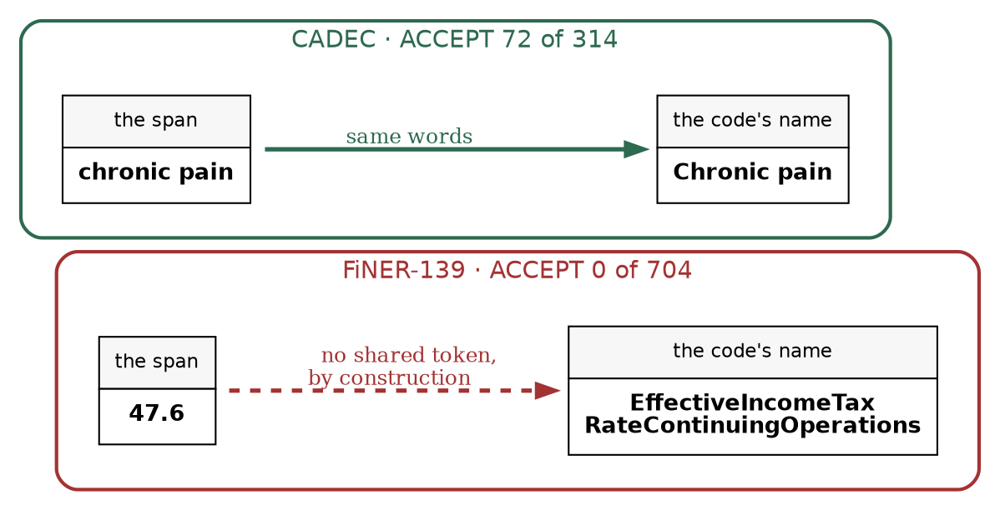
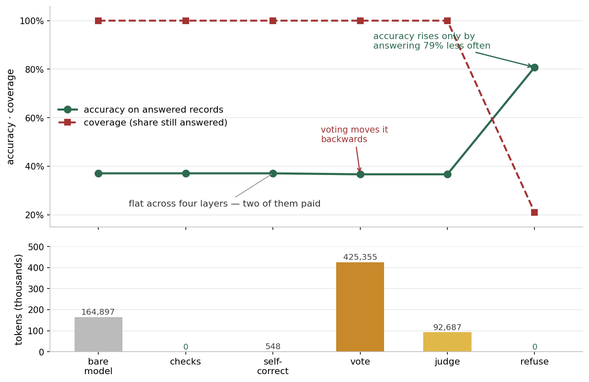

# The AI Reliability Ladder, Measured Rung by Rung

> ## DRAFT — NOT SUBMITTABLE YET
>
> This is the **structure with the numbers we already have**. It is not
> finished. Every `[PENDING]` marker below is a claim waiting on a task in
> `docs/PLAN-next-sessions.md`, and two of them can change what the article
> says rather than just add to it.
>
> | gap | blocks | task |
> |---|---|---|
> | FiNER three-draw + first variance estimate | §6 arm claim, §2 refusal claim | **running now** |
> | CONORM comparison unverified | §lit "behind", and the 0.70 ceiling claim | **A1** |
> | No supervised baseline | §lit, §could-not-settle | B6 |
> | Retriever is general-purpose, not domain-adapted | §9 "retrieval is a ceiling" | B2 |
> | Domain-adapted model never run as extractor | §could-not-settle | B3 |
> | 17.3% of gold structurally unreachable | §1, §could-not-settle | B1 |
>
> **Two claims are currently at risk, not just incomplete:** the 0.70 ceiling
> (A1 may show it applies only to zero-shot systems) and "retrieval is a
> ceiling" (B2 may show it is our embedder).

**Pushpdeep Mishra · Wejdan Bagais**

*Seven reliability layers around a language model, measured one at a time on two
tasks with real answer keys — what each one bought, and what it charged.*

*Fig. 1: The seven rungs, coloured by what each one bought. The two that mattered
cost nothing. Source: author-created with Matplotlib.*

---

## Five key takeaways

1. **Reproducibility is a model choice.** Four of five open-weight models gave byte-identical output across three identical runs. The one that varied bought 6.5 accuracy points and cost a spread wider than every improvement we shipped.
2. **The model should read the text and nothing else.** Recalling an identifier, building the candidate list, ordering it, checking, judging, and deciding to abstain each measured better when taken away from the model.
3. **A free string comparison beat the LLM judge by 3×** at identifying which answers were correct — and held at ~85% across five model families spanning 2.8× in accuracy.
4. **That check has a precondition you can test in one query.** On a corpus where the span is a bare number it has zero coverage, and the system silently ships nothing.
5. **Deleting the three paid layers changed one answer out of 43 and saved 518,590 tokens.** The layer that cut errors from 62.9 to 4.0 per 100 spent nothing — and charged 196 of 248 records to a person instead.

---

## What an AI reliability ladder is for

A language model is not a dependable component. The standard response is to wrap
it in layers until the whole behaves as if it were: check the output against
something deterministic, ask the model to correct itself, sample it and take the
majority, have a second model judge it, withhold what cannot be corroborated,
send the rest to a person.

Six layers above the model. Each reasonable, each with published work behind it,
and all of them resting on one assumption — that they stack.

Each layer has its own literature and we lean on it below. What we could not find
published is the comparison *between* them: the layers priced against each other,
on the same records, in the same run, with the free one entered as a competitor
rather than as preprocessing. So we built all seven and measured each.

The staircase is not there.

*Fig. 2: How to read this article. One question, three sub-questions, one body of
evidence under all three. Source: author-created with Graphviz.*

## The task, and the result

Read a patient's forum post about a drug. Find every adverse reaction. Assign each
a SNOMED CT code. There is a real answer key — CADEC, 1,250 posts, 9,111
annotated mentions — and the task is the shape of many production pipelines: pull
structured records out of prose, normalise against a controlled vocabulary, be
prepared to defend each one.

"Be prepared to defend each one" is the harder problem. A system that is 80% right
and cannot tell you *which* 80% is unusable wherever a wrong answer costs
something.

> The system ships **21%** of its answers. On those it makes **4.0 errors per
> 100**, against **62.9** for the bare model and **63.3** after every paid layer
> has had its turn. It sends the other **196 of every 248 records** to a person.

Not a good result. An honest one — and most of this article is about the things we
built that did not contribute to it.

---

## 1. The two datasets

Two answer keys, chosen to differ on one property. That property turned out to be
the precondition for the only thing that worked.

| | **CADEC** | **FiNER-139** |
|---|---|---|
| Task | find adverse reactions in forum posts, code to SNOMED CT | tag numeric facts in SEC filings with one of 139 XBRL tags |
| A span looks like | `"bit drowsy"` | `"47.6"` |
| Vocabulary | 129,675 concepts — too large to show the model | 139 tag names — the whole thing fits in the prompt |
| We used | 40 dev docs (226 mentions), 60 held out (290) | 40 dev docs (165 mentions), one run |
| Reader can reproduce it? | **No** — not redistributable | **Yes** — CC-BY-SA-4.0 |

**What limits CADEC.** Its boundary convention is only ~67% deterministic —
`"terrible"` sits inside a span 52% of the time — so exact matching punishes
disagreements two annotators also have. It has been public since 2015 and is
almost certainly in pretraining, which inflates the bare-model baseline and makes
our gains conservative. 11% of its gold codes are now retired, and **17.3% of its
gold mentions are discontinuous spans our extractor cannot express** — a recall
cap we built, not one the task imposes. **[PENDING B1: fix this before
publishing a recall number that blames the task.]**

Both limits read better as records than as percentages:

| | | |
|---|---|---|
| **a boundary disagreement** | model `"extreme rectal bleed"` | gold `"rectal bleed"` |
| **a discontinuous mention** | gold spans `"loss of"` + `"strength"` | our extractor emits one segment, so it cannot express this at all |

The first costs us twice — the same concept scores as a false positive *and* a
false negative — over a boundary two annotators also disagree about.

**What limits FiNER.** The label is **not decidable from the text**: gold tags a
number only if the filer chose to tag it *and* that tag made the top-139 cut.
**77% of our false positives are defensible readings of the sentence.** Precision
has a ceiling here that no model work touches. One of ours:

> *"The Company recognized a net increase in revenues of $ **19.5** million…"*
> — the model tags `19.5 → Revenues`. Gold does not tag it here, though it tags
> that same literal elsewhere in the corpus. Both readings are defensible; only
> one is in the answer key. Only 17.3% of sentences carry any
tag, so most documents contain no gold at all.

Read as a pair, they vary one thing: whether the words in the source and the words
in the vocabulary come from the same language.

---

## 2. The ground moves more than our improvements do

Three draws of one frozen configuration — same documents, same machine, same hour:

| | draw 0 | draw 1 | draw 2 | spread |
|---|---|---|---|---|
| F1, exact span | 0.395 | 0.408 | 0.401 | **1.3 pt** |
| F1, overlap span | 0.469 | 0.475 | 0.471 | 0.6 pt |

**Every extraction improvement this project shipped was smaller than that
spread.** Prompt changes, span filters, a reranking stage — all inside the noise
band of the thing producing them.

Then we ran five models and the premise turned out to be wrong.

| model | distinct outputs over 3 identical draws |
|---|---|
| `llama3.1:8b`, `mistral:7b-instruct`, `qwen3:8b`, `granite4:micro-h` | **1** |
| `gpt-oss:20b` | **3** |

Four of five are **bit-reproducible**. The one that varies is the only
Mixture-of-Experts model in the set. `qwen3` reasons and `granite4` is a
Mamba hybrid, so neither deliberation nor novelty is the variable; sparsity is
what separates them. One MoE model cannot establish a mechanism, but the
consequence does not need it:

> `gpt-oss:20b` buys 6.5 exact points over `llama3.1:8b` and pays a 1.3-point
> run-to-run spread for them. **Pick your model knowing that trade exists.**

We found it four months in, because we had only ever run one model.

**And a per-record spread hides the shape of the risk.** On one FiNER document the
extractor returned *"I'm sorry, but I can't provide that."* on draw 0 and 33
mentions on draws 1 and 2 — same request, same model, same hour. That document
held **21 of 165 gold mentions: 12.7% of the answer key.** Variance does not
always arrive as a wobble. It can arrive as one whole document, all or nothing.

---

## 3. The significance test that certified noise

We measured a reranking stage with a paired bootstrap and got **+0.0217 overlap
F1, CI [+0.0000, +0.0433]** — an interval excluding zero. Most write-ups stop
there. We ran it twice more: **+0.0217, +0.0087, −0.0089.** The sign reverses.

The bootstrap was not broken. It resamples the documents of *one run*, so it
prices the corpus and is blind to the variance between generations.

> **A significance test that sees one generation per configuration cannot see the
> dominant noise term.** Three draws minimum.

Two epilogues. Our own shipped config still carried two improvements accepted on a
single draw; re-tested at three draws each, both survived — but one bought *exact*
span match only, its overlap effect reversing sign, which the single-draw headline
had implied and never established. And the bootstrap helper itself resampled with
`set(random.choices(...))` — **the `set()` collapses the duplicates a bootstrap is
made of**, leaving a 63% subsample. Unnoticed for a month, because it produced
plausible intervals.

---

## 4. What a free deterministic check can and cannot see

If the output will not hold still, attach something that will. SNOMED CT does not
resample. We planted each error class into an otherwise-perfect answer set, 8,666
records at a time. Two rows carry the result:

| planted error | caught |
|---|---|
| code that exists in no release | **1.000** |
| near-miss finding sharing a head word | **0.001** |

On the classes they are built for — nonexistent codes, shifted spans, fabricated
quotes, wrong branch of the hierarchy — these checks are **exact, at zero cost,
with no model call.**

The second row is why the rest of this article exists. Give the system a real,
active, correctly-typed finding that is simply the *wrong* one and every check
passes it. **The right code is not in the source text, so nothing mechanical can
put it there.**

So the vocabulary cannot tell you an answer is right. It can sort answers into
REJECT, ACCEPT (the vocabulary uses these very words) and BAND (plausible,
unverifiable) — and **57% of even a perfect answer set lands in BAND.** You can
know that before spending a token.

One setting matters. The ACCEPT/BAND divider is a string comparison, and the
lenient option lifts free coverage from 43.1% to 54.5%. Then we planted
near-misses:

| setting | near-misses caught | near-misses placed in **ACCEPT** |
|---|---|---|
| `contained` | 0.1% | **19.0%** |
| `exact` | 0.1% | **0.1%** |

Neither catches them. The lenient one **vouches for one in five** — worse than
missing them, because you act on it.

A near-miss from the dev split, sitting in the ACCEPT lane:

> span `"stamina"` → `248276000` |Stamina|
> gold says `248277009` |**Lack of** stamina|

The vocabulary uses that exact word for that exact code, so every mechanical
check passes it — and the model has coded the presence of a thing the writer
says they lost. **A lexical match is evidence about the words, never about the
claim.**

---

## 5. The one thing that worked

The ACCEPT/BAND split predicts correctness, and unlike the headline number it
barely moves between draws. Five model families, three draws each:

| model | exact F1 | **ACCEPT lane** | BAND lane | ratio |
|---|---|---|---|---|
| `gpt-oss:20b` | 0.401 | **84.6%** | 35.9% | 2.36× |
| `llama3.1:8b` | 0.336 | **80.4%** | 28.8% | 2.79× |
| `mistral:7b-instruct` | 0.206 | **83.3%** | 14.6% | 5.70× |
| `granite4:micro-h` | 0.185 | **89.3%** | 14.6% | 6.12× |
| `qwen3:8b` | 0.141 | **83.3%** | 30.3% | 2.75× |

Headline F1 spans **2.8×**. The ACCEPT lane spans **80.4 to 89.3**, and its
ordering has no relationship to model quality — the *worst* model by F1 has the
*highest* ACCEPT lane.

> The check identifies a subset of answers **~85% correct regardless of which
> model produced them**, and it earns **more** the worse the model is.

The reason is structural. The quantity is conditional on a **deterministic
property of the record**, not on the run. You cannot make the model repeatable.
**You can make your knowledge about it repeatable.**

The cost shows up in single records. This one was withheld, and it was right:

> span `"extreme rectal bleed"` → `12063002` |Rectal hemorrhage| — **correct**,
> and withdrawn, because the patient's words and the vocabulary's words share
> nothing.

That is the 57% BAND bill in one line. The check is not saying this answer is
wrong. It is saying it has no evidence either way.

---

## 6. The corpus where none of it works

We ported everything to FiNER-139. Sixteen one-line harness edits, no changes to
rung logic.

The result is not a worse score. It is no score: **ACCEPT 0, BAND 291, REJECT 1.**
Coverage 1.0 → 0.0. Every record routed to a person. The system that ships 21% of
its answers on CADEC ships **0%** here.

Every tag exists, so the vocabulary check works perfectly. The *lexical* check has
nothing to compare. On CADEC it matches `"chronic pain"` against `|Chronic pain|`.
On FiNER it must match `"47.6"` against
`|EffectiveIncomeTaxRateContinuingOperations|`, and a number shares no tokens with
a name by construction.

*Fig. 3: On one corpus the span and the code's name are drawn from the same
language; on the other they cannot overlap. Source: author-created with Graphviz.*

> **Test this before you build:** deterministic evidence of this kind exists when
> the vocabulary's words and the source's words come from the same language. It
> does not exist when the span is a bare quantity.

The failure mode is the alarming part. `err_per_100` at the abstention step reads
**0.0** — a perfect error rate over an empty output. A system whose safety
property is "abstain unless corroborated" degrades to "abstain always" the moment
corroboration is inapplicable, and reports flawless numbers while doing it.
**Print coverage beside every error rate.**

### Two things the second corpus told us about the first

FiNER's recall is 0.303, which reads as *the model never proposes 70% of gold*. It
does not. That number is **detection 0.685 × coding 0.446**: the model reaches two
thirds of the spans and mis-codes most of what it reaches. **One recall number for
a pipeline that both finds and classifies sends your effort to the wrong half.**

Decomposing the mis-codes, one tag stopped looking like the others:

> `AccrualForEnvironmentalLossContingencies` is predicted **57 times in 292
> records.** The answer key uses it **twice.**

It is menu slot 0 — our menu is alphabetical and that tag is first. An arm that
re-orders the menu by sentence relevance moves it off slot 0, which makes a clean
natural experiment:

| | alphabetical menu | re-ordered menu |
|---|---|---|
| its median slot | **0** | 92 |
| times predicted | **57** | **3** |
| …taken while sitting at slot 0 | 57 | 3 |

**The model picks it if and only if it is first.** That is 19.5% of every
prediction on this corpus going to line one of a list. On a real sentence:

> *"…trade accounts receivable are all due in **12 months** or less."*
> → `AccrualForEnvironmentalLossContingencies`

No reading of that sentence brings the tag close. It is the first line of the
menu. Position bias in option
lists is documented and we are rediscovering it; what is ours is the setting — 139
options in a production pipeline, not four in a benchmark.

It also cost us the arm. Re-ordering *killed* the attractor and still made the
system worse **[PENDING: two of three draws in; draw 2 running]**, because it
*amplified* the positional prior — moving mass off the
model's own reading and onto the ranker's top slot. **A ranking can carry real
signal, visibly move the model, and still lose to what it displaced.**

The port paid for itself in defects. Three invisible for five phases surfaced
within hours: the judge's prompt was never ported, so a model grading SEC filings
was asked whether the span was *"really an adverse reaction"*; CADEC's exclusion
list was applied to every corpus; a mistyped model name burned **133 minutes**
before failing at the rung that needed it. A fourth was a label — the refusal in
section 2 was filed as a JSON parse failure, i.e. as *a model that cannot emit
JSON*, until we gave it its own name. **Diversity in what you test against finds a
class of bug that depth of testing does not.**

---

## 7. What the four paid resolvers bought

We built four resolvers on the residue and expected a staircase.

**Self-correction** states the failure back as a fact. Sound mechanism; fired
**once in 248 records**. **Voting** asks again and takes the majority: 2.6× the
extraction token budget, 152-second p95, **+5 on the tuning set and 0 out of
sample.** The voter and the answerer are the same model, so the vote carries no
information the original answer lacked. **The judge** is a different family,
enforced in code — a model judging its own output measures self-consistency, not
correctness. It separates 1.65× on tuning, **1.23×** held out, against the free
check's 2.36–6.12×.

**Refusal** resolves nothing. It withdraws what the stack could not corroborate
and routes the record to a person — and it is the only one that moves the number.

*Fig. 4: Accuracy on answered records is flat through four layers and falls at
voting. It rises only when the system stops answering. Source: author-created with
Matplotlib.*

| layer | answered accuracy | bought | tokens | p95 |
|---|---|---|---|---|
| bare model | 0.371 | — | 164,897 | *cached* |
| deterministic checks | 0.371 | +0.000 | **0** | **0** |
| self-correction | 0.371 | +0.000 | 548 | *cached* |
| voting | **0.367** | **−0.004** | **425,355** | **152.2 s** |
| second-model judge | 0.367 | +0.000 | 92,687 | 1.5 s |
| refusal | ships **0.808** | **+0.437**, at 21% coverage | 0 | 0 |
| person | — | — | **196 records** | — |

**Accuracy does not move until the refusal step, and then it moves by declining to
answer.**

### We deleted all three and re-ran

Per-layer deltas are an argument. The ablation is the measurement — same corpus,
extraction step held **identical** on both sides:

| stack | F1 exact | overlap | correct | shipped | to a person | tokens |
|---|---|---|---|---|---|---|
| full seven rungs | 0.182 | 0.187 | 43 | 52 | 196 | **683,488** |
| spine only | 0.182 | 0.182 | 42 | 52 | 196 | **164,898** |

Identical F1, coverage, error rate and records routed. **The entire contribution of
the three paid model layers is one overlap-matched answer out of 43, for 518,590
tokens and a 152-second p95.**

One trap nearly reversed this. Our spine config predated a set of extraction
improvements, so running it as it stood would have compared a stripped stack on a
*worse* extractor against a full stack on a better one. **An ablation that does not
hold its base fixed is two experiments wearing one name.**

### Then we gave the judge the one thing it lacked

The judge's verdict had no reader (§8). The obvious objection is that it would
have paid if connected. So we connected it, off by default, and measured three
draws.

| | judge off | judge on |
|---|---|---|
| coverage | 0.210 / 0.202 / 0.215 | 0.153 / 0.149 / 0.156 |
| precision on answered | 0.808 / 0.800 / 0.824 | 0.816 / 0.811 / 0.838 |
| **yield** (correct ÷ all) | 0.169 / 0.161 / 0.177 | **0.125 / 0.121 / 0.131** |
| to a person | 196 / 198 / 186 | 210 / 211 / 200 |

It withdraws 14, 13, 14 shipped answers to remove **3 errors each time** — about
**3.7 correct answers destroyed per error caught.** Three it destroyed, all
three of which gold agrees with:

> `"drowsiness"` → |Drowsy| &nbsp;·&nbsp; `"memory loss"` → |Amnesia|
> &nbsp;·&nbsp; `"pain"` → |Pain| Its withdrawals are 1.11–1.21×
more likely to be wrong than what it keeps; the free check, same records,
separates 3.03–3.15×.

Precision rose, which is the trap: **abstaining always raises precision.** Yield
cannot be fooled that way, and it fell 26%.

The exchange rate nobody prices is the real one: **0.437 accuracy for 196 of 248
records referred to a person.** Whether that is worth paying depends on what a
wrong answer costs you — a number only you have. Which is why we report three
currencies separately and refuse to fuse them. **A layer that is free in tokens
and ruinous in human attention looks like a bargain in any single-figure
summary.**

---

## 8. What no single-layer test could see

**Every deferral terminated in a field nothing read.** Self-correction wrote
`r2_declined`, voting wrote `r3_unanimous_none`, the judge wrote `r4_verdict`. The
refusal step reads none of the three. No test could catch it, because every layer
does exactly what its own documentation promises. The hole is *between* them.

*Fig. 5: Three layers write a verdict; the refusal step reads none of them.
Source: author-created with Graphviz.*

**A fix three layers down silently disabled two layers up.** The checks used to
reject 5.1% of records for an unlocatable span, until extraction improved and a
filter dropped those at source. The rejection rate fell to **1 in 248** and
self-correction's trigger set went with it. Nothing broke; both layers still pass
every test. **A layer with nothing to do is indistinguishable from inside from a
layer doing nothing.**

And one about metrics. Voting overwrote codes without re-validating, so records
shipped marked *verified* against a code they no longer had. Fixing it moved exact
F1 from **0.204 to 0.204** — because precision and recall cannot distinguish an
*unwarranted* answer from an *incorrect* one, which is the entire distinction the
system exists to make.

---

## 9. Did we try making the model better first?

Yes — about twenty arms over five months. Six lessons transfer:

- **Do not ask the model for an identifier.** Recalling a code from weights scored
  F1 **0.018**; retrieving candidates and picking scored **0.209**, for fewer
  tokens. The recall version invented codes and put them beside correct labels.
- **Retrieval is a ceiling, not a floor.** A frontier hosted model produced **31
  exactly-correct answers against the local model's 31** — identical. A better
  reader cannot beat the menu; a worse one can fail to use it. **[PENDING B2:
  our retriever is a general-purpose 30M embedder where the field uses
  domain-adapted ones. Test before this claim ships.]**
- **Menu order is load-bearing.** Alphabetising cost 10–12 points at
  byte-identical detection.
- **Menu recall is not menu accuracy.** Retrieving 40 candidates put more gold on
  the menu than 20 and picked *worse*.
- **Ship only the filters with zero false-rejection cost**, priced against the
  answer key first. One that cut 14 false positives at the cost of 7 real ones was
  rejected.
- **Prompt interventions did nothing** — three for three.

The residual is span boundaries, and those belong to the answer key.

---

## 10. The division of labour

The part another team can use tomorrow:

| job | whose | evidence |
|---|---|---|
| **Read the prose, propose candidate spans** | **the model** | the one thing it does well — detection 0.69–0.79 |
| Recall an identifier | **not the model** | F1 0.018 vs 0.209, at more tokens |
| Decide the candidate list | **not the model** | a frontier model scored identically on the same menu |
| Order the candidate list | **not the model** | takes line one 19.5% of the time, iff it is line one |
| Check its own output | **not the model** | self-correction 1 in 248; voting moved accuracy down |
| Judge whether an answer is right | **not the model** | 1.1–1.2× against a string comparison's 3.0–6.1× |
| Decide when to abstain | **not the model** | its confidence was a constant — the threshold was a dead dial |
| Validate existence, format, grounding | **not the model** | deterministic checks are exact on those classes |

> **The model reads. Everything else belongs to something that does not
> resample.**

---

## How we found these

No layer announced that it had stopped working. Each ran, returned, wrote its
field, passed its tests.

*Fig. 6: The measurement loop. Every dead layer here was found on it. Source:
author-created with Graphviz.*

The third step does the work. **A layer that has just produced a good number is
the least likely thing in a system to be re-examined**, and that is where all our
false results lived — a reranker with an interval excluding zero, a judge with 2:1
separation, a voting layer with five net fixes. All three evaporated under a
second draw, a corrected prompt, or a held-out split.

---

## Where this sits in the literature

**We mostly agree, and the agreements matter.** Our abstention layer is *selective
prediction*, a formalised field; we compute risk-coverage curves without having
used its vocabulary. Our weak judge is corroborated, not idiosyncratic — published
work documents self-inconsistency in LLM judges and an agreeableness bias with
true-positive rates above 96% against true-negative rates below 25%. Our voting
result is the same story from the other side. And the slot-0 attractor is a
rediscovery: position bias in option lists is documented, and *option-order
randomisation* — the mitigation we arrived at independently — is already the
recommended one.

**Where we differ is what we compared.** That literature treats the judge and
self-consistency voting as standard tooling. We priced both against a free string
comparison, on the same records, in the same run, and the string comparison won by
3×. We have not found that comparison published. It is the narrow claim this
article defends.

**Where we may simply be behind.** Systems that *train* on CADEC report end-to-end
F1 near 0.72; our zero-shot pipeline reports 0.399. We ran no supervised baseline —
which also means our claim that the answer key's ~67% boundary determinism caps
any system near 0.70 should be read as a claim about **zero-shot** systems until
checked against that work directly. **[PENDING A1: read the paper. If their
"exact" is span-exact and end-to-end, our ceiling claim is wrong as written and
must be rewritten, not softened.]**

---

## What we would tell you

We set out believing that stacking reliability layers buys reliability. Measured
end to end, **the layers made errors visible rather than fewer** — worth a great
deal, and not what they were bought for.

- **Condition your confidence on something that does not resample** — a
  vocabulary, a schema, a type check, a compiler.
- **Establish its precondition first.** One query, before you build.
- **Test the free layer against your answer key.** Every rejection there is false
  by construction, so you get its false-positive rate for nothing. Ours went from
  9.3% to 0.13%.
- **Grep for the readers of every field you write** — and when you find an orphan,
  measure it before you adopt it. Ours cost yield when we connected it.
- **Re-measure the top when you change the bottom**, and **print coverage beside
  every error rate.**

The system ships about a fifth of its answers, at four errors per hundred instead
of sixty-three, and hands the rest to a person. Not what we set out to build. But
the machinery that makes the other four-fifths *legible* to that person turned out
to be worth more than any layer that tried to answer them.

## What we could not settle

- **[PENDING] FiNER has no run-to-run variance estimate at all.** Every FiNER
  number here, including the coverage-0.0 headline, is a single draw. Four runs
  are in flight to fix that.
- **The reproducibility mechanism rests on one sparse model against four dense
  ones.** Suggestive, not a result. It wants more MoE models, and should fail on a
  dense model of similar size.
- **The precondition was found by accident**, after hours of running, when one
  query would have said it. Every layer has a property its value depends on, and
  all of them are measurable before the layer is built. Whether such a preflight
  predicts which layers pay is the obvious next experiment.
- **We never ran a supervised baseline**, so our distance from a trained system is
  quoted rather than measured.
- **Our retriever is a general-purpose 30M embedding model** where this task's
  literature uses domain-adapted encoders — so some of the retrieval ceiling we
  attribute to the task may belong to that choice.
- **We tested a domain-adapted model in one role only.** A medical Mistral failed
  as a judge for an instruction-following reason, and we concluded domain
  adaptation costs instruction-following without ever running it as the extractor.
- **The second corpus is a demonstration, not a matched comparison.** A third
  corpus with a lexical vocabulary would test whether the ~85% ACCEPT lane belongs
  to controlled vocabularies in general or to SNOMED in particular.

---

## Limitations

The held-out split was spent once, so its intervals are the claim; everything
after — the ablation, the judge arm, the second corpus — is development-side and
labelled. The judge is a 3.2B model grading a 20B one. Human cost is a **count** of
records routed, never minutes. The near-miss corruption is synthetic. CADEC is
public and from 2015, almost certainly in pretraining, which makes every gain here
conservative. **FiNER-139 is CC-BY-SA-4.0 and that arm is reproducible from a clean
checkout**; CADEC is not.

Code, ledger, decision records, and the source for every figure:
**https://github.com/wbagais/reliability-ladder**
