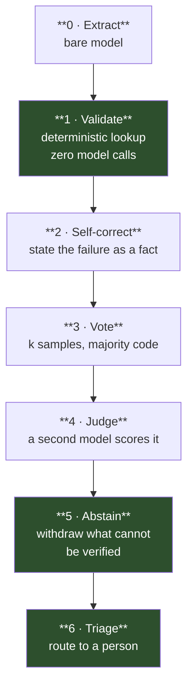

# We Built Seven Reliability Layers Around an LLM. One of Them Worked.

## What each layer taught us about making a nondeterministic model's errors visible

---

## Key Takeaways

- **Run-to-run variance was larger than every improvement we had shipped.** Three identical runs of a frozen configuration spread 1.3 F1 points. Every gain we had measured up to that point was smaller than that.
- **A bootstrap confidence interval that excluded zero certified an effect whose sign reversed on the third draw.** The bootstrap resamples your documents, not your generator, so with one generation per arm it cannot see the dominant noise term.
- **The cheapest layer outperformed the expensive ones.** A string comparison against a controlled vocabulary separated correct from incorrect answers 2.3x, holding across three draws. An LLM judge, at one model call per record, managed 1.23x out of sample.
- **Asking the same model to check itself bought nothing.** A voting layer cost 2.6x the extraction budget and moved the correct-answer count by zero on held-out data — because the voter and the answerer share their errors.
- **Three of our layers were wired to nothing for months.** Each wrote its verdict into a field and deferred the action to a later layer. That layer read none of them. Every layer passed its own tests.
- **The metric could not see the bug we most cared about.** Fixing a record that shipped marked *verified* on a stale warrant moved F1 by 0.0000, because precision cannot distinguish an unwarranted answer from an incorrect one.

---

**Scope, up front.** CADEC, 1,250 patient forum posts about medications with
9,111 human-annotated adverse-reaction mentions normalised to SNOMED CT. A
40-document tuning split and a 60-document held-out split. Open-weight models
running locally — `gpt-oss:20b` extracting, `granite4:micro-h` judging — because
the corpus licence is non-transferable and the text does not leave the machine.
The held-out split was spent exactly once and everything measured afterwards is
tuning-side and labelled as such. The instrumentation findings generalise. The
specific accuracy numbers do not, and we say so again where it matters.

---

## The task, and why it makes a good probe

Read a patient's forum post about a drug, find every adverse reaction the writer
says they experienced, and assign each one a SNOMED CT code.

Most LLM reliability work is done on tasks where the only available grader is
another language model. Summarisation, question answering, code explanation —
you can measure fluency, and you can ask a bigger model whether it liked the
answer, but there is no fact of the matter outside the system.

This task has one. Whether `41456009` exists in the release, whether it is
active, and whether it descends from Clinical Finding are three lookups against
a SQLite index built from the official distribution. They take microseconds and
they have no opinions. The corpus also ships 9,111 human annotations, so there
is a ground truth for what the right answer was.

That combination — a decidable floor plus a real answer key — is what lets you
measure reliability *layers* rather than model quality. When a layer reports an
improvement, you can check.

## What we set out to build

The plan was a stack, each layer added on top of the last, each measured for
what it buys and what it costs.



We expected a staircase: each layer buying some accuracy, at some cost, with a
visible point where the cost stopped being worth paying. That curve was the
contribution we thought we were producing.

It is not what we got. Here is the order we found things out in, because the
order is the useful part.

---

## First: the ground was moving

Before comparing layers we checked something we had been assuming — that a run
is reproducible. Three fresh draws of a frozen configuration, same 40 documents,
same machine, same hour:

| | draw 0 | draw 1 | draw 2 | spread |
|---|---|---|---|---|
| F1, exact span | 0.395 | 0.408 | 0.401 | **1.3 pt** |
| F1, overlap span | 0.469 | 0.475 | 0.471 | 0.6 pt |

Every accuracy improvement we had measured up to that point was smaller than
1.3 points.

Two properties mattered more than the size. The variance is **all-or-nothing per
run** — it enters at one call, the extraction step, and then propagates
deterministically through everything downstream. A run is not 40 independent
document draws; it is closer to one draw with 40 correlated parts. And it is
**not something you can average away cheaply**, because each draw costs a full
run.

**What this taught us:** measure your generator's variance before you measure
anything else, because it sets the resolution of every comparison you are about
to make. We had been reporting differences below our own noise floor for weeks.

## Second: we tried to make the model repeatable, and could not

The obvious response is to reduce the variance rather than live with it. We
tried three interventions.

A **system message** pinning the model's role, on the theory that constraining
the persona would tighten the output distribution. A set of **added prompt
rules** for the cases we saw it getting wrong — lab values, single-word
mentions. A **scope clause** restating that only the writer's own reactions
count.

All three were measured across draws, and all three showed the same pattern:
they traded exact-span F1 for overlap-span F1 without moving the number of
answers that were actually correct. They changed *where the boundaries landed*,
not whether the model understood the task.

The scope clause is the sharpest case. It was written to attack the largest
category of misses, and the model had already been given essentially that
instruction in an earlier revision — and was already ignoring it. Restating an
instruction a model ignores does not make it comply. We tried that three times,
on three different instructions, with the same result each time.

**What this taught us:** prompt-level pressure moves where the errors land, not
how many there are. You are not going to make the model repeatable, so the
question has to change from *how do we stop it moving* to *what can we say about
its answers that does not move when it does*.

## Third: our significance test was lying to us

This one nearly cost us a published result, and it is the most transferable
thing in the study.

We had a paired bootstrap, built carefully. It resamples **documents**, not
mentions, because mentions inside one post share an author, a topic and a model
call — resampling mentions would pretend to roughly six times more independent
observations than exist and report a band far too tight. That reasoning is
correct and we still recommend it.

We used it to evaluate a reranking stage over retrieved candidates:

> draw 0: **+0.0217 overlap F1**, paired bootstrap **+0.0215 [+0.0000, +0.0433]**

An interval excluding zero. In most write-ups that is where the analysis ends.

We ran it twice more:

| | draw 0 | draw 1 | draw 2 | mean |
|---|---|---|---|---|
| overlap F1 delta | +0.0217 | +0.0087 | **−0.0089** | +0.0072 |
| exact F1 delta | +0.0000 | +0.0087 | −0.0044 | +0.0014 |

The sign reverses. There is no effect.

The bootstrap was not broken — it was answering a different question than we
were asking. It resamples the documents of **one** run, so every replicate is
drawn from the same fixed set of model outputs. The run-to-run variance from the
first section is completely invisible to it. Given a single generation per arm,
it will certify noise, confidently, with a tight interval.

**What this taught us:** three independent draws, plus the paired bootstrap,
never one alone. And not ten-document subsets, which we also tried — they
overstate both the effect size and the variance, and we have a decision-log entry
recording an arm we ran whose hypothesis the sample could not test.

## Fourth: attaching evidence that does not resample

If the answer will not hold still, attach something to it that will. The
controlled vocabulary is the obvious candidate, because SNOMED CT is a fixed
artefact.

Six checks, all free, no model calls: does the code exist, is it active, is it
the right kind of concept, does the quoted text actually appear where the model
said it does, does the model's own concept name match the vocabulary's words for
the code it chose.

We measured what those checks can catch by planting each error class into an
otherwise-perfect answer set, 8,666 records per class:

| planted error | caught |
|---|---|
| code that exists in no release | 1.000 |
| span shifted two characters | 1.000 |
| fabricated quote | 1.000 |
| real code, wrong branch of the hierarchy | 1.000 |
| random plausible clinical finding | **0.000** |
| near-miss finding sharing a head word | **0.001** |

The top half is better than "helpful": on the classes they are designed for,
deterministic checks are *exact*, at zero cost. Not 95%.

The bottom half is why the rest of the system exists. Give it a real, active,
correctly-typed clinical finding that is simply the wrong one and every check
passes. This is not a gap to close with better rules — the right code is not
present in the source text, so nothing mechanical can put it there.

So the vocabulary cannot tell you an answer is right. What it can do is sort
answers into three states:

- **REJECT** — provably wrong
- **ACCEPT** — the vocabulary uses these very words for this code
- **BAND** — plausible, and unverifiable by string comparison

Three states, not two. Two cannot express BAND, and **BAND is where 57% of a
perfect answer set lands.** You can compute that number before spending a single
token: it is the fraction of your output free checks will never settle, which is
the bill everything expensive has to work through.

**What this taught us:** run your deterministic layer over your answer key
first. Every rejection there is false by construction, so you get the layer's
false-positive rate exactly, before any model output exists. Ours started at
9.3% — three separate faults, each of which would have shipped as a plausible
rejection rate that every paid layer above would have inherited — and three
fixes took it to 0.13%.

### The setting that turns a gate into an endorsement machine

The ACCEPT/BAND divider is a string comparison with one obvious knob: exact
equality, or token containment.

Containment is the intuitive choice. Patients write "bit drowsy" where the
vocabulary says "Drowsy"; strictness looks pedantic, and leniency lifts the
share of a perfect answer set settled for free from 43.1% to 54.5%.

Then we planted **near-miss codes** — real, active findings sharing a head word
with the correct one, which is the confusion this kind of model actually makes:

| setting | near-misses caught | near-misses placed in **ACCEPT** | ACCEPT lane on gold |
|---|---|---|---|
| `contained` | 0.1% | **19.0%** | 54.5% |
| `exact` | 0.1% | 0.1% | 43.1% |

Neither setting catches near-misses. But the lenient one actively vouches for
one in five of them, because the patient's phrase is a subset of the wrong
concept's name. It does not fail to protect you; it hands you false confidence,
which is worse, because you act on it.

We took the strict setting and paid the eleven points.

**What this taught us:** before shipping the permissive setting of a validation
gate, measure its false-vouch rate on planted near-misses. "Be lenient with
colloquial input" is a reasonable instinct that converts a gate into an
endorsement machine.

### The one number that held still

Here is what the free layer bought, and it is the study's main positive result.

The ACCEPT/BAND split predicts correctness:

| | n | coding accuracy |
|---|---|---|
| **ACCEPT** — free, deterministic | 49 | **83.7%** |
| **BAND** | 131 | 35.9% |

A 2.3x separation over 21% of the output, at zero model cost. And, given the
first section, the part that matters — it barely moves between draws:

| | draw 0 | draw 1 | draw 2 | spread |
|---|---|---|---|---|
| ACCEPT lane | 83.7% | 83.0% | 87.2% | 4.2 pt |
| BAND lane | 35.9% | 36.8% | 36.2% | **0.9 pt** |
| ratio | 2.33 | 2.26 | 2.41 | 0.15 |

The BAND lane moves 0.9 points across the same three runs whose headline F1
moves 1.3. It also holds under a completely different upstream configuration:
85.7% versus 30.1%.

The reason is structural. The quantity is conditional on a deterministic
property of the record rather than on the run. "Given that the vocabulary uses
these exact words for this code, how often is the code right?" is a question
about the vocabulary and the record; resampling moves *which* records land in
each lane without much moving what each lane *means*.

**What this taught us:** you cannot make the model repeatable, but you can make
your knowledge about it repeatable, by conditioning it on something that does
not resample. Ours was a controlled vocabulary. Yours might be a schema, a unit
check, a database lookup, a compiler.

---

## Then we spent money on the residue

With 57% unsettled, the plan was to buy the rest with model calls. We built
three resolvers. This is the part we expected to be the staircase.

### Self-correction: state the failure as a fact

When a deterministic check rejects a record, tell the model what was wrong —
"the code 41456009 does not exist in SNOMED CT" — as a fact, never as a
question. A question invites the model to re-derive the answer it already gave.
A fact gives it something it did not have.

We think the mechanism is sound. We cannot tell you whether it works, because
**it fired once in 248 records**, for a reason covered in the audit section
below. That is an honest null, not a negative result.

### Voting: ask again and take the majority

Resample each document at temperature, match the answers back to the originals,
take the majority code. This is the intervention people reach for first against
nondeterminism.

Its first build was actively destructive, and the failure is instructive.
Answers were matched to records by an exact span key — but spans shift between
samples ("extreme rectal bleed" versus "rectal bleed"), so 206 of 240 records
received no vote at all. Where matching did succeed, the sampler was calling a
*different extraction path* than the one that produced the answers, so the votes
came from a different distribution, and 9 of 32 vocabulary-verified answers were
overwritten with recalled hallucinations. One of them was a "majority" of one.

Three repairs, each test-first: match by span overlap, one-to-one; draw every
sample through the extractor's own configured path; and require at least two
sightings before changing anything.

After repair, scored per changed record against the answer key:

| | changes scored | fixed | broke | net |
|---|---|---|---|---|
| tuning set | 18 | 5 | 0 | **+5** |
| held-out | 21 | 2 | 2 | **0** |

On the tuning set it looked like a layer that works — until you notice three of
those five "fixes" were *no code → a correct code*, filling a gap rather than
correcting an error. Out of sample it destroyed two correct answers while
rescuing two others.

Cost: 2.6x the entire extraction token budget, and a 152-second p95 latency.

**What this taught us:** the voter and the answerer are the same model, so the
vote carries no information the original answer lacked. We measured this
directly in a cleaner setting — a reranking stage promoted the correct candidate
to the top slot for 50% of the cases the picker already got right, and 16.7% of
the ones it got wrong. It ranked well and converted nothing, because the ranker
and the picker were the same model making the same judgement.

### A judge: use a different model

If self-consistency is the problem, use a second model family. Our
implementation enforces this rather than advising it: if judge and extractor are
the same model, the code raises, because a self-judge measures self-consistency
and reports it under a heading that says correctness.

The judge separates — weakly, and less where it counts:

| | pass | fail | ratio |
|---|---|---|---|
| tuning set | 21.0% | 12.7% | 1.65x |
| held-out | 27.0% | 21.9% | **1.23x** |

Set that beside the free check's 2.3x holding across three draws. **A string
comparison against a controlled vocabulary out-separates the LLM judge on the
only axis a judge is for** — and not because the judge is bad, but because the
vocabulary knows something neither model does.

We also learned something uncomfortable about the judge's signal. When we
repaired an *accidental* defect in its prompt — the source post had been pasted
in twice — its pass/fail separation collapsed from 28.0/15.6 to 25.4/23.6. Part
of the signal had been living in the duplication.

**What this taught us:** for small models, prompt form is part of the
measurement, not a detail of it. Separately, we found that alphabetising the
candidate menu — changing nothing but the order — cost 10 to 12 points of coding
accuracy at byte-identical detection. Presentation is load-bearing, and a result
that survives only under one presentation is not a result.

### Refusal: the layer that worked

The last resolver resolves nothing. It withdraws every answer the stack could
not corroborate, preserves it rather than deleting it, and routes the record to
a person.

- Errors per 100 records: **63.3 → 4.03**
- Coverage: 100% → **21%**
- Records routed to a person: **196 of 248**

Every point of that fall is the free deterministic verdict, acted on. And it is
paid for entirely in a third currency — a person's attention — which is why we
never collapse cost into one figure. Tokens, latency and human referrals are
three axes, and a system that looks cheap on two can be ruinous on the third.

How much is on the other side of that referral? We measured the ceiling with an
oracle desk: gold-derived resolutions, labelled on every row, refused on
held-out data by construction. A perfect reviewer takes shipped F1 from 0.131 to
**0.444**, and coding accuracy on matched answers from 0.291 to **0.990 — with
detection unchanged**.

**What this taught us:** read that pair carefully, because it names the next
thing to build. After a perfect human code-picker, the entire remaining gap is
*span boundaries*, which no code-picking reviewer can fix. That is the real use
of a ceiling — not to admire the headroom, but to find out which layer it is in.

### The whole thing, end to end

All layers, in order, one run, 248 records:

| layer | answered accuracy | tokens | p95 latency |
|---|---|---|---|
| bare model | 0.371 | 164,897 | *cache-served* |
| deterministic checks | 0.371 | **0** | **0** |
| self-correction | 0.371 | 548 | *cache-served* |
| voting | **0.367** | **425,355** | **152.2 s** |
| judge | 0.367 | 92,687 | 1.5 s |
| refusal | ships **0.808** | 0 | 0 |
| person | — | **196 records** | — |

683,487 tokens over 618 calls. Two of those latencies were served from a call
cache and are not latency measurements; we say so rather than quoting them.

Read down the accuracy column. It does not move until the refusal step, and then
it moves by declining to answer. The two paid model resolvers cost 518,042
tokens between them and moved the number backwards.

---

## What we found when we audited the stack instead of the layers

Everything above measures one layer at a time. Late in the project we went back
and asked a different question — not *does this layer work* but *what reads this
layer's output* — and found three things that no per-layer test could have
caught.

### Every deferral terminated in a field nothing read

Each paid resolver correctly declined to act on its own evidence. The argument
is good: a layer that both judges and routes contaminates every measurement
above it, because the next layer is then graded on a set this one pre-filtered.
So each wrote its verdict into a field and named the refusal step as the layer
that would act.

- self-correction wrote `r2_declined` — *"the refusal step owns abstention and reads this"*
- voting wrote `r3_unanimous_none` — *"EVIDENCE for the refusal step, not an action here"*
- the judge wrote `r4_verdict` — *"record it, and let the refusal step act"*

The refusal step reads none of the three. It reads the deterministic verdict and
nothing else. A repository-wide search found no consumer for any of those fields
outside the layers that write them.

So the composition was never what the diagram said. Three layers ran, cost
money, passed their tests, and were wired to nothing — the judge in particular
pays one model call per record, in every run, and *cannot* change any shipped
number.

**What this taught us:** for every field your pipeline writes, grep for its
readers. A field with no reader is a layer you are paying for and not running.
No test caught this because every layer does exactly what its own documentation
promises; the hole is between them.

### A fix three layers down disabled two layers up

The deterministic checks used to reject 5.1% of records, all for the same
reason: the extractor emitting an unlocatable span for a quote it could not find
in the post. Self-correction fires on a rejection that yields a statable fact,
and that one yields none — so it fired zero times.

Then extraction got better. A span filter added during an accuracy pass drops
exactly those records at the source. The rejection rate fell to **1 in 248**,
and the self-correction trigger set went with it.

Nothing broke. Both layers still pass every test and log every row. Their
*input* was removed from underneath them by a change three layers below, and a
layer with nothing to do is indistinguishable from a layer doing nothing when
you look at it from inside.

The same mechanism hollowed out the checks themselves. The existence check —
"is this a real code?", the check the whole validation layer was built around —
now fires **0 times in 248 records**, because the extractor picks its code from
a retrieved menu of real codes and can no longer emit one that does not exist.
And the check asking "did the model name the concept it coded?" is true **232
times out of 232**, because the same menu displays the code and its official
name together, so the model's label *is* the vocabulary's label by construction.

**What this taught us:** when you improve the bottom of a pipeline, re-measure
the top. A validation layer is calibrated against a generator, and when the
generator's failure mode moves, the layer does not follow it — it keeps passing.

### The metric could not see the bug

The voting layer adopted its majority code by overwriting the record's code and
stopping there. But the refusal step routes on the deterministic verdict, which
had been computed against the code voting had just replaced.

Across three full runs, voting changed 25, 30 and 29 codes, and every one of
those records carried a verdict about a code it no longer had. In each run
exactly one of them shipped marked *verified*. In the most recent: the phrase
"stamina", coded |Stamina| and ACCEPTed on an exact name match, then voted 2–1
to |Lack of stamina| — which does not match — and shipped on the older code's
warrant.

We fixed it. Here is what the fix does to the headline:

| | exact F1 | overlap F1 | shipped | routed to a person |
|---|---|---|---|---|
| as built | 0.204 | 0.215 | 72 | 242 |
| re-validated | 0.204 | 0.218 | 72 | 242 |

Nothing — and of course nothing. A record that was wrong scores identically
whether it ships wrong or is withdrawn. Precision and recall cannot distinguish
an answer that is *unwarranted* from one that is merely *incorrect*, and that
distinction is the entire purpose of the system.

**What this taught us:** be suspicious of any reliability layer justified on F1,
including every layer in this project.

---

## Open-weight models: what we learned trying to swap them

*(Measurement in progress; this section reports completed runs only.)*

The whole system runs on open weights because the corpus licence is
non-transferable. That constraint produced its own findings.

### The first result was our harness, not the models

We ran five open models through the extraction step. Two of them —
`llama3.1:8b` and `qwen3:8b` — appeared to fail outright, producing nothing
parseable on the first document.

Both were our fault.

`qwen3:8b` is a reasoning model. It deliberates before answering, and we had
never registered a token budget for it, so it inherited a 2,000-token default,
spent all of it thinking, and returned an empty answer field with
`truncated=True`. `llama3.1:8b` produced *correct* JSON with the *right*
mentions — and wrapped it in conversational prose:

```
Here are the adverse reactions extracted from the post:

```
{"mentions": [{"span_text": "extreme rectal bleed", ...
```

Note that "extremely sick" and "might not survive" are not specific medical
```

Our fence-stripper anchors its match at the start of the reply, so a fence with
prose in front of it is not a fence, and a good answer was scored as a parse
failure.

Reporting that as a model failure would have measured **which model our harness
was built around** — `gpt-oss:20b` emits bare JSON because the prompts were
tuned against it — rather than which model can do the task. So we added one more
repair, under the same rules as the two we already had: it fires only when the
reply does not parse, it never fabricates, it applies identically to every
model, and it is *counted*, so a model's chattiness appears as a compliance cost
rather than disappearing into a zero.

With budgets registered and the repair in place, all five models produce
parseable output.

**What this taught us, and it is the finding we would most want checked
elsewhere:** a model comparison measures your harness until you prove otherwise.
Ours would have published two false negatives. Before reporting that a model
cannot do a task, read what it actually returned.

### The prior we are testing

An earlier experiment gives a strong prediction. Swapping a frontier hosted
model into the extraction step alone (ten documents, one draw, both caveats
stated) fixed detection outright — overlap detection recall 55/62 → **61/62** —
and produced **identical** exactly-correct answers, 31 for both models, with
coding accuracy drifting *down*.

Both models pick their code from the same 20-candidate retrieved menu, so a
better reader cannot beat the menu's recall. The extractor was never the binding
constraint on the number we cared about.

So we expect the open-model comparison to show large differences in *detection*
and small ones in *coding*. Results below when the draws are in.

---

## The ceiling nobody can cross

One limit shapes every accuracy number here, and it applies to any span
extraction task scored against human annotation.

**The answer key's own boundary convention is only about 67% deterministic.**
Over 25,002 boundary decisions, 66.9% fall at tokens the annotators treat one
way at least 95% of the time; 20% lean; 13% are genuinely mixed. "terrible" is
kept inside a span 52% of the time. "very" 70%. "in" 40%.

A perfect learner of that convention gets roughly 0.92 per boundary decision,
and a span needs two — capping the exact-span rate near 0.85. Composed with the
measured detection and retrieval ceilings, that puts F1 at about **0.68 with
every component at its best**, and a directly measured oracle lands at 0.667.

Exact F1 above 0.70 is not reachable on this task by any system, including a
perfect one, and the binding constraint is the answer key rather than the model.
Exact matching scores a boundary disagreement as both a false positive and a
false negative — punishing it twice for a difference two humans also disagree
about.

Every number here is therefore reported on both layers, and any claim in the
0.70 class is stated on overlap.

**What this taught us:** if you are benchmarking span extraction against human
annotation, measure your annotators' agreement with each other first. It is
probably your ceiling, and it is probably lower than you think.

---

## What we would do differently

The premise was that stacking reliability layers buys reliability. Measured end
to end, the system ships about a fifth of its answers at roughly four errors per
hundred instead of sixty-three, and hands the rest to a person. **The layers
made the errors visible rather than fewer.** That is worth something. It is not
what they were bought for.

If we started again:

**Measure the generator's variance first.** It sets the resolution of every
comparison you will make, and ours was larger than everything we had shipped.

**Never accept a single-draw result.** Three draws and a paired bootstrap. Our
bootstrap certified an effect that reversed sign on the third run.

**Build the free layer first, and measure it against the answer key.** Every
rejection there is false by construction. Ours had a 9.3% false-positive rate
that three fixes took to 0.13% — errors every paid layer above would have
inherited and reported as model error.

**Spend the paid layers' budget on a person instead.** Self-correction never
fired, voting moved zero correct answers out of sample at 2.6x the extraction
budget, and the judge was not wired to anything. The oracle ceiling says a
reviewer takes coding accuracy from 0.291 to 0.990.

**Audit the composition, not just the layers.** Grep for the readers of every
field you write.

The machinery that makes the four-fifths we cannot answer *legible* to the
person who has to answer them turned out to be worth more than any of the layers
that tried to answer them.

---

## Reproducing this

Every figure comes from commands in the project's build log, and every decision
from a dated entry in its decision log. The corpus is not redistributable —
CADEC carries the CSIRO Data Licence, non-commercial and non-transferable — and
the vocabulary needs an affiliate licence.

**Limitations, stated plainly.** The held-out split was spent exactly once, so
its intervals are the claim and no second draw exists to average with;
everything measured after that point is tuning-side and unvalidatable, and is
labelled as such throughout. The voting layer's numbers are samples and carry
their run id. The judge is a 3.2B model grading a 20B one — the wrong way round,
and the domain-adapted 7B we imported to fix it failed to return parseable
verdicts at all, which taught us that domain adaptation does not buy
instruction-following. The oracle desk is a tuning-side ceiling, gold-derived
and labelled on every row; no real reviewer session was ever timed, so human
minutes appear only at a declared rate and the honest cost measure is the
*count* of records routed. The near-miss corruption is synthetic. And the corpus
is public and from 2015, so it is almost certainly in pretraining — which
inflates the bare-model baseline and makes every gain reported here
conservative.
