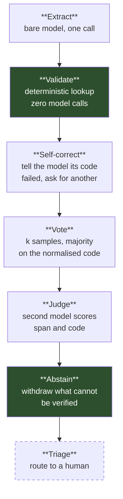
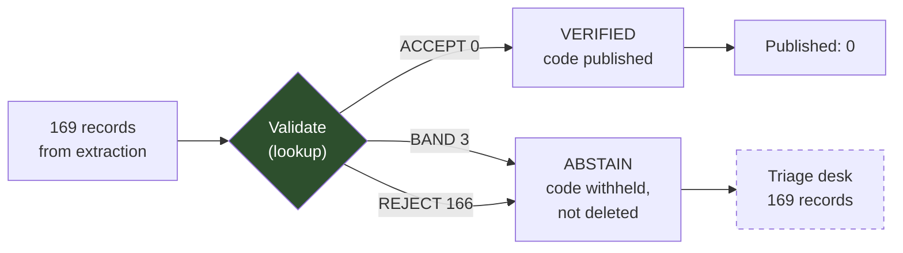
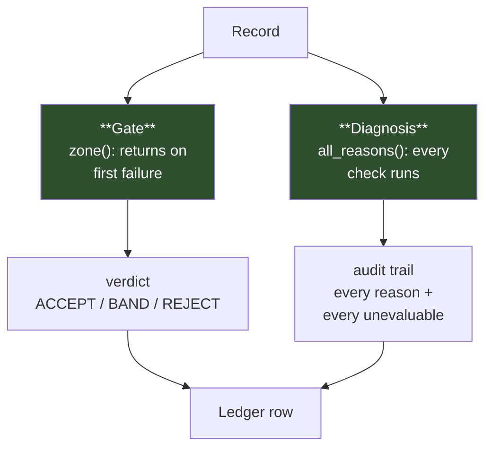

# Every Reliability Layer We Added Reported Success

## What four wrappers around an LLM measured, and what they missed

---

**Scope, up front.** 40 documents from the CADEC v2 adverse-event corpus, one
~3B parameter model (`granite4:micro-h`) running locally on a single GPU,
SNOMED CT-AU release `AU1000036_20260731`, judged by `llama3.2:3b`. Everything
below was measured on that setup. The instrumentation findings generalise. The
specific accuracy numbers do not, and I will say so again where it matters.

---

## The task, and why it makes a good probe

Pharmacovigilance triage: read a patient's forum post about a medication, pull
out the adverse reactions they describe, and normalise each one to a SNOMED CT
code.

Most work on LLM reliability is done on tasks where the only available grader is
another language model. Summarisation, question answering, code explanation —
you can measure fluency and you can ask a bigger model whether it liked the
answer, but there is no fact of the matter sitting outside the system.

This task has one. Whether `41456009` exists in the release, whether it is
active, and whether it descends from Clinical Finding are three lookups against
a 365 MB SQLite index built from the official distribution. They take
microseconds and they do not have opinions. The corpus ships 9,111 human
annotations, so there is also a ground truth for what the right answer was.

That combination — a decidable floor plus a real answer key — is what makes the
task useful for measuring reliability layers rather than model quality. It means
that when a layer reports an improvement, you can check.

## The ladder

The design is a stack of interventions, each one added on top of the last, each
one measured for what it buys and what it costs.



Two design choices matter for what follows.

**Rung order is configuration, not a constant.** Execution order is
`[0, 1, 3, 5, 4, 2, 6]` — cheap fixes before expensive sampling, judging after
both so the judge grades the best available answer, abstention last because
withdrawing early throws away records the layers above might have recovered.
Because the order lives in a manifest rather than in code, it can be varied and
measured rather than asserted.

**Cost is three numbers, never one.** Tokens per record, p95 latency, and
records routed to a person. Fusing them into a single figure hides which
resource a layer actually spends, and the three do not move together — as the
voting results below demonstrate.

The two layers shaded green are deterministic. They make no model calls. Hold
that thought.

## Result one: the model finds half the reactions and codes none of them

Baseline, no wrappers:

| | |
|---|---|
| Mentions emitted | 169 |
| Span precision | 0.683 |
| Span recall | 0.451 |
| Span F1 | **0.543** |
| Correct codes | **0 / 105** |

The span numbers are unremarkable for a small model on noisy patient text. It
finds roughly half the reactions, and about a third of what it finds is not
there.

The code column is the interesting one. Of 105 gradable predictions, zero
matched the gold code. Not a low rate — zero. The model produces SCTID-shaped
strings with confident term labels attached, and none of them are the right
code. Most are not codes at all: 155 of 169 fail an existence check against the
release.

That is the number every subsequent layer is measured against. Each of the four
layers below reported an improvement. The correct-code count stayed at zero
throughout.

## Result two: a tool-access experiment that never tested tool access

The first wrapper was a prompt variant that describes a vocabulary lookup tool
and instructs the model to use it. Call it Mode B.

Mode B halved the validation layer's rejection rate. That looks like a win until
you ask where the halving came from: 59 records where the model returned no code
at all. Rejections fell because the model answered less often, and correct codes
stayed at zero.

Then the arm's own instrumentation gave it away. A flag called `honoured_tool`
is never `True` across the entire split — and `vocab.search` runs *after*
generation, not during it. The model never had the tool. The A/B contrast
measured **prompt wording**, not tool access.

The lesson is not about tools. It is that the label on an experimental arm is a
claim, and it needs the same verification as a result. We came within one commit
of publishing "tool access does not help" from an experiment where no tool was
ever available.

## Result three: self-correction that never corrects

The next layer takes each validation failure and tells the model the fact:
*code 41456009 does not exist in this release*. Then it asks for a replacement,
and — a deliberate departure from the original spec — re-validates whatever
comes back through the same validation function.

| outcome | count |
|---|---|
| offered | 158 |
| **rescued** | **0** |
| still failing | 0 |
| reasserted | 0 |
| declined | **158** |

Told that a code does not exist, the model neither defends it nor proposes
another. It returns null, 158 times out of 158, at a cost of 72,539 tokens.

The spec deviation is the part worth dwelling on. The original design said this
layer should not re-validate — update the record and let the ladder continue.
Under that design, `rescued` would have been an *assertion*: a record marked as
repaired because a repair was attempted, not because it worked. A
spec-conformant implementation would have reported **158 corrections, none of
them checked, all of them empty.** A 100% correction rate for a layer that
corrected nothing.

That is not a hypothetical. It is what the spec said to build, and it was caught
because someone asked what `rescued` would mean if nothing verified it.

## Result four: unanimous agreement, computed over 2% of the input

Voting: sample the extractor k=3 times at temperature 0.7, take the majority on
the normalised code.

| outcome | count | share |
|---|---|---|
| unanimous | 3 | 2% |
| split | 0 | 0% |
| tie | 0 | 0% |
| **not re-found by any sample** | **166** | **98%** |

Cost: 55,704 tokens, 505 seconds.

Ninety-eight percent of the mentions from the greedy pass were not found again
by any of three samples. The voting mechanism had three records to vote on. It
was unanimous on all three, and all three codes were fabricated.

An agreement metric requires a set that persists across samples. Here it does
not. At temperature 0.7 the extractor's span boundaries move enough that
matching between samples fails almost entirely — the consensus figure describes
2% of the input, and the other 98% is not disagreement either.

The implementation happens to have a `not_resampled` outcome, distinct from both
agreement and disagreement. Without that third category — and the first draft
did not have it — those 166 records would have been folded into one bucket or
the other, and voting would have reported near-perfect consensus.

There is a sharper version of this failure. My collaborator found that our
shared model caller was not varying the sample index, which is part of the disk
cache key. All k votes were hitting the same cache entry. Her words from the
decisions log: *unanimity that was never measured, in 0.00s, for free.*

## Result five: a judge with no discriminative power on either channel

The judge is a second model, from a different family — a model judging its own
output measures self-consistency and reports it as verification, so the
implementation raises if the two model strings match. It answers two questions,
counted separately:

- `span_ok` — is the quoted text really a reported reaction?
- `code_ok` — is this code right for it?

First run, 40 documents:

| | |
|---|---|
| offered | 169 |
| judged | 96 |
| parse failures | 73 |
| span_ok | 3 |
| code_ok | 83 |

The v1 report pooled the two questions into one verdict and concluded the judge
always agreed with the deterministic checker — two checkers paid for twice, a
null result. Splitting the channels showed something different: the judge fails
almost every span and passes almost every code, and the codes it passes are ones
the deterministic lookup has already established do not exist.

That is worth stating plainly. The judge affirms fabricated codes. My
collaborator caught a verbatim instance: the judge asserted that *SNOMED CT
41456009 represents rectal hemorrhage*, at 0.95 confidence, for a code the
existence check had already rejected. It confabulated a label for a hallucinated
identifier, because nothing in a judge prompt touches the vocabulary.

But 3% on spans and 86% on codes could still mean the judge is right — those
records had *already been rejected*, so a harsh span verdict might be accurate
and a lenient code verdict might be a model treating a moot question as moot.
Distinguishing those readings needs ground truth on both sides.

### The gold control

Mix 226 gold reaction mentions — spans written by human annotators, codes
correct by construction — with the 169 model records, and judge all 395 in one
pass. Now the validation layer splits the set three ways and both questions have
known answers on each side.

| | gold (correct by construction) | model output (0/105 codes correct) |
|---|---|---|
| judged | 95 | 96 |
| `span_ok` | 3 — **3%** | 3 — **3%** |
| `code_ok` | 87 — **92%** | 83 — **86%** |

The judge fails the annotators' own spans at exactly the rate it fails the
model's. On codes, it passes valid ones and fabricated ones six points apart on
n≈95 each — about 1.4 standard errors, no detectable discrimination.

**Both channels are constants.** The judge is not reading its input. It returns
approximately the same answer to both questions regardless of whether the answer
is right.

It is not uniformly useless — on one record it returned `span_ok: false` with
the explanation *a fear, not an adverse reaction*, which is a genuine catch no
deterministic check could make and exactly the work a judge is for. But that is
an anecdote, and 3% versus 3% is a measurement.

### The number that moved 51 points while nothing changed

Because the judge fails everything on the pooled verdict, its agreement with the
deterministic checker equals that checker's rejection rate on whatever set you
hand it:

| set | validator's REJECT share | reported agreement |
|---|---|---|
| 5 documents | 9 / 9 | **100%** |
| 40 documents | 94 / 96 | **98%** |
| mixed gold control | 94 / 191 | **49%** |

Same judge. Same prompt. Same model. Identical behaviour on every record. The
agreement metric moved across half its range purely because the composition of
the comparison set changed.

If you take one thing from this article, take that table. A reliability metric
swung 51 points with no change whatsoever in the thing being measured, and
nothing in the metric's presentation would have told you.

### Availability is input-dependent

Parse failures ran **58% on gold (131/226) against 43% on model output
(73/169)**. So the records the judge can answer about are not a random sample of
the records it is given — every rate above is conditioned on the judge having
produced parseable output at all.

At 43–58% failure, this judge has an availability problem before it has an
accuracy problem, and the cost belongs to the judge rather than to the
extractor. Total for the control run: 207,529 tokens, 611 seconds — by a wide
margin the most expensive layer, for two constants.

## The layer that worked, and what it cost

Abstention is deterministic. It reads the validation verdict and maps it: accept
becomes verified and keeps its code; band or reject becomes abstain and the code
is withdrawn — moved to a `withheld` field rather than deleted, so a human
reviewer can still see what the system was going to say.

On model output: **169 of 169 withdrawn, zero codes published.** Since the
extractor produced zero correct codes, the correct abstention rate was 100%, and
this layer reached it exactly.

On the gold control: 76 kept, 150 withdrawn, no crossover in either direction.

So the one layer that behaved correctly is the one that makes no claim, calls no
model, produces no accuracy metric, and costs milliseconds. The four layers that
generated impressive-looking numbers recovered nothing between them.

Two caveats keep that from being a victory lap.

**Its correctness is entirely inherited.** Abstention is a transfer function
over the validator's verdict. It withdrew 169 of 169 because the validator
rejected 166 and banded 3 — not because it assessed anything. All of the
discrimination lives in the lookup one layer below.

**It withheld 150 of 226 correct gold codes — 66%.** Those are valid, active,
correct annotator codes, banded for lacking a lexical match and therefore
withdrawn. On this data the trade is free, because there were no correct model
answers to lose. On a model that gets codes right, this layer would suppress two
thirds of them. Nobody has measured that.



## Where the ladder terminates

The top of the ladder is a triage desk: route what could not be verified to a
human. It has never taken a review, and it cannot usefully take one.

It would receive 169 withheld model records, every one of which carries either a
wrong answer or no answer. There is nothing for a reviewer to adjudicate. The
ladder terminates before the top not because the top is unfinished, but because
the bottom produces no signal to pass upward.

That is a result, not a gap in the implementation. A seven-rung ladder with
seven green checkmarks would have been a less honest artefact than one that
stops.

## The instrumentation was wrong the whole time

Everything above is about layers. This section is about the measuring apparatus,
and it is the part that transfers to work that has nothing to do with SNOMED.

### Check order determines the reported diagnosis

The validation function returns on first failure. That is correct behaviour for
a gate — you do not need to know every reason something is invalid in order to
reject it.

It is wrong for a report. On the 40-document run, the verdict table said
`span_ungrounded 172, code_unknown 3`. The true failure set was `code_unknown
164`. **172 of 176 failures were hidden by ordering alone.**

The cleanest demonstration is a single-flag ablation. Identical model output,
identical checks, one configuration flag changed:

| | flag off | flag on |
|---|---|---|
| `span_ungrounded` | 162 | **0** |
| `code_unknown` | 4 | **155** |
| total failures | 163 | 163 |

The full failure set is invariant. What moved was which failure got reported.

The fix separates the two jobs: the gate still returns on first failure, and a
separate function runs every check into an audit trail. Both derive from the
same code — there is no second implementation to drift.



### The bias was invisible in the regime the validator was developed in

Here is why nobody caught it for weeks.

Run both the first-failure set and the full-failure set over all 9,111 gold
mentions and **they are identical**. Gold spans ground by construction — they
were written by annotators against the text — so the check that masks the others
never fires.

The validator was developed against gold, where its ordering bias cannot appear,
and deployed against model output, where the bias dominates. That is the most
portable lesson here: **develop validators in the regime you will deploy them
in, not the regime where they look correct.**

### A check that cannot run gets reported as one that ran

This pattern appeared eight separate times in one project. Every instance has
the same shape: the absence of a result rendered as a result.

1. A `--live` comparison mode that was comparing a run against itself.
2. A vocabulary backend flag that was inert — set, read, and connected to
   nothing.
3. A missing vocabulary object returning a neutral verdict instead of raising.
   It now raises unless explicitly allowed.
4. An analysis script counting exceptions as disagreements.
5. The judge's agreement metric computed over a constant set.
6. The judge's guard against (5) — it suppressed the figure when the validator
   returned a single verdict, which is correct. At 40 documents, **two** records
   of a different verdict made the set technically non-constant, the guard
   stopped firing, and a meaningless 98% printed. A binary constancy check needs
   to be a minority-class threshold.
7. Three separate layers where the ledger call sat *below* an early return, so
   the records that could not be evaluated were exactly the records that left no
   trace. Self-correction's parse failures, voting's not-re-found records — 98%
   of that layer's input — and the judge's unparseable responses.
8. The per-record cost accounting for all three model-facing layers called a
   ledger method that **did not exist**, with a required argument missing,
   guarded by a condition that was never true. Four independent reasons it could
   not work.

Number 6 is the one I would put in front of a reader. It is the same failure,
occurring inside the fix written for the previous instance of that failure. This
is not a bug list. It is a structural tendency: when a check cannot produce an
answer, the path of least resistance in code is to return early, and an early
return looks identical to a clean pass.

And number 8 came with a coda. The test suite passed 93 tests before the fix,
after the fix, and after every subsequent revision — because no test constructs
a layer with a ledger attached. Green across eight call sites that could never
have executed.

### A pooled ratio can describe neither population in the pool

The corpus has two entity types: drugs and reactions. Almost every headline
figure changes when you split them.

| pooled | drugs | reactions |
|---|---|---|
| 11% of codes inactive | 46.8% | **6.2%** |
| 23.9% backend disagreement | 100% | **5.9%** |
| 43.1% accepted on gold | 76.0% | **35.0%** |

Drug names appear in patient text as printed on the box. Reactions appear in the
reporter's own words — *"no control over urination"*, *"constipitation"*. They
are different problems and the pooled number describes neither.

The headline changes with them: 43% pooled is 35% on reactions, and reactions
are what the task is actually about.

This one produced an unexpected confirmation. Months later and in a completely
different code path, the abstention layer's gold control accepted 76 of 226
reaction mentions — 33.6%, against the 35.0% above. The split predicted a number
in an experiment built for another purpose, which is much stronger evidence than
the original observation.

### Determinism is bounded by the hardware

Same model, same seed, greedy decoding: **176 mentions on CPU, 169 on GPU.**
Three GPU runs byte-identical to each other.

Reproducible within a backend, not across one. Record the compute backend the
way you record the vocabulary release — and note that the inference server
reported "100% GPU" from its own placement estimate while running on CPU at 4.4
tokens per second. Another check reporting a result it could not have had.

### Wall clock is not reproducible across run lengths

Running the layers individually versus end-to-end produced **identical token
counts** and wall clocks 2–4× longer in the pipeline: self-correction 230s →
977s, voting 505s → 2,050s, judging 265s → 504s.

Identical work, different duration, on a laptop GPU already at 24W of a 25W cap.
Thermal throttling is the obvious hypothesis. Whatever the cause, p95 latency —
one of the three cost measures — is contaminated in a way tokens are not, and
nothing in the run stamp records run position or thermal state.

### The tooling does not model any of this

Partway through, we went looking for an observability platform — the reasonable
instinct once you have found this many measurement bugs. We evaluated the main
open-source LLM tracing tools, instrumented a ledger exporter against
OpenTelemetry, and got spans rendering in a local trace viewer within an hour.

Then we looked at what the views could show. Every platform in this category
models the same unit: the call. Prompt, response, tokens, latency, p50/p95, and
usually an LLM-judged quality score. All of that we already had.

Not one of them models a denominator. There is no field for *judged 96 of 169
offered*, no way to say that a rate belongs to one subset and not another, and
no representation of a comparison set's composition. The agreement table above —
the strongest finding here — is invisible in every tool we looked at, because
the thing that moved was not a property of any call.

Several also ship LLM-as-judge scoring as their default quality signal. Adopting
one and using it would have put this pipeline's quality gate on the mechanism
that, three sections ago, returned two constants.

The exporter still went in, with two custom span attributes: which named set a
row's rate is computed over, and whether the check produced a pass, a fail, or
could not run at all. Both had to be invented. That is the finding — not that
the tools are bad, but that the industry's instrumentation vocabulary describes
what happened to a request and has almost nothing to say about what a number is
computed over.

## What deterministic checking can and cannot do

The lookups caught everything above. They are also not a scorer, and the
distinction matters.

Three records survived validation on the 40-document run — code exists, code
active, code is a clinical finding, no lexical match. All three are wrong
against gold:

```
LIPITOR.401#3   60551006   'loss of balance'
LIPITOR.935#1   39249009   'constipitation'
LIPITOR.935#2   39249009   'no control over urination'
```

One code assigned to two opposite conditions in a single document. The validator
checks codes in isolation and structurally cannot notice.

A deterministic checker is a floor, not a grader. It tells you what is
impossible, never what is right.

## The answer key is not clean either

One gold annotation file has a date — `20070731` — where an SCTID belongs,
inside a multi-code annotation. It has the right shape and the right length. It
survived the corpus's v1 → v2 revision.

It is handled as a documented defect list, never a silent filter. A silent
filter is the same failure as everything in the previous section: a record that
could not be graded, removed without a trace, changing a denominator that nobody
re-derives.

## What this shows, and what it does not

**It shows** that on this task, each of four reliability layers produced a
metric indicating improvement while correct codes stayed at zero, and that in
every case the metric was generated by the layer being evaluated.

**It does not show** that wrappers never help. Forty documents, one small model,
one corpus, one terminology. A larger model may well have the knowledge this one
lacks. The finding is that the wrappers could not tell us either way, and
reported that they could.

**The transferable claim** is narrower and, I think, more useful: a reliability
layer is also a measurement instrument, and it is an instrument built by the
same reasoning that built the layer. It will tend to report the layer working.
The only checks that caught anything here were the ones with no stake in the
outcome — a lookup against a file, and a function that withdraws answers.

## A checklist

- Run every check, always. Gate on the first failure; diagnose on all of them.
- Develop validators in the regime you will deploy them in, not the one where
  they were tuned.
- Make *could not run* a third outcome that raises or records, never a pass and
  never a fail. Then check that the code path recording it is actually
  reachable.
- Split pooled ratios by the populations you pooled, before publishing either.
- Never report an agreement figure without the composition of the set it was
  computed on.
- Stamp backend, release, corpus version, temperature, and rung order into every
  run record.
- Verify the label on an experimental arm before reporting the contrast.
- Keep defects listed, never filtered.
- Write one test that constructs each component with its accounting attached. A
  green suite over unreachable code is the cheapest lie in the project.
- If you adopt a tracing platform, check it can express your denominators before
  you trust its dashboards. Most cannot, and a rate over the wrong base renders
  as healthy.

---

*The pipeline, the decisions log, and every figure above are at
`gitlab.com/pushpdeep/ai-reliability-ladder`. The corpus and the terminology
release are not redistributable and are not included.*
