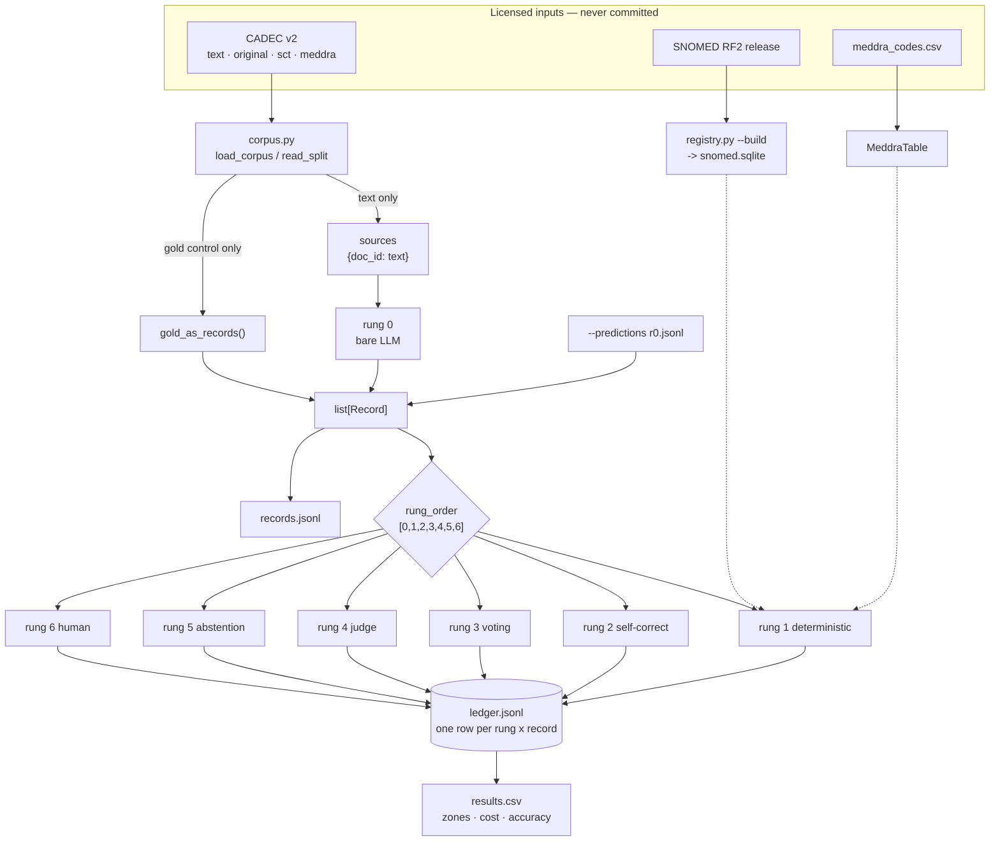

# Architecture

## System flow



## Design invariants

Reverse none of these silently. Each is recorded in `docs/decisions.md` with the measurement that settled it.

- **Rung ID equals execution position.** `manifest.rung_order` is `[0,1,2,3,4,5,6]`. Renumbered 2026-08-23 from `[0,1,3,5,4,2,6]`; earlier measurements use the old IDs and the mapping is in `docs/decisions.md`. Order is still read from configuration, so a different order stays testable.
- **Rung 1 judges, it does not route.** Default `mode: observe`. A filtering rung 1 confounds every rung above it. See [[r1]].
- **Rung 5 runs last.** Abstaining before correction and voting throws away recoverable records. See [[r5]].
- **Three outcomes, not two.** REJECT / ACCEPT / BAND. BAND holds 56.8 % of even a perfect answer set.
- **Cost is three measures.** Tokens, latency p95, human minutes. Never fused into a currency figure.
- **One accounting path.** Everything reported is a `GROUP BY` over [[ledger]]. Two accounting paths is how a benchmark gets two numbers for one run.
- **One file per rung.** A rung is registered by adding `ladder/rungs/rN.py`; `run.py` is never edited to register one.
- **Schemas append, never reorder.** `schema.py` enums are the contract every rung reads.

## Module map

| File | Role |
|---|---|
| `ladder/run.py` | pipeline, CLI, reporting |
| `ladder/schema.py` | `Record`, zones, reject reasons — the contract |
| `ladder/ledger.py` | append-only ledger + cost meter |
| `ladder/corpus.py` | CADEC parsing, splits |
| `ladder/registry.py` | SNOMED RF2 → SQLite, `MeddraTable` |
| `ladder/vocab.py` | backend selection, OLS4 fallback |
| `ladder/negation.py` | cue list + window |
| `ladder/fixture.py` | the 13-record harness gate |
| `ladder/calibrate.py` | rung 1 vs gold, setting sweep |
| `ladder/probe.py` | rung 1 vs planted corruptions |
| `ladder/vocab_crosscheck.py` | local-rf2 vs OLS4 |
| `ladder/rungs/r1.py` | [[r1]] |
| `ladder/rungs/r5.py` | [[r5]] |
| `ladder/rungs/r0.py` | rung 0, and the recall-vs-search ablation over it |
| `ladder/stub_llm.py` | Ollama client for rung 0 |
| `ladder/score.py` | the ONE scorer: pairs predictions with gold by SPAN KEY, `exact` or `overlap`, detection and coding as separate layers |
| `schemas/vocabulary.py` | the `Vocabulary` contract |

## Data boundary

- Rung 0 receives `sources` — `{doc_id: text}` — and an **empty** record list. It builds records from the post alone.
- Rung 0 must never receive `docs`. That object carries gold spans and codes; a rung 0 that reads them makes rung 1's span check vacuous.
- Rungs 3 and 4 may read `checks["r1_verdict"]` and `checks["r1_reason"]`, **and nothing else from `checks`**. `meddra_term` is derived from the answer key; putting it in a prompt leaks the answer.

## Rung contract

```python
def apply(records: list[Record], sources: dict[str, str], cfg: dict) -> list[Record]
```

- `cfg` carries manifest settings plus `ledger`, `registry`, `meddra`, `manifest`, `split`.
- Mutate only `zone`, `reason`, `provenance`, `checks`. Use `Record.mark()`.
- Log one ledger row per record touched.
- Rung 0 is the exception: it is handed `[]` and returns the records everything else routes.

## Related

- [[record]] · [[ledger]] · [[manifest]] · [[runner]] · [[rungs]] · [[glossary]]
