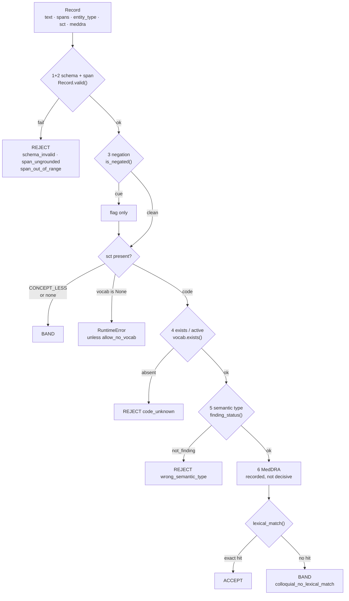

# Rung 1 · deterministic {{done|BUILT}}

`ladder/rungs/r1.py` · owner A · Wejdan Bagais · **zero model calls, zero tokens, zero network**

393 records in 0.13 s. Free in all three cost measures.

## What it does

- **Cannot tell you a code is right.** Nothing deterministic can — the code is not in the source text.
- **Can tell you a code is wrong**, and does it for free.
- Emits one of three verdicts. See [[rungs]] for why two is not enough.

| Verdict | Meaning |
|---|---|
| `REJECT` | provably wrong, with a reason from `schema.REJECT_REASONS` |
| `ACCEPT` | passed, and the vocabulary uses these very words |
| `BAND` | passed, unverifiable by string comparison |

## Judges, does not route

- `rungs.1.mode` defaults to `"observe"`: verdict written to `checks`, `zone` untouched.
- Rungs 3–6 therefore see the full unfiltered set, and each stays a single-rung ablation on identical input.
- [[r2]], which runs last, is where a rung 1 verdict finally costs coverage.
- `mode: "gate"` restores filtering. Measured: final coverage is identical either way — observe **defers** rung 1's cost, it does not cancel it.

## Check sequence

Cost order. Free string work before any lookup. `zone()` short-circuits on the first failure.



| # | Function | Reads | Emits | Can reject? |
|---|---|---|---|---|
| 1+2 | `Record.valid(source)` | record, source text | `span_grounded` | yes |
| 3 | `negation.is_negated()` | source, spans, window 6 | `negated`, `negation_cue` | no — flags only |
| 4 | `vocab.exists()` / `is_active()` | `snomed.sqlite` | `sct_exists`, `sct_active` | yes — `code_unknown` |
| 5 | `vocab.finding_status()` | is-a graph | `sct_finding_status` | yes, on positive `not_finding` only |
| 6 | `meddra.exists()` / `term()` | `meddra_codes.csv` | `meddra_exists`, `meddra_term` | no — flags only |
| 7 | `vocab.lexical_match()` | descriptions | `lexical_match` | no — decides ACCEPT vs BAND |

> A missing vocabulary raises `RuntimeError`, it does not BAND. BAND would make "unverifiable" and "never checked" the same value, and nothing above rung 1 could tell them apart. `allow_no_vocab=True` opts out.

## Worked example

Synthetic post, 42 characters. Real CADEC text is never reproduced in a committed file.

```
i had bad cramping and shortness of breath
0         1         2         3         4
012345678901234567890123456789012345678901
          ^------^     ^-----------------^
          10    18     23               42
```

Rung 1 **did not find these mentions** — extraction is [[r0]]'s job. It receives finished records and asks one question of each: can I prove this code wrong?

### `shortness of breath` → `267036007`

```
1+2  source[23:42] == 'shortness of breath'          -> True
3    no cue within 6 tokens                          -> False
4    exists / active                                 -> True / True
5    finding_status                                  -> 'finding'
6    meddra.term  (recorded, not decisive)           -> 'Dyspnoea'
7    terms: Dyspnea, Dyspnoea, Breathless, Breathlessness,
            SOB - Shortness of breath, Shortness of breath
     'shortness of breath' matches term 6            -> True

OUTPUT  r1_verdict='ACCEPT'  r1_reason=None  zone='NEW' (unchanged)
```

- The **preferred** term is `Dyspnea`, which looks nothing like the mention. The match came from a synonym. Matching runs over every term the concept has.

### `cramping` → `55300003`

```
1-6  all pass, exactly as above                      meddra.term -> 'Muscle cramp'
7    terms: Cramp, Cramp in muscle, Muscle cramp,
            Cramp (finding), Muscle cramps
     'cramping' matches none                         -> False

OUTPUT  r1_verdict='BAND'  reason_band='colloquial_no_lexical_match'
```

- **`55300003` is the correct code.** BAND is not a rejection. Rung 1 says: real, active, correctly typed, span grounded — I have no string evidence, so I decline to have an opinion.
- Step 6 found `meddra_term='Muscle cramp'`, which **is** an exact term. It changed nothing, because `meddra_check: "flag"`. Had the table been allowed to vote, the record would be rescued and the result would be an artefact — that table is derived from the answer key.

### It has no access to the answer key

Same mention, gold code plus three wrong-but-real SNOMED findings:

| code | is it gold? | verdict |
|---|---|---|
| `55300003` | **gold** | BAND |
| `25064002` | wrong (Headache) | BAND |
| `422587007` | wrong (Nausea) | BAND |
| `396275006` | wrong (Osteoarthritis) | BAND |

Identical. If rung 1 could see the answer key, the gold code would separate.

## The audit pass

`all_reasons()` runs **every** check unconditionally and does **not** decide the verdict.

- `zone()` short-circuits, which is right for a verdict and wrong for a reason table.
- Measured on 2 dev docs, mode A: 6/6 records rejected as `span_ungrounded`, and all 3 distinct codes emitted were absent from SNOMED. **Not one appeared in the reason table.**
- So rung 1's reported reason table is a distribution over *first* failures, weighted by check order. On gold the bias is latent; on model output it dominates.
- Returns `reasons` (all that apply), `unevaluable` (checks that could not run, and why), and the full check dict.

## Settings

`manifest.rungs.1`, defaulted in `r1.DEFAULTS`. Every one moves the rejection rate.

| Setting | Default | Why |
|---|---|---|
| `mode` | `observe` | a filtering rung 1 confounds every rung above it |
| `negation_action` | `flag` | as a rejection it costs 427 gold-correct mentions (4.7 %) |
| `reject_inactive` | `false` | 11 % of CADEC's codes are retired; rejecting them rejects the answer key |
| `finding_scope` | `reaction` | a drug normalises to a product concept, correctly not a finding |
| `lexical_mode` | `exact` | `contained` buys 11.4 pt of ACCEPT coverage and 19 % wrong acceptances |
| `meddra_check` | `flag` | the table is the answer key's inventory, not a vocabulary |
| `finding_check` | `true` | catches right-code-wrong-slot |
| `negation_window` | `6` | tokens either side of the span |

Each default was settled by replaying rung 1 over gold, where every rejection is false by construction. That took the error floor from **9.3 % to 0.13 %**.

## Measured

| | |
|---|---|
| false-rejection floor on gold | 12 / 9,111 = **0.13 %** |
| zone occupancy on gold | ACCEPT 43.1 % · BAND 56.8 % · REJECT 0.13 % |
| hallucinated code · span shift · fabricated quote | 1.000 · 1.000 · 1.000 |
| real code, wrong branch | 1.000 on reaction records |
| plausible wrong finding | 0.000 caught, 0.000 wrongly accepted |
| near-miss code | 0.001 caught; **19 %** wrongly ACCEPTED under `contained`, 0.1 % under `exact` |

Exact on its own error classes, blind to the interesting one.

## Contract for rungs above

```python
record.checks["r1_verdict"]   # "ACCEPT" | "BAND" | "REJECT"
record.checks["r1_reason"]    # a schema.REJECT_REASONS value, or None
```

- [[r3]] fires only on `REJECT`, stating `r1_reason` as fact.
- [[r2]] reads `r1_verdict`, falling back to the zone.
- Everything else in `checks` is audit trail, **not input**. `meddra_term` is answer-key-derived; a rung that puts it in a prompt leaks the answer.

## Run it

```bash
python -m ladder.run ladder --split test --source gold --rungs 1 --run-id r1_only
```

## Related

- [[r2]] · [[record]] · [[vocabulary]] · [[measurement]] · [[testing]]
