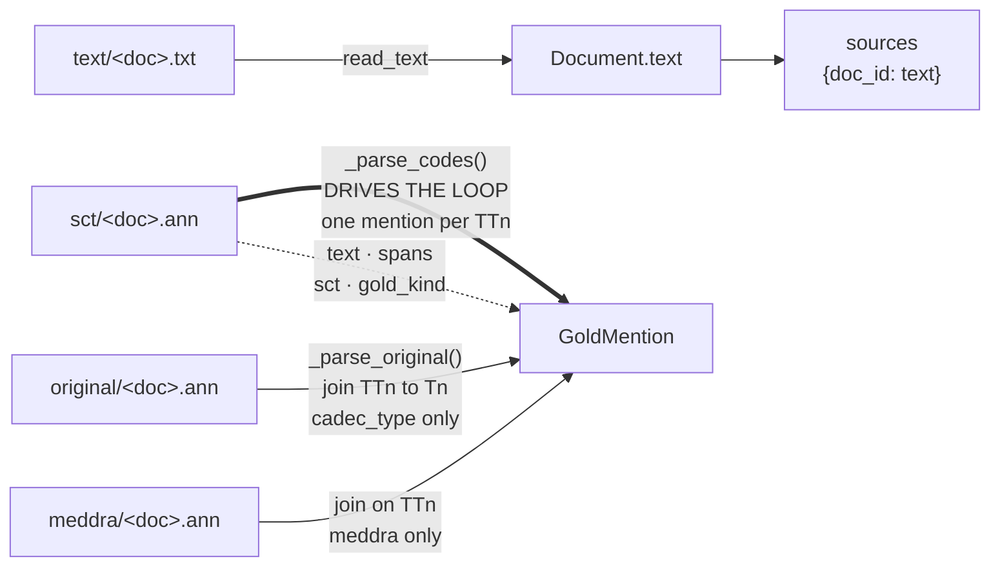
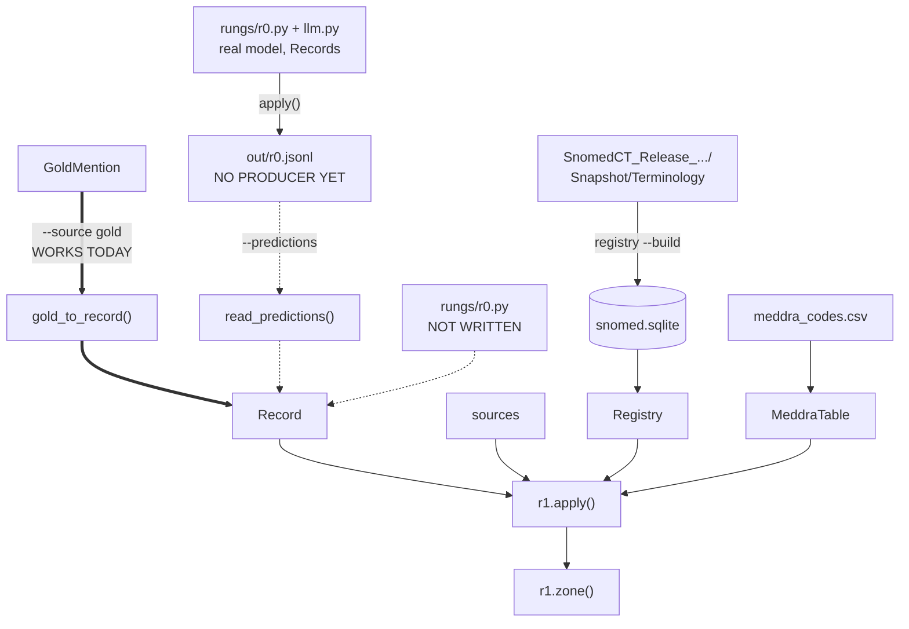
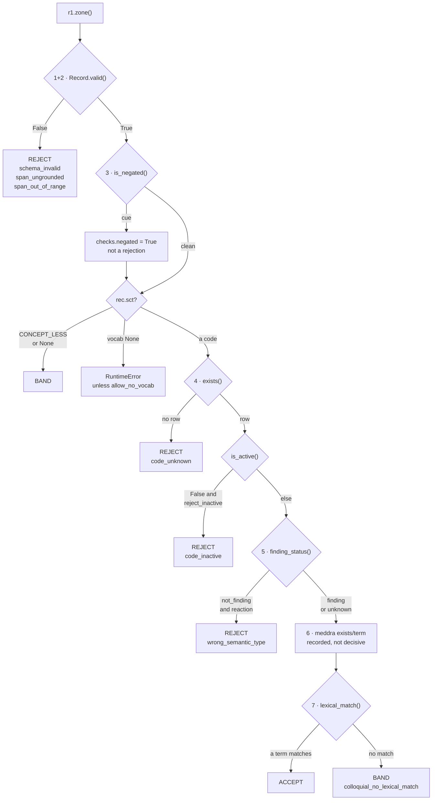

# Rung 1 · deterministic {{done|BUILT}}

`ladder/rungs/r1.py` · **zero model calls, zero tokens, zero network**

393 records in 0.13 s. Free in all three cost measures.

## What it does

- **Cannot tell you a code is right.** Nothing deterministic can — the code is not in the source text.
- **Can tell you a code is wrong**, and does it for free.
- Emits one of three verdicts. See [[rungs]] for why two is not enough.

| Verdict | Meaning |
|---|---|
| `REJECT` | provably wrong, with a reason from `schema.REJECT_REASONS` |
| `ACCEPT` | passed, and the vocabulary uses these very words |
| `BAND` | passed, unverifiable by string comparison |

## Judges, does not route

- `rungs.1.mode` defaults to `"observe"`: verdict written to `checks`, `zone` untouched.
- Rungs 3–6 therefore see the full unfiltered set, and each stays a single-rung ablation on identical input.
- [[r2]], which runs last, is where a rung 1 verdict finally costs coverage.
- `mode: "gate"` restores filtering. Measured: final coverage is identical either way — observe **defers** rung 1's cost, it does not cancel it.

## Where the data comes from

Rung 1 reads nothing from `data/` itself. Everything is loaded before it runs and handed in through `cfg`.

### A · the four CADEC files become `sources` and `GoldMention`



### B · a `Record` reaches `r1.zone()`



### Three ways a Record can reach rung 1 — only one works today

| Route | Flag | State |
|---|---|---|
| the answer key, dressed as rung-0 output | `--source gold` | **works** — this is the control |
| a prediction file | `--predictions out/r0.jsonl` | the reader works; **nothing writes the file** |
| rung 0 generating in-process | neither flag | `ladder/rungs/r0.py` **does not exist**; `run.py` exits with a message |

- `out/r0.jsonl` is a **contract, not an artefact**. `run.read_predictions()` consumes it and `schema.dumps()` would produce it, but no code calls `dumps` on rung-0 output today.
- `ladder/rungs/r0.py` drives a real model through `ladder/llm.py` and builds `list[Record]` — see [[r0]] for the measured A/B.
- The model→Record path and the Record→ladder path are **joined**: `run.py` hands `r0.apply()` an empty record list and the split's sources.

**`sources` is `text/` and nothing else** — the post body, keyed by doc id. It is what [[r0]] will be handed, and what rung 1's span check reads.

**`GoldMention` is assembled from three files, and `sct/` drives it.** One mention per `TTn` tag in `sct/`; a span with no `sct/` entry never becomes a GoldMention at all. That is why the corpus reports 9,111 mentions rather than the number of `original/` annotations.

| `GoldMention` field | Comes from |
|---|---|
| `doc_id` | the filename |
| `index` | position in `sct/`'s sorted tags |
| `text` | **`sct/`**, column 3 |
| `spans` | **`sct/`**, the offsets inside column 2 |
| `sct`, `gold_kind` | **`sct/`**, column 2 |
| `entity_type`, `cadec_type` | **`original/`**, joined `TTn` → `Tn` |
| `meddra` | **`meddra/`**, joined on `TTn` |

- `original/` carries the same offsets, but the parser does not read them — it takes only the CADEC label (`ADR`/`Symptom`/`Disease`/`Finding`/`Drug`), which `CADEC_TYPE_MAP` collapses to `reaction` or `drug`.
- The annotator's term in `sct/` column 2 (`| Muscle cramp |`) is **discarded**. Keeping it would let rung 1 match against the annotator's wording and ACCEPT everything.

| Node | Full path |
|---|---|
| `text/`, `original/`, `sct/`, `meddra/` | `data/cadec/data/cadec/<dir>/<doc>.{txt,ann}` |
| `SnomedCT_Release_.../` | `data/SnomedCT_Release_AU1000036_20260731/Snapshot/Terminology/sct2_{Concept,Relationship,Description}_*.txt` |
| `snomed.sqlite` | `ladder/cache/snomed.sqlite` — built once, read-only at run time |
| `meddra_codes.csv` | `data/meddra_codes.csv` — 666 rows |

- **`sct/` and `meddra/` reach rung 1 only through the record.** Under `--source gold` that record IS the answer key — which is what makes the run a control. Under `--predictions` the codes come from the model and `sct/` is never read.
- The vocabulary is a **prebuilt SQLite file**, not the RF2 text.

## Check sequence

`r1.zone()` — one pure function, ordered by cost. Free string work before any lookup; it returns on the **first** failure.



| # | Function | Reads | How | Emits into `checks` | Can reject |
|---|---|---|---|---|---|
| 1+2 | `Record.valid(source)` | `sources[doc_id]`, i.e. `text/<doc>.txt` | compares a **token bag** of `source[a:b]` against `rec.text` — case-, order- and whitespace-insensitive | `span_grounded` | `schema_invalid`, `span_ungrounded`, `span_out_of_range` |
| 3 | `negation.is_negated()` | the same source string | scans back up to **6 tokens** from the span start, stopping at a sentence end or terminator; pseudo-negation phrases veto | `negated`, `negation_cue` | only if `negation_action="reject"` |
| 4 | `Registry.exists()` → `is_active()` | `ladder/cache/snomed.sqlite` | `SELECT active, is_finding, is_finding_hist FROM concept WHERE id=?`, memoised per code | `sct_exists`, `sct_active` | `code_unknown`; `code_inactive` only if `reject_inactive=true` |
| 5 | `Registry.finding_status()` | same row, no second query | `is_finding` → `"finding"`; active but not → `"not_finding"`; retired → `is_finding_hist` → `"finding"`, else `"unknown"` | `sct_finding_status`, `sct_is_finding` | `wrong_semantic_type`, **only on a positive `not_finding`** |
| 6 | `MeddraTable.exists()` / `term()` | `data/meddra_codes.csv` | dict lookup, 666 rows keyed by `meddra_code` | `meddra_exists`, `meddra_term`, `meddra_lexical_match` | only if `meddra_check="reject"` |
| 7 | `Registry.lexical_match()` | `snomed.sqlite` | `SELECT term FROM description WHERE concept_id=?`, then `normalise_term()` both sides (lowercase, strip semantic tag, squash punctuation) and compare **every** term | `lexical_match` | never — decides ACCEPT vs BAND |

## What the verdict does

`r1.apply()` writes the verdict to the record and logs a ledger row. **In `observe` mode the zone does not move.**

| Verdict | `r1.apply` writes | `zone` after rung 1 | What [[r2]] does with it |
|---|---|---|---|
| `ACCEPT` | `checks.r1_verdict="ACCEPT"` | `NEW` (unchanged) | → `VERIFIED`, `sct` kept |
| `BAND` | `checks.r1_verdict="BAND"`, `reason_band` | `NEW` (unchanged) | → `ABSTAIN`, reason `unresolved`, `sct` blanked, answer saved to `checks.withheld` |
| `REJECT` | `checks.r1_verdict="REJECT"`, `r1_reason` | `NEW` (unchanged) | → `ABSTAIN`, reason = the `r1_reason`, answer saved to `checks.withheld` |

- Under `mode: "gate"` the verdict is also written to `zone` via `Record.mark()`, and `provenance` gains a rung-1 entry.
- Every record gets **one ledger row** either way: `rung=1`, `outcome="judged"`, `verdict=<the verdict>`, `tokens_in=0`, `tokens_out=0`, `api_calls=0`.

## Worked example

Synthetic post, 42 characters. Real CADEC text is never reproduced in a committed file.

```
i had bad cramping and shortness of breath
0         1         2         3         4
012345678901234567890123456789012345678901
          ^------^     ^-----------------^
          10    18     23               42
```

Rung 1 **did not find these mentions** — extraction is [[r0]]'s job. It receives finished records.

### Record B · `cramping` → `55300003`, step by step

```
INPUT
  Record(doc_id='SYNTH', entity_type='reaction', text='cramping',
         spans=[(10,18)], sct='55300003', meddra='10028294', zone='NEW')
  sources['SYNTH'] = 'i had bad cramping and shortness of breath'

STEP 1+2  Record.valid(source)
  source[10:18]              -> 'cramping'
  token bag vs rec.text      -> ('cramping',) == ('cramping',)
  OUT                        -> (True, None)          checks.span_grounded = True

STEP 3    negation.is_negated(source, [(10,18)], window=6)
  tokens before span         -> ['i','had','bad']
  cue list hit               -> none
  OUT                        -> (False, None)         checks.negated = False

STEP 4    Registry.exists('55300003')
  SELECT active, is_finding, is_finding_hist FROM concept WHERE id='55300003'
  row                        -> (1, 1, 1)
  OUT                        -> True                  checks.sct_exists = True
          Registry.is_active('55300003')  -> True     checks.sct_active  = True

STEP 5    Registry.finding_status('55300003')
  is_finding == 1            -> 'finding'
  OUT                        -> 'finding'             checks.sct_finding_status='finding'
  entity_type == 'reaction', status != 'not_finding'  -> no rejection

STEP 6    MeddraTable.term('10028294')
  dict lookup over 666 rows  -> 'Muscle cramp'        checks.meddra_term='Muscle cramp'
  meddra_check == 'flag'                              -> recorded, not decisive

STEP 7    Registry.lexical_match('cramping', '55300003', mode='exact')
  SELECT term FROM description WHERE concept_id='55300003'
    -> ['Cramp','Cramp in muscle','Muscle cramp','Cramp (finding)','Muscle cramps']
  normalise_term('cramping') -> 'cramping'
  normalised terms           -> ['cramp','cramp in muscle','muscle cramp','cramp','muscle cramps']
  any equal?                 -> no
  OUT                        -> False                 checks.lexical_match = False

OUTPUT (rung 1)
  return ('BAND', None, checks)
  checks.reason_band = 'colloquial_no_lexical_match'
  checks.r1_verdict  = 'BAND'
  rec.zone           = 'NEW'      <- unchanged, observe mode
  ledger row         = rung 1, outcome='judged', verdict='BAND', tokens=0

OUTPUT (rung 2, later)
  r2.decide reads checks.r1_verdict == 'BAND', which is in abstain_zones
  rec.zone            = 'ABSTAIN'
  rec.reason          = 'unresolved'
  rec.sct             = None                  <- ships no answer
  checks.withheld     = {'sct': '55300003', 'confidence': 1.0}
  rec.provenance     += {'rung': 2, 'from': 'NEW', 'to': 'ABSTAIN', 'reason': 'unresolved'}
```

**`55300003` is the correct code.** BAND is not a rejection — step 7 is the only one that did not pass, and it is the one check that can never reject.

### Record A · `shortness of breath` → `267036007`

Steps 1–6 identical in shape. Step 7 diverges:

```
STEP 7    Registry.lexical_match('shortness of breath', '267036007', mode='exact')
  SELECT term FROM description WHERE concept_id='267036007'
    -> ['Dyspnea','Dyspnoea','Breathless','Breathlessness',
        'SOB - Shortness of breath','Shortness of breath']
  normalise_term('shortness of breath') -> 'shortness of breath'
  term 6 normalises to                  -> 'shortness of breath'   MATCH
  OUT                                   -> True

OUTPUT (rung 1)   r1_verdict = 'ACCEPT',  zone = 'NEW'
OUTPUT (rung 2)   zone = 'VERIFIED',  sct = '267036007' kept,  no withheld
```

- The **preferred** term is `Dyspnea`, nothing like the mention. The match came from a **synonym** — `lexical_match` compares against every row `description` returns, not just the preferred one.

### Record C · a hallucinated code, `999999999`

```
STEP 1+2  Record.valid()        -> (True, None)      span is still perfectly grounded
STEP 3    is_negated()          -> (False, None)
STEP 4    SELECT ... WHERE id='999999999'
          row                   -> None
          OUT                   -> False             checks.sct_exists = False

          return ('REJECT', 'code_unknown', checks)  <- steps 5, 6, 7 NEVER RUN
```

- The chain early-returns, so a rejected record carries a **shorter** `checks` dict. That is also why the reported reason table is a distribution over *first* failures — see the audit pass below.

### It cannot tell gold from wrong

Same mention, gold code plus three wrong-but-real SNOMED findings:

| code | is it gold? | verdict |
|---|---|---|
| `55300003` | **gold** | BAND |
| `25064002` | wrong (Headache) | BAND |
| `422587007` | wrong (Nausea) | BAND |
| `396275006` | wrong (Osteoarthritis) | BAND |

Identical. If rung 1 could see the answer key, the gold code would separate.

## The audit pass

`all_reasons()` runs **every** check unconditionally and does **not** decide the verdict.

- `zone()` short-circuits, which is right for a verdict and wrong for a reason table.
- Measured on 2 dev docs, mode A: 6/6 records rejected as `span_ungrounded`, and all 3 distinct codes emitted were absent from SNOMED. **Not one appeared in the reason table.**
- So rung 1's reported reason table is a distribution over *first* failures, weighted by check order. On gold the bias is latent; on model output it dominates.
- Returns `reasons` (all that apply), `unevaluable` (checks that could not run, and why), and the full check dict.

## Settings

`manifest.rungs.1`, defaulted in `r1.DEFAULTS`. Every one moves the rejection rate.

| Setting | Default | Why |
|---|---|---|
| `mode` | `observe` | a filtering rung 1 confounds every rung above it |
| `negation_action` | `flag` | as a rejection it costs 427 gold-correct mentions (4.7 %) |
| `reject_inactive` | `false` | 11 % of CADEC's codes are retired; rejecting them rejects the answer key |
| `finding_scope` | `reaction` | a drug normalises to a product concept, correctly not a finding |
| `lexical_mode` | `exact` | `contained` buys 11.4 pt of ACCEPT coverage and 19 % wrong acceptances |
| `meddra_check` | `flag` | the table is the answer key's inventory, not a vocabulary |
| `finding_check` | `true` | catches right-code-wrong-slot |
| `negation_window` | `6` | tokens either side of the span |

Each default was settled by replaying rung 1 over gold, where every rejection is false by construction. That took the error floor from **9.3 % to 0.13 %**.

## Measured

> **Provenance.** 2026-08-22, CADEC v2, SNOMED `AU1000036_20260731`, backend `local-rf2`. A rung 1 rejection rate is not comparable across backends — see [[vocabulary]]. Regenerate with the commands on [[measurement]].

| | |
|---|---|
| false-rejection floor on gold | 12 / 9,111 = **0.13 %** |
| zone occupancy on gold | ACCEPT 43.1 % · BAND 56.8 % · REJECT 0.13 % |
| hallucinated code · span shift · fabricated quote | 1.000 · 1.000 · 1.000 |
| real code, wrong branch | 1.000 on reaction records |
| plausible wrong finding | 0.000 caught, 0.000 wrongly accepted |
| near-miss code | 0.001 caught; **19 %** wrongly ACCEPTED under `contained`, 0.1 % under `exact` |

Exact on its own error classes, blind to the interesting one.

## Contract for rungs above

```python
record.checks["r1_verdict"]   # "ACCEPT" | "BAND" | "REJECT"
record.checks["r1_reason"]    # a schema.REJECT_REASONS value, or None
```

- [[r3]] fires only on `REJECT`, stating `r1_reason` as fact.
- [[r2]] reads `r1_verdict`, falling back to the zone.
- Everything else in `checks` is audit trail, **not input**. `meddra_term` is answer-key-derived; a rung that puts it in a prompt leaks the answer.

## Run it

```bash
python -m ladder.run ladder --split test --source gold --rungs 1 --run-id r1_only
```

## Related

- [[r2]] · [[record]] · [[vocabulary]] · [[measurement]] · [[testing]] · [[glossary]]
