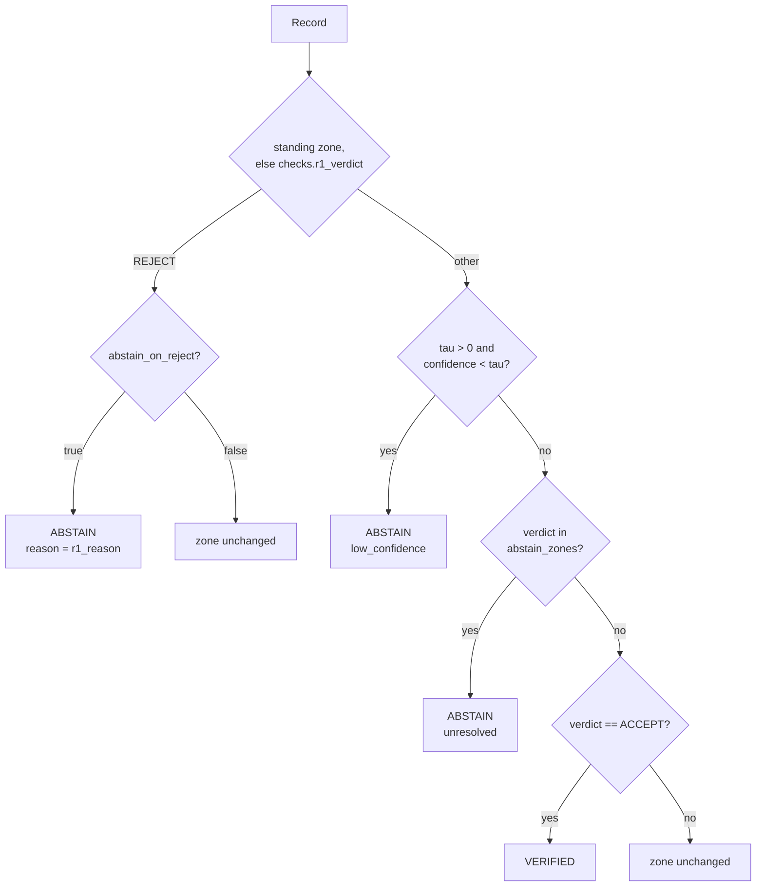

# Rung 2 · abstention {{done|BUILT}}

`ladder/rungs/r2.py` · owner A · Wejdan Bagais · **zero model calls**

Declines rather than resolves. Runs **last**.

## Why last

- Order is `[0, 1, 3, 5, 4, 2, 6]`. Abstaining before self-correction and voting throws away records those rungs would have recovered.
- Rung 2 is where a [[r1]] verdict is **finally allowed to cost coverage**. Rung 1 in observe mode defers that cost; rung 2 pays it.

## Decision logic

`decide(rec, cfg) -> (zone, reason)`. Pure, so the risk-coverage sweep can replay it.



- Reads `checks["r1_verdict"]` first, falling back to the zone. One mechanism covers both rung 1 modes: in observe the zone never moved; in gate they agree unless a later rung changed it, in which case that later fact is more recent.

## Three reasons to abstain

Logged separately, because they are different failures.

| Reason | Meaning |
|---|---|
| `unresolved` | still BAND after every resolver ran — plausible, but nothing could verify it |
| `rejected` | rung 1 called it provably wrong and [[r3]] never rescued it |
| `low_confidence` | the model's own confidence sits below τ |

## Withdrawal, never deletion

- Safety constraint 5. The proposed answer is preserved in `checks["withheld"]` so [[r6]] can show a person what the system was going to say.
- `sct` is blanked so the record ships no answer; `withheld` keeps `{sct, confidence}`.
- The system has no authority to rule anything out.

```
BEFORE  sct='55300003'  zone='NEW'
AFTER   sct=None        zone='ABSTAIN'  reason='unresolved'
        checks.withheld = {'sct': '55300003', 'confidence': 1.0}
        provenance = [{'rung': 2, 'from': 'NEW', 'to': 'ABSTAIN', 'reason': 'unresolved'}]
```

## CONCEPT_LESS is not an abstention

- "No code in the vocabulary is correct" is a positive, scoreable answer that CADEC's gold also gives, for 445 mentions.
- Folding it into abstention would make the system look cautious where it was right, and destroy the only clean abstention target the corpus offers.

## Settings

| Setting | Default | Note |
|---|---|---|
| `tau` | `0.0` | confidence gate **off** until a real rung-0 confidence distribution exists to calibrate against |
| `abstain_zones` | `["BAND"]` | which verdicts become abstentions |
| `abstain_on_reject` | `true` | a rejected record is not an answer |

- τ is swept on **dev only** and written to the manifest **before** the first test run. See [[corpus]].
- `sweep()` produces the risk-coverage curve. It takes the correctness oracle as an argument rather than importing a scorer, so the one shared scorer stays Pushpdeep's file and there is still only one of it.

## Measured

On the gold control, test split, 393 records:

- 171 ACCEPT → `VERIFIED`
- 222 BAND → `ABSTAIN`
- coverage `1.000` → `0.435`

Every one of those 393 codes is correct. The system publishes 43.5 % of them and withdraws the rest, having got none wrong. **That gap is what rungs 3–6 exist to close.**

Run alone, rung 2 abstains **nothing** — it reads `r1_verdict`, and with no rung 1 upstream there is nothing to withdraw on:

```bash
python -m ladder.run ablate --split test --source gold
```

## Related

- [[r1]] · [[r6]] · [[record]] · [[measurement]]
