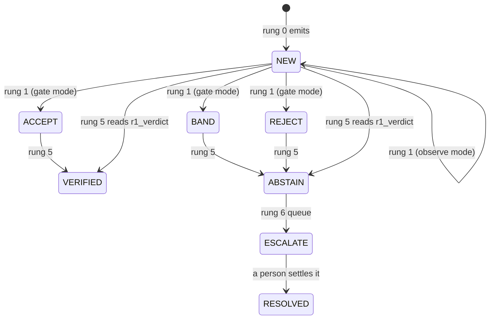

# Record & zones

`ladder/schema.py` · **FROZEN** after the fixture gate.

A silent change here costs an hour nobody has. If it must change, agree it first, and **append, never reorder**.

## Unit of evaluation

- **One mention, not one document.** A document yields many records; the ladder routes each independently.
- Not the plan's `{drug_text, reaction_text}` pair. Pairing them would make the output a causal claim by construction, contradicting the safety constraint that the system never emits "drug X causes Y". CADEC annotates them independently too.

## The Record

| Field | Meaning |
|---|---|
| `doc_id` | source document |
| `entity_type` | `reaction` or `drug` |
| `text` | the span exactly as written in the source |
| `spans` | `list[(start, end)]` — a **list**, because 11.7 % of CADEC reaction mentions are discontinuous |
| `sct` | SNOMED code, `CONCEPT_LESS`, or `None` |
| `meddra` | secondary, never the primary scored target |
| `confidence` | model's own, used by [[r5]]'s τ |
| `zone` | where the ladder has routed it |
| `reason` | why |
| `record_id` | `f"{doc_id}#{index}"`, stable within a run |
| `provenance` | every zone transition, with the rung that made it |
| `checks` | audit trail — **never scored** |

## Zones

| Zone | Meaning |
|---|---|
| `NEW` | emitted, nothing has looked at it |
| `ACCEPT` | passed validation **and** the vocabulary uses these words |
| `BAND` | passed, unverifiable by code alone |
| `REJECT` | provably wrong |
| `ABSTAIN` | the system declines to resolve |
| `ESCALATE` | queued for a person |
| `VERIFIED` | settled |
| `RESOLVED` | a person settled it |

- `OPEN_ZONES` = `NEW`, `ACCEPT`, `BAND`, `REJECT`. Everything else is terminal for a run.

## Reject reasons

Rung 1's value is the **breakdown**, not the rate. Append new reasons at the end; never renumber or rename.

- `schema_invalid` · `span_ungrounded` · `span_out_of_range` · `negated`
- `code_unknown` · `code_inactive` · `wrong_semantic_type` · `meddra_code_unknown`
- `low_confidence`, `unresolved` — [[r5]] only

## Span grounding

`Record.valid(source)` — the cheapest check on the ladder, so it fires first.

- Compares a **token bag**: whitespace-, order- and case-insensitive.
- Segment order is deliberately **not** required to match. 45 of CADEC's 9,109 gold mentions quote discontinuous segments in reading order rather than offset order. A concatenation-order check would call the gold standard ungrounded.
- Measured: an exact-string span check false-rejected 725 mentions (8.0 %); the token bag rejects 4 (0.04 %).

## Entity types

CADEC labels five (ADR / Symptom / Disease / Finding / Drug). Four collapse to `reaction`.

- **ADR is a causal attribution made by the annotator.** Asking a model to reproduce it would be asking for exactly the causal claim the safety constraint forbids.
- Only the drug/non-drug distinction is asked for or scored.

## Related

- [[r1]] · [[r5]] · [[ledger]] · [[corpus]] · [[glossary]]
